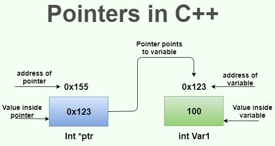
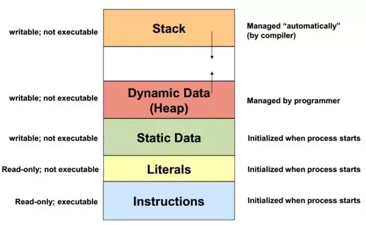
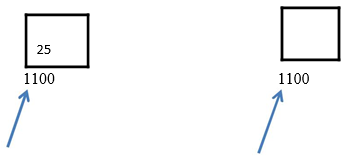
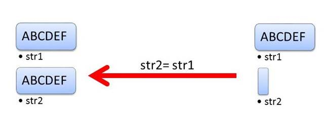
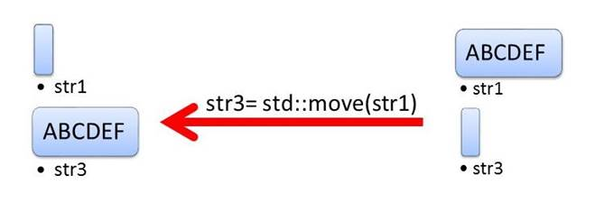

# Advanced C++ Crash Course (Pointers and Memory)

Author: methylDragon  
Contains an advanced syntax reference for C++  
This time, we'll be going through Pointers and Memory Management!   
I'll be adapting it from the ever amazing Derek Banas: https://www.youtube.com/watch?v=Rub-JsjMhWY

------

## Pre-Requisites

**Assumed knowledge (This is a C++ crash course, not a basic coding tutorial)**

- How **variables, loops, conditionals, etc**. work (Basic coding fundamentals will help a lot!)
- Linux (**Terminal/Console proficiency**) (We're going to need to compile our stuff)
- Gone through the all preceding parts of the tutorial


## Table Of Contents <a name="top"></a>

1. [Introduction](#1)  
2. [C++ Pointer Syntax Reference](#2)    
   2.1   [Memory Addresses](#2.1)    
   2.2   [Passing by Value vs Passing by Reference](#2.2)    
   2.3   [References](#2.3)    
   2.4   [Pointers](#2.4)    
   2.5   [Arrays with Pointers](#2.5)    
   2.6   [Indirection (Pointers of Pointers)](#2.6)    
   2.7   [When to use Pointers and when to use References](#2.7)    
   2.8   [Memory in C++](#2.8)    
   2.8   [Heap and Stack](#2.9)    
   2.10   [Memory Management](#2.10)    
   2.11   [Smart Pointers](#2.11)    


## 1. Introduction <a name="1"></a>

Ok. So we've covered the basics of C++ that overlap with most other programming languages. Now we'll dive into the deep end of what makes C++, well, C++. Memory management, pointers, and the like.


## 2. C++ Pointer Syntax Reference <a name="2"></a>

### 2.1 Memory Addresses <a name="2.1"></a>

[go to top](#top)

https://gist.github.com/ericandrewlewis/720c374c29bbafadedc9

Basic understanding: Whenever you create a variable, say...

```c++
int myNumber = 8;
```

The variable, myNumber is another name for a **memory address** that **stores** the value 8. Every variable does this. (Example memory address: 0x1001054a0)

>  Imagine that the memory address is a box that holds the value! The variable name then is a user-friendly way to give the box a name to refer to it (instead of having to type out the memory address explicitly!)

We use these variable names to manipulate the values stored within their respective **memory addresses**.

In order to print out the memory address of a variable, use the **reference** ('address-of') operator (&)

```c++
std::cout << "The variable's value lives at memory address " << &myVariable << "\n"; // This prints out the memory address of myVariable
```


### 2.2 Passing by Value vs Passing by Reference <a name="2.2"></a>

[go to top](#top)

https://www.reddit.com/r/explainlikeimfive/comments/2gl0xh/eli5programming_value_vs_reference/

This leads us to a very **important** concept in C and C++. The difference between passing by **value** and passing by **reference**.

Let's illustrate the important difference between the two using an example.

```c++
void myMultiplicationFunction(int x) 
{
  x = x * 2;
}

int main()
{
	int x = 2;
	myMultiplicationFunction(x);
  	std::cout << "Multiplied x is " << myMultiplicationFunction(x) << '\n';
	std::cout << "x is " << x;
}

/* OUTPUT:
Multiplied x is 4
x is 2
*/
```

This is **very weird**. Didn't the function manipulate x, since we passed it?

Well, actually, not really. The key understanding is that there are **TWO** ways to pass variables to functions.

> Passing by **Value**: You pass a COPY of the value stored inside a variable
>
> - This means the original value stored in the variable **DOESN'T CHANGE**
> - This accrues copying overhead

> Passing by **Reference**: You pass the variable itself! (By passing the reference TO the variable)
>
> - This is the **only way to change** the value stored in a variable!

The default way C++ passes variables to functions when you write them as arguments is through passing by **value**!

So **how** do we pass by reference? You can do it in two ways. Either:

>a) Access the value via **pointers**
>
>b) Set the argument to be the variable itself via **references**

The concepts needed to understand them will be explained in the next section

```c++
// Via pointers (a)
void myMultiplicationFunction(int* x) // Pass this function addresses (&parameter)
{
  *x = x * 2;
}

// Example call: 
// int a = 2;
// myMultiplicationFunction(&a);

// Via references (b)
void myMultiplicationFunction(int &x) // Pass this function variables as normal parameters it'll find the address itself!
{
  x = x * 2;
}

// Example calls
// int a = 2;
// myMultiplicationFunction(a);

// You can also pass by const reference!
// Doing this passes in the object directly, while avoiding copying the input
// But you're not allowed to change the passed in argument
void myMultiplicationFunction(const int &x)
{
  x = x * 2; // This is invalid and will fail since the passed in parameter is const
}
```


### 2.3 References <a name="2.3"></a>

[go to top](#top)

**Recall:** Every variable that you define is another name (an **alias**) of a memory address. Imagine these memory addresses as boxes to store values in, and the variable names as a way to refer to the box.

You can create MORE **aliases** for the variables! These are called **references**.

```c++
// Let's say we have a variable defined
int i = 5;

// To define an alias (r) for it, we use
int &r = i; // Now, manipulating r, does the same thing as manipulating i
// Note: int& r = i; will ALSO work!

// What we're essentially saying, is, let the address of r (&r)  be the same as the address defined by i. So now r and i refer to the SAME memory address.
// r does NOT STORE the memory address, r BECOMES another name for the memory address that i is the alias for
```

To illustrate what we've just done, examine the output of the following program:

```c++
cout << "r = " << r << endl;
cout << "i = " << i << endl;
r++;
cout << "i = " << i << endl;

/* OUTPUT:
r = 5
i = 5
i = 6
*/

// Notice how i changed even though we didn't explicitly manipulate i, but r instead? r is indeed an alias for i!
```

**Note that there are some restrictions on references though!:**

> - References cannot be NULL (they must always be an alias for something that exists)
> - References cannot be changed to be an alias for another object/variable
> - A reference must be initialised when it is created


### 2.4 Pointers <a name="2.4"></a>

[go to top](#top)

#### **Concepts**



[Image Source](<https://simplesnippets.tech/cpp-pointers-concept-with-example/>)

Pointers are **variables** in and of themselves, that **STORE MEMORY ADDRESSES**. In effect, they act as signposts that POINT to memory addresses!

> A pointer `x` that points to variable `y` will have its own memory address, but will store the memory address that y is the alias for.

Pointers are the more versatile, but less 'safe/secure' cousin to references.

```c++
// You define a pointer by using the * operator
int myNumber = 5;
int* myPointer = &myNumber; // Now myPointer stores the memory address of myNumber, which is an int
// Note: int *myPointer = &myNumber; will ALSO work!
```

Now we can manipulate and access this variable! We access the data stored inside the memory address pointed to by the pointer using the **dereference** operator (*)

```c++
cout << "Address of pointer: " << myPointer << endl;
// To access the data stored inside the memory address pointed to by the pointer, use the asterisk again. But this time it's used as a 'dereferencing operator'
cout << "Number stored: " << *myPointer << endl;

/* OUTPUTS:
<some address>
5
*/
```

Final intuitions:

References are the ALTERNATE NAMES you give to memory addresses. When you increment a reference, you are incrementing the value contained within the memory address!

Pointers STORE the memory addresses. When you increment a pointer, you are incrementing the memory address (the label), not the value contained within it!

> (https://www.reddit.com/r/learnprogramming/comments/1w6v07/eli5_pointers_and_their_usefulness/)
>
> Pointers, ELI5 version:
>
> Let's say you want to remember part of a book for later.  What would you do?
>
> You could write the entire passage down on another piece of paper so that you can remember for later, but that takes a while and might use a lot of paper.
>
> Instead, you could just write down the page number and look for the passage later. That's a lot faster to write down and won't use as much paper.
>
> The second example uses a "pointer" to the passage you want to remember for later.
>
> However, the first example may be a bit more convenient, depending on the size of the passage.  You're also able to change the passage in the first example to whatever you want without ruining your book.
>
> ------
>
> This is a nice analogy because it's easy to extend:
>
> You want to look up a specific topic in a book so you open it and find the index. The index says the glossary is on page 200. In the glossary you find that the phrase "intermediate value theorem" is referenced on page 106, and 110. Pointers to pointers!

#### **Important Notes**

**Assigning to pointers**

This is a very important intuition to have regarding pointers.

Take this example.

```c++
// This WILL NOT COMPILE PROPERLY
int* myPointer = 2;
```

This doesn't work because:

- myPointer is of type `int*` (that is, an integer pointer)
- 2 is of type `int`
- They're incompatible!

When one assigns to a pointer, they are assigning a memory address that that pointer points to. **Not the value stored in that memory address.**

In more code related terms:

```c++
// This segment:
int* myPointer = 2;

// Does NOT do this
int* myPointer;
*myPointer = 2;

// It instead does this
int* myPointer;
myPointer = 2; // This line is erroneous because of the type mismatch
```

**`int* var` vs `int *var`**

There's actually no difference between these two. It's more a question of style. I like to use `int*` because it's more clear that the type that I'm declaring is a pointer type.

**Memory Leaks**

Pointers of this kind:

```c++
int* myPointer;
```

Are known as **raw pointers** which are provisioned for in native C++. It's very important to take note that when you delete a pointer, the **memory referenced to that pointer is not released!** In other words, the memory will clog up space in your RAM with no way to delete it if you've lost the address to that memory. This is known as a **memory leak** which is a very bad thing.

**Junk Data**

Additionally, if you initialise a raw pointer but don't assign it anything, it **points to a random address in memory.**

```c++
int* myPointer;
```

It's even worse if you create a struct and create a pointer of its type. Because the members inside that pointer will still point to jibberish.

Since this address assignment is random, you could potentially break a lot of things in your program if you're not careful and use the pointer when it hasn't been properly initialised yet!

Because of this, it is more useful to initialise the pointer as a `nullptr` pointer, or better, to use **smart pointers** (which we'll go through later on.)

```c++
int* myPointer = nullptr;
```


> **TL;DR** Be very careful when using raw pointers. And actually, so careful you'll probably favour smart pointers over raw pointers. More on that in the later section


### 2.5 Arrays with Pointers <a name="2.5"></a>

[go to top](#top)

Basic concept: When an array is initialised in C++, each successive array element is actually in successive memory addresses! So when you increment a pointer that points to an array, you'll change the value that is pointed to to the next element!

```c++
// Let's try this out!
int numbers[5] = {1, 2, 3, 4, 5}; // Initialise an array
int* numbersPtr = numbers; // And a pointer which stores the pointer to the first element!

cout << "Before: " << *numbersPtr << endl;

numbersPtr++; // We increment the pointer here

cout << "After: " << *numbersPtr << endl;

/* OUTPUTS:
Before: 1
After: 2
*/
```

The variable name of an array is also just a pointer to the array!

```c++
// Let's try this out!
int numbers[5] = {1, 2, 3, 4, 5}; // Initialise an array

cout << "Before: " << *numbers << endl;

numbersPtr++; // We increment the pointer here

cout << "After: " << *numbers << endl;

/* OUTPUTS:
Before: 1
After: 2
*/
```

> So because of this. Just remember that array variables are special, since they're not really variables (aliases), but pointers that point to the array. So passing arrays to functions will result in you passing by reference!


### 2.6 Indirection (Pointers of Pointers) <a name="2.6"></a>

[go to top](#top)

Basically, pointers to pointers (ad nauseum)

If you think of a first-level pointer (say... int*) as an array, then a second-level pointer (int**) is an array of arrays! The cool thing about doing nth-dimensional arrays via pointers, is that the sizes don't have to be set in stone for the lowest level array!

```c++
// Here's an example

int numbers[5][5]; // This will give you 25 memory blocks worth of data. 5 arrays of size 5
int* numbers[5]; // This will give you n * 5 memory blocks worth of data, where n is the size of the particular array being pointed at

// You can do this ad nauseum, creating monstrosities like int************
```

Why is this useful? Let's ask stackoverflow!

https://stackoverflow.com/questions/5580761/why-use-double-pointer-or-why-use-pointers-to-pointers

> Here is a SIMPLE answer!!!!
>
> - lets say you have a pointer that its value is an address.
> - but now you want to change that address.
> - you could, by doing pointer1 = pointer2, and pointer1 would now have the address of pointer2.
> - BUT! if you want a function to do that for you, and you want the result to persist after the function is done, you need do some extra work, you need a new pointer3 just to point to pointer1, and pass pointer3 to the function.

Another example of indirection being used, is with strings!

> If you want to have a list of characters (a word), you can use `char *word`
>
> If you want a list of words (a sentence), you can use `char **sentence`
>
> If you want a list of sentences (a monologue), you can use `char ***monologue`
>
> If you want a list of monologues (a biography), you can use `char ****biography`
>
> If you want a list of biographies (a bio-library), you can use `char *****biolibrary`
>
> If you want a list of bio-libraries (a ??lol), you can use `char ******lol`


### 2.7 When to use Pointers and when to use References <a name="2.7"></a>

[go to top](#top)

General maxim: `Use reference wherever you can, pointers wherever you must.`

Use pointers if you don't want to initialise it at point of declaration. (Declaring an object means you create it. Initialise means you assign a value to it as well as creating it.) 

You HAVE to initialise a reference when you create it because a reference cannot be an alias for nothing/nullptr, but pointers CAN!!

Pointers can also be altered to point to other memory addresses! But references are stuck with being an immutable alias for only ONE object!


### 2.8 Memory in C++ <a name="2.8"></a>

[go to top](#top)

#### **Introduction**

Before we move on we should talk about how memory is stored in C++.

There are several main sections of memory used in any C++ program. They are ordered as follows. (Generally speaking. It's usually platform dependent.)


[Image Source](<https://www.geeksforgeeks.org/memory-layout-of-c-program/>)

Or in terms of the read-write capabilities of each block of memory,



[Image Source](<https://www.quora.com/Is-it-a-design-fault-that-C++-itself-has-no-garbage-collection>)

We'll start from the bottom, following the first image.

If you're trying to interpret the second image in terms of the first, just take it that literals and static data are stored in the `unitialised` and `initialised data` segments, depending on whether they are initialised or not. `int i;` vs `int i = 5;`

#### **Text Segment**

The text segment is where the actual executable code instructions are stored. It's placed below the heap and stack to prevent any overflows from either from overwriting it.

Pretty smart.

#### **Initialised Data/Data Segment**

This is where all the data that is initialised with non-zero data at compile time is stored.

- The **read-only** section of this segment will go to **literals**, like strings. Eg: `char s[] = "rawr"`
- The **read-write** section of this segment will go to static or global variables. Eg: `global int wow = 1;`

#### **Uninitialised Data/bss Segment**

(bss stands for "block started by symbol".)

All data here is initialised with 0. And it contains **all static or global data that is either explicitly initialised to 0 or does not have explicit initialisation in the source code.**

Some examples of stuff that's stored in the bss segment:

```c++
static int a;
global int b;

// This one will NOT be in the bss! Since it's local to main, and will actually go to the stack.
int main(){
  int c = 0;
  return 0;
}
```

#### **Stack and Heap**

The stack and heap actually share the same segment, and typically grow in opposite directions from opposite ends of the segment. Though some optimisations and compilers might break this guideline.


[Image Source](<http://bluegalaxy.info/codewalk/2018/08/12/python-how-to-implement-a-lifo-stack/>)

The stack follows last-in, first-out (LIFO) structure.

The top of the stack and heap are tracked using pointers. Once the two pointers meet, you've run out of memory. If you don't catch this, you'll get overflows, which will mean you're going to have a **bad time.**

Each time you call a function, a stack frame containing function variables, and information relating to the function caller's environments, return address, some machine registers, and other function-call related info are pushed to the stack. If you have a recursive function each recursive call actually generates a new stack frame on the stack.

> - The stack grows and shrinks as functions push and pop local variables
> - There is no need to manage the memory yourself, variables are allocated and freed automatically
> - The stack has size limits
> - Stack variables only exist while the function that created them, is running
>   - This includes the main() function!!
>
> <https://www.gribblelab.org/CBootCamp/7_Memory_Stack_vs_Heap.html>

#### **Heap**

The heap is where dynamic memory allocation typically happens.

You manage it by using `malloc`, `realloc`, `free` (C functions), or the newer `new`, `new[]`, `delete`, and `delete[]` C++ operators, which are better and almost always better to use.

Every thread, library, or module in a single program process has access to this data segment, since they're essentially global.

It's **normally slower to access heap data than stack data since you need to use pointers to access them.**


### 2.9 Heap and Stack <a name="2.9"></a>

[go to top](#top)

There's actually more to go through for the heap and stack, since they're the two data segments that you'll encounter most often.

> ## Stack vs Heap Pros and Cons
>
> ### Stack
>
> - Very fast access
> - Don't have to explicitly de-allocate variables
> - Space is managed efficiently by CPU, memory will not become fragmented
> - Local variables only
> - Limit on stack size (OS-dependent)
> - Variables cannot be resized
>
> ### Heap
>
> - Variables can be accessed globally
> - No limit on memory size
> - (Relatively) slower access
> - No guaranteed efficient use of space, memory may become fragmented over time as blocks of memory are allocated, then freed
> - You must manage memory (you're in charge of allocating and freeing variables)
> - Variables can be resized using `realloc()`
>
> ## When to use the Heap?
>
> When should you use the heap, and when should you use the stack?
>
> If you need to allocate a **large block of memory** (e.g. a large array, or a big struct), and you need to **keep that variable around a long time** (like a global), then you should **allocate it on the heap**.
>
> If you are dealing with **relatively small variables that only need to persist as long as the function using them is alive**, then you should **use the stack**, it's easier and faster.
>
> If you need variables like arrays and structs that can **change size dynamically** (e.g. arrays that can grow or shrink as needed) then you will likely need to **allocate them on the heap**, and use dynamic memory allocation functions like `malloc()`, `calloc()`, `realloc()` and `free()` to manage that memory "by hand".
>
> <https://www.gribblelab.org/CBootCamp/7_Memory_Stack_vs_Heap.html>

#### **Allocating to Stack**

It's fairly simple to allocate stuff to the stack. Just make sure that they're specifically **local variables** in a function (which can be main()!)

These variables are **automatically allocated**.

```c++
int main(){
  int c = 0;
  return 0;
}

void foo(){
  int a = 1;
}

// The variables are deallocated automatically once the functions go out of scope
```

#### **Allocating to Heap**

You **can't declare variables on the heap.** You can only create variables anonymously, then point to them with a named **pointer**.

So, allocating to the heap is trickier. You need to **explicitly allocate** the memory as a pointer.

The variables pointed at by the pointer are on the heap, and are **dynamically allocated.**

**Allocation**
```c++
int* ptr = new int; // ptr is assigned 4 bytes in the heap
int* array = new int[10]; // array is assigned 40 bytes in the heap

// Or later, when we go through smart pointers (which are better than raw pointers)
std::unique_ptr<someType> uniqueptr(new int(1));
```

**Deallocation**
```c++
// You'll need to manually deallocate them if using raw pointers to free memory
// Otherwise you'll get a memory leak!
*ex= new Example();
delete ex;
ex = nullptr; // Remember to reassign the pointer to NULL so the pointer won't dangle

// With a smart pointer you can just call .reset
uniqueptr.reset();
```

**Dangling Pointers**



[Image Source](<https://www.studytonight.com/cpp/memory-management-in-cpp.php>)

You don't want this. This is a dangling pointer and what happens if you don't reassign the pointer to `nullptr`.


### 2.10 Memory Management <a name="2.10"></a>

[go to top](#top)

Read more: http://www.cplusplus.com/doc/tutorial/dynamic/

I have to say it here, since we've covered pointers. The reason why C++ is so powerful (and hard), is because you have to control how memory is managed in the program. This means cleaning up after yourself if you want to no longer use variables, controlling the memory flow, assigning pointers, and all the like. It goes really, really deep.

So here's a small primer! For **dynamic (runtime) memory management.**

(We will not be going through the old `malloc`, `free`, `realloc` and related C functions, since the operators C++ provisions for are way better.)


#### **new and new[]**

> You use `new` if you want objects to persist until you `delete` it. But if you don't specifically need that, DO NOT USE NEW because it's expensive memory-wise.

`new` reserves memory, and returns a pointer to the memory that was allocated! If you assign an array, then it returns the pointer to the first element of the array.

```c++
int * foo; // Initialise a pointer
int * bar; // Another one

foo = new int; // And allocate memory to it
bar = new int [5]; // Or perhaps an array of size 5?
```

>  But be careful! Memory allocated in this way needs to be disposed of manually using `delete.`
>
> Otherwise it becomes a memory leak, which, if accumulated enough such that your program runs out of the memory allocated to it, crashes.


#### **delete and delete[]**

`delete` is how you do garbage disposal. Be wary of using pointers you've deleted though! Since the memory space previously allocated to the pointer could have been used for other things, or would be filled with garbage.

```c++
delete ptr; // To delete pointers
delete[] array_ptr; // To delete array pointers
```


#### **Assignment Failures**

From: http://www.cplusplus.com/doc/tutorial/dynamic/

If you try to store a variable that will take too much memory than the memory that is available, the assignment statement will fail.

**You can catch this exception!**

Alternatively, if you want to still let it pass, then use `nothrow`, which will return a null pointer instead (which is still bad, and you still have to verify if it worked, so it's less efficient, but easier to write intially...)

```c++
 foo = new int [5];  // if allocation fails, an exception is thrown 

// Or using (nothrow)

int * bar;
bar = new (nothrow) int [5];
if (bar == nullptr) { // Check to see if bar was assigned a null pointer
  // error assigning memory. Take measures.
}
```


#### **Moving and Copying**

When you move something, you merely reassign the pointer that points to that object. When you copy something, you copy the entire memory block that the pointer points to.

**This is important if what you're trying to move is large.** Moving is usually more efficient and faster than copying because of this.

To be more technical, copying an object uses the copied object's copy constructor, whereas moving an object uses the object's move constructor.


**Copy**



Image source: <https://www.modernescpp.com/index.php/copy-versus-move-semantic-a-few-numbers>

```c++
std::string("ABCDEF");
std::string str2;
str2 = str1;
```


**Move**



Image source: <https://www.modernescpp.com/index.php/copy-versus-move-semantic-a-few-numbers>

```c++
std::string("ABCDEF");
std::string str3;
str2 = std::move(str1);
```


### 2.11 Smart Pointers <a name="2.11"></a>

[go to top](#top)

#### **Concepts**

You know how in the section for **raw pointers** it was mentioned that raw pointers don't do memory management (that is, they don't delete the memory they refer to once the pointers get unassigned or the pointer goes out of scope, which can lead to memory leaks and a whole bunch of other problems?)

There's a whole type of pointers called **smart pointers** that, at the cost of a tiny overhead, does this management for you! You'll no longer have to explicitly destroy objects!

> These smart pointers **wrap** raw pointers to allow for more functionality and memory integrity.

There are three main types of smart pointers provisioned for in the C++ `std` library (they used to be in boost, and still are, but it's more recommended nowadays to use the `std` library ones.) There are a bunch more outside of `std`, but these should be more than sufficient to do what you need to do.

> **All smart pointers destroy their wrapped pointers and the underlying data those pointers contain once they go out of scope.**
>
> By destroy, I mean that the smart pointer calls the destructor of the pointer or object that is passed to the smart pointer.

| Pointer Type   | Init Signature         | Description                                                  |
| -------------- | ---------------------- | ------------------------------------------------------------ |
| Unique Pointer | std::unique_ptr\<TYPE> | A unique pointer is always the unique owner of its associated raw pointer. This means that its underlying raw pointer can't be copied, only moved. When the unique pointer's associated raw pointer is reassigned or reset, the associated raw pointer and the memory it points to is released. |
| Shared Pointer | std::shared_ptr\<TYPE> | A shared pointer allows multiple owners to be assigned to its associated raw pointer. You can copy shared pointers as well as move them. This works because the shared pointer counts how many owners the associated raw pointer has, and only deletes the associated raw pointer when it has no more owners. |
| Weak Pointer   | std::weak_ptr\<TYPE>   | A weak pointer is something like a shared pointer, and can **only be used in conjunction with shared pointers.** They allow you to access an object without counting towards the owner count of the shared pointer. This allows access to the object without forcing you to keep the object alive. |


#### **Example Syntax**

```c++
// Initialisation
std::unique_ptr<someType> uniqueptr;
std::shared_ptr<someType> sharedptr;
std::weak_ptr<someType> weakptr;

// Best practice initialisation (notice that this uses direct initialisation!)
// You won't be able to use copy initialisation for the uniqueptr
std::unique_ptr<someType> uniqueptr(new someType("VALUE/VALUES"));
std::shared_ptr<someType> sharedptr(new someType("VALUE/VALUES"));
std::weak_ptr<someType> weakptr(new someType("VALUE/VALUES"));

// Deleting the pointer
smart_pointer.reset();

// Releasing and then initialising
smart_pointer.reset(new someType("VALUE/VALUES"));

// Access member variables
smart_pointer->member_name;

// Reference passing
passByReferenceToMe(*smart_pointer);

// Check if smart pointer is empty or is null/uninitialised
// Two ways
if(!smart_pointer){}
if(smart_pointer == nullptr){}
```

#### **Copying Smart Pointers**

```c++
// This will work on everything EXCEPT for a unique pointer
smart_pointer2 = smart_pointer1;

// For more clarity
// Suppose smart_pointer1 is a unique_ptr
// This will NOT WORK!
std::unique_ptr<someType> smart_pointer2 = smart_pointer1;
```

#### **Moving Smart Pointers**

```c++
// Just use the standard move semantics!
smart_pointer2 = std::move(smart_pointer1);

// This will work with unique pointers!
// But do take note that this will cause smart_pointer1 to contain a nullptr
std::unique_ptr<someType> smart_pointer2 = std::move(smart_pointer1);
```


```
                            .     .
                         .  |\-^-/|  .    
                        /| } O.=.O { |\     
```
​        

---

 [.png)](https://www.buymeacoffee.com/methylDragon)