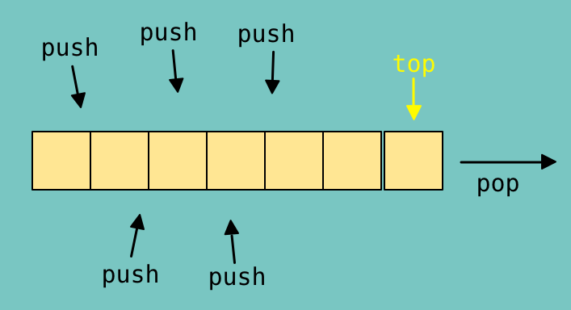
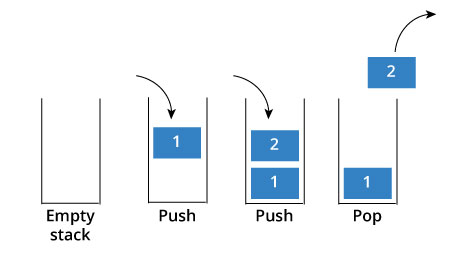
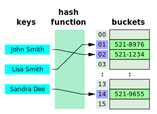

# Advanced C++ Crash Course (Data Structures)

Author: methylDragon  
Contains an advanced syntax reference for C++  
This time, we'll be going through some basic Data Structures!   

------

## Pre-Requisites

**Assumed knowledge (This is a C++ crash course, not a basic coding tutorial)**

- How **variables, loops, conditionals, etc**. work (Basic coding fundamentals will help a lot!)
- Linux (**Terminal/Console proficiency**) (We're going to need to compile our stuff)
- Gone through the all preceding parts of the tutorial


## Table Of Contents


## Introduction

Time to dive into some more super useful functionalities that the standard C++ library offers - data structures that can be used for solving lots of different computer science problems!

> Note that when we're talking about data structures, we're talking about stuff like vectors, queues, etc.
>
> And **NOT** structs like so:
>
> ```c++
> struct not_this_please {
>   int nope;
>   double definitely no;
> } not_this_please_instance_1;
> ```
>
> We're talking algorithm related data structures!

It might be a bit confusing, so we might perhaps use the term that C++ uses, and just say outright that we're going to go through a cursory, non-exhaustive tour of the C++ STL **Container library**.

(STL stands for Standard Template Library.)


## C++ Container Reference

This will not be an exhaustive list.

### Containers

Standard containers in the C++ STL and standard library wraps different abstract and non-abstract data structures in a nice neat interface.

They:

- Are well documented
- Are guaranteed to be implemented correctly
- Are fast and usually more efficient
- Share common interfaces

Although one gotcha needs to be taken care of if working with them in a threaded application.

Threaded reads are fine, but any operation that modifies the container (in a way that invalidates iterators) are **not thread safe generally.**


### Arrays


[Image Source](<https://openframeworks.cc/ofBook/chapters/memory.html>)

Contiguous and continuous collection of **homogeneous** elements that can be accessed by index. The index is the displacement from the start of the array. **It can't be resized.** 

> C++ container: **[Array](<https://en.cppreference.com/w/cpp/container/array>)**
> Example:`array<int, 5> array{{1, 2, 3, 4, 5}};`
>
> Notice that these are different from the standard `int i[5]` type arrays! The underlying implementation is about the same, but we're talking containers here.

```c++
#include <array>

// Array 1 uses aggregate initialisation
array<int, 5> array{{1, 2, 3, 4, 5}};
array<int, 5> array_2 = {1, 2, 3, 4, 5}

array.size(); // Get size
array.max_size(); // Get max size
array.empty(); // Check if empty

// Get iterator to beginning and end
array.begin();
array.end();

// Get reverse iterators
array.rbegin(); // Last element backwards
array.rend(); // First element - 1 index

// Get values at beginning and end
array.front();
array.end();

// Get values at index
array.at(INDEX);

// Just directly access the entire array
array.data();
```


### Dynamic Arrays

Just like normal arrays, except that they can be resized as they are **dynamically allocated.**

It's not so efficient to add or remove elements from dynamic arrays since all the elements are contiguous and need to be shifted.

If you need that, it's probably better to use a linked list. On the other hand, contiguous memory containers are great for accessing data though!

> C++ container: **[Vector](<http://www.cplusplus.com/reference/vector/vector/>)**
>
> Example: `std::vector<int> i{1, 2, 3};`

```c++
#include <vector>

std::vector<int> vector{1, 2, 3};

vector.size(); // Get size
vector.max_size(); // Get max size
vector.empty(); // Check if empty
vector.resize(); // Resize vector
vector.reserve(); // Request change in capacity
vector.shrink_to_fit(); // Shrink to fit
vector.capacity(); // Return size of allocated storage capacity

// Get iterator to beginning and end
vector.begin();
vector.end();

// Get reverse iterators
vector.rbegin(); // Last element backwards
vector.rend(); // First element - 1 index

// Get values at beginning and end
vector.front();
vector.end();

// Get values at index
vector.at(INDEX);

// Just directly access the entire underlying array
vector.data();

vector.assign(); // Assign vector content
vector.push_back(); // Add element at end
vector.pop_back(); // Delete last element

// Insertions
// https://www.geeksforgeeks.org/vector-insert-function-in-c-stl/
vector.insert();

// Deletions
// https://www.geeksforgeeks.org/vector-erase-and-clear-in-cpp/
vector.erase();
vector.clear();

// Swap values
vector.swap();

// Emplace (returns a modified copy of the vector)
vector.emplace();
vector.emplace_back();
```


### Linked Lists

(Singly Linked List)

[Image Source](<https://www.geeksforgeeks.org/data-structures/linked-list/>)

 
(Doubly Linked List)

[Image Source](<https://openframeworks.cc/ofBook/chapters/memory.html>)

Linked lists contain data that aren't contiguous. Each element in the list is linked using pointers, so in order to access the next element, you need to first access the preceding element. This allows for very quick insertions and deletions, but not very efficient indexing.

They come in two flavours too! Singly linked lists only support indexing in one direction, while doubly linked lists do it both ways.

The C++ list is actually a doubly linked list.

> C++ container: **[List](<https://en.cppreference.com/w/cpp/container/list>) and [Forward List](<https://en.cppreference.com/w/cpp/container/list>)**
>
> Example: `std::list<int> i;`
>
> Example: `std::forward_list<int> i;`
>
> List is doubly linked. Forward list is singly linked.

From here on out it'll get too unwieldy to write everything.

Most containers have a standard interface with `.begin`, `.end`, and most of the insertion and deletion methods. So just check out the reference!

**List**

```c++
// Adapted From Source: https://www.geeksforgeeks.org/list-cpp-stl/

#include <list>  

int main()
{
  // Declaring forward list 
  std::list<int> list1; 

  // Declaring another forward list 
  std::list<int> list2; 

  // Assigning values using assign() 
  list1.assign({1, 2, 3}); 

  // Assigning repeating values using assign() 
  // 5 elements with value 10 
  list2.assign(5, 10); 
}
```

**Forward List**

```c++
// Source: https://www.geeksforgeeks.org/forward-list-c-set-1-introduction-important-functions/

#include <forward_list>  

int main()
{
  // Declaring forward list 
  std::forward_list<int> flist1; 

  // Declaring another forward list 
  std::forward_list<int> flist2; 

  // Assigning values using assign() 
  flist1.assign({1, 2, 3}); 

  // Assigning repeating values using assign() 
  // 5 elements with value 10 
  flist2.assign(5, 10); 
}
```


### Pairs

They're pairs. Of objects. In twos.

Yeah.

They don't have to be the same type though. That's cool... Right? :eyes:

It's not really a data structure per se, if anything it's a primitive. But it's nice to include here.

> C++ container: **[Pair](<https://en.cppreference.com/w/cpp/utility/pair>)**
>
> Example: ``std::pair<int, float> pair;`

```c++
#include <utility>

std::pair<int, char> pair;
std::pair<int, char> pair_2(1, 'o');

pair.first = 100;
pair.second = 'w';
```


### Tuples

They're like arrays, but can be heterogeneous. Pairs are technically tuples that are limited to size 2.

> C++ container: **[Tuple](<https://en.cppreference.com/w/cpp/utility/tuple>)**
>
> Example: `std::tuple<int,char> tuple(10,'x');`
>
> Example:  `auto wow = std::make_tuple("wow!", 1, 2, 'a');`

```c++
#include <tuple>

int main()
{
  std::tuple <char, int, float> wow; 
  wow = std::make_tuple("a", 15, 12);
}

// Unpack tuple values into variables using tie()
std::tie(a, b, c) = wow;
std::tie(a, ignore, c) = wow; // Use ignore to ignore values

// Concatenate tuples
std::tuple_cat(tuple_1, tuple_2);

// Swap tuple elements
tuple_1.swap(tuple_2); // Swaps tuple_1 values with tuple_2's

// Index into tuples
tuple_1.get(1);
```


### Queues


[Image Source](<https://www.fluentcpp.com/2018/03/20/heaps-and-priority-queues-in-c-part-3-queues-and-priority-queues/>)

Abstract data structure that contains elements. Adheres to FIFO (First In, First Out.)

> C++ container: **[Queue](<https://en.cppreference.com/w/cpp/container/queue>)**
>
> Example: `std::queue<int> numbers;`

You can also have a double ended queue called a deque!

> C++ container: **[Deque](<https://en.cppreference.com/w/cpp/container/deque>)**
>
> Example: `std::deque<int> numbers;`

The specific C++ implementation uses a vector of vectors to implement deques. And queues are just limited versions of deques. Specifically it's a queue of chunks of fixed size, which are vectors. And the queue of chunks is a vector.


[Image Source](<https://stackoverflow.com/questions/6292332/what-really-is-a-deque-in-stl>)

**Queue**

Note that the standard implementation does not support random access (at) indexing!

```c++
#include <queue>

// Function to print queue
template<typename T> void print_queue(T& q)
{
    while(!q.empty()) {
        std::cout << q.top() << " ";
        q.pop();
    }
    std::cout << '\n';
}

// Construct Queue
std::queue queue;

// Insert and pop
queue.push(1);
queue.pop();

// Get front
queue.front();

// Get size
queue.size();
```

**Deque**

```c++
#include <deque>

// Construct Queue
std::deque deque;

// Insert and pop
deque.push_back(1);
deque.push_front(2);
deque.pop_back();
deque.pop_front();

// Get front and back
deque.front();
deque.back();

// Get size
deque.size();
deque.max_size();

// Index
deque.at(1);
```


### Priority Queues



[Image Source](<https://www.fluentcpp.com/2018/03/20/heaps-and-priority-queues-in-c-part-3-queues-and-priority-queues/>)

Just like queues, except FIFO isn't adhered to. Only the 'top' element will be shoved to the front of the queue to be popped next.

> C++ container: **[Priority Queue](<https://en.cppreference.com/w/cpp/container/priority_queue>)**
>
> Example: `std::priority_queue<int> q;`

```c++
// Source: https://en.cppreference.com/w/cpp/container/priority_queue

// Function to print queue
template<typename T> void print_queue(T& q)
{
    while(!q.empty()) {
        std::cout << q.top() << " ";
        q.pop();
    }
    std::cout << '\n';
}

#include <queue>

std::priority_queue<int> q;

for(int n : {1,8,5,6,3,4,0,9,7,2})
{
  q.push(n);
}

q.pop();
```


### Stacks



[Image Source](<http://bluegalaxy.info/codewalk/2018/08/12/python-how-to-implement-a-lifo-stack/>)

Abstract data structure that contains elements. Adheres to LIFO (Last In, First Out.)

> C++ container: **[Stack](<https://en.cppreference.com/w/cpp/container/stack>)**
>
> Example: `std::stack<int> s;`

```c++
#include <stack> 

// Function to print a stack
template<typename T> void showstack(T& s) 
{ 
    while (!s.empty()) 
    { 
        cout << '\t' << s.top(); 
        s.pop(); 
    } 
    cout << '\n'; 
} 

std::stack<int> s;

// Push to stack
s.push(1);

showstack(s);

// Get top value
s.top();

// Pop
s.pop();
```


### Trees


[Image Source](<https://en.wikipedia.org/wiki/Tree_(data_structure)>)

Oh man. There are [way](<https://en.wikipedia.org/wiki/Binary_search_tree>) [too]([https://en.wikipedia.org/wiki/Red%E2%80%93black_tree](https://en.wikipedia.org/wiki/Red–black_tree)) [many](<https://en.wikipedia.org/wiki/Splay_tree>) [trees](<https://en.wikipedia.org/wiki/Trie>). And we can't cover them all. The image above should give you a good intuition of what trees are, but each special type of trees have their own special features.

They can sometimes be implemented in array or vector form as well, but we'll not talk about that.

> **There are no dedicated C++ generalised tree containers.** There's too many to generalise properly!
>
> There should be some specialised libraries for use with trees, but none specifically for trees in the STL. (Though some STL classes like sets and maps do make use of red-black trees in their implementations.)


### Sets

A set is an abstract data type that stores sorted, unique values. You can insert or delete elements from them but those elements can't be modified.

They're collections of unique, sorted keys.

In C++ these are implemented using red-black trees.

> C++ container: **[Set](<https://en.cppreference.com/w/cpp/container/set>)**
>
> Example: `std::set<int> s;`

There's a variant called a multiset that allows duplicate non-unique keys to be stored!

> C++ container: **[Multiset](<https://en.cppreference.com/w/cpp/container/multiset>)**
>
> Example: `std::multiset<int> s;`

```c++
#include <set>

std::set<int> s;
std::multiset<int> ms; // All the below apply as well

// Insert and erase
s.insert(50);
s.insert(50); // This second one does nothing since sets store UNIQUE values

ms.insert(50);
ms.insert(50); // The multiset now has two elements of 50

s.erase(50);

// Get iterators to beginning and end
s.begin();
s.end();

// Get reverse iterators
s.rbegin(); // Last element backwards
s.rend(); // First element - 1 index

// Get iterators
s.lower_bound(5); // Iterator >= 5
s.upper_bound(50); // Iterator <=50
s.equal_range(); // Gets you upper and lower bound as a pair

// Get iterator indexed at key
s.find(5)

// Get sizes
s.size();
s.max_size();

// Check if empty
s.empty();
```


### Maps

A map is an abstract data type that stores sorted key-value pairs. You can insert or delete keys, but you can't modify the keys. You can modify the values though!

They're collections of unique, sorted key-value pairs.

In C++ these are implemented using red-black trees.

> C++ container: **[Map](<https://en.cppreference.com/w/cpp/container/map>)**
>
> `std::map<key_type, value_type>`
>
> Example: `std::map<int, int> map = {{1, 1}, {2, 2}};`

There's a variant called a multimap that allows duplicate non-unique keys to be stored!

> C++ container: **[Multimap](<https://en.cppreference.com/w/cpp/container/multimap>)**
>
> Example: `std::multimap<int> s;`

```c++
#include <map>

std::map<char, int> map;
std::multimap<char, int> multimap; // All the below apply as well

// Insert and erase
map.insert(std::pair<char, int>('a', 50));
map.insert(std::pair<char, int>('a', 50)); // This second one does nothing since sets store UNIQUE values

multimap.insert(std::pair<char, int>('a', 50));
multimap.insert(std::pair<char, int>('a', 50)); // The multiset now has two elements of 50

map.erase(50);

// Get iterators to beginning and end
map.begin();
map.end();

// Get reverse iterators
map.rbegin(); // Last element backwards
map.rend(); // First element - 1 index
                
// Get iterators
map.lower_bound(5); // Iterator >= 5
map.upper_bound(50); // Iterator <=50
map.equal_range(); // Gets you upper and lower bound as a pair

// Index into map
map.at(5)

// Get sizes
map.size();
map.max_size();

// Check if empty
map.empty();
```


### Unordered Sets/HashSets

They're like sets. But they're unordered. Because they're implemented using hashes! These use more memory but with the benefit of faster accesses if the sets are large.

> C++ container: **[Unordered Set](<https://en.cppreference.com/w/cpp/container/unordered_set>)**
>
> Example: `std::unordered_set<int> unordered_set;`

And of course there's the multiset variant

> C++ container: **[Unordered Multiset](<https://en.cppreference.com/w/cpp/container/unordered_multiset>)**
>
> Example: `std::unordered_multiset<int> unordered_multiset;`

```c++
#include <unordered_set>

std::unordered_set<int> s;
std::unordered_multiset<int> ms; // All the below apply as well

// Insert and erase
s.insert(50);
s.insert(50); // This second one does nothing since sets store UNIQUE values

ms.insert(50);
ms.insert(50); // The multiset now has two elements of 50

s.erase(50);

// Get iterators to beginning and end
s.begin();
s.end();

// No reverse or iterators that require sorting

// Get iterators
s.equal_range(); // Gets you upper and lower bound as a pair

// Get iterator indexed at key
s.find(5)

// Get sizes
s.size();
s.max_size();

// Check if empty
s.empty();

// Hash policy methods
s.load_factor();
s.max_load_factor();
s.rehash(); // Set number of buckets
s.reserve(); // Change capacity
s.hash_function(); // Get hash function

// Bucket methods
s.bucket_count();
s.max_bucket_count();
s.bucket_size();
s.bucket(); // Locate element's bucket
```


### Unordered Maps/HashMaps



[Image Source](<https://medium.com/@aozturk/simple-hash-map-hash-table-implementation-in-c-931965904250>)

They're like maps. But they're unordered. Because they're implemented using hashes! These use more memory but with the benefit of faster accesses if the maps are large.

Keys are passed through a hash function that spits out a bucket ID. The buckets are there to prevent collisions (when the bucket IDs clash for different keys.)

> C++ container: **[Unordered Map](<https://en.cppreference.com/w/cpp/container/unordered_map>)**
>
> `std::unordered_map<key_type, value_type>`
>
> Example: `std::unordered_map<int, int> unordered_map = {{1, 1}, {2, 2}};`

And the multimap variant

> C++ container: **[Unordered Multimap](<https://en.cppreference.com/w/cpp/container/unordered_multimap>)**
>
> Example: `std::unordered_multimap<int, int> unordered_multimap;`

```c++
#include <unsorted_map>

std::map<char, int> map;
std::multimap<char, int> multimap; // All the below apply as well

// Insert and erase
map.insert(std::pair<char, int>('a', 50));
map.insert(std::pair<char, int>('a', 50)); // This second one does nothing since sets store UNIQUE values

multimap.insert(std::pair<char, int>('a', 50));
multimap.insert(std::pair<char, int>('a', 50)); // The multiset now has two elements of 50

map.erase(50);

// Get iterators to beginning and end
map.begin();
map.end();

// No reverse or iterators that require sorting

// Get iterators
map.equal_range(); // Gets you upper and lower bound as a pair

// Index into map
map.at(5)

// Get sizes
map.size();
map.max_size();

// Check if empty
map.empty();

// Hash policy methods
map.load_factor();
map.max_load_factor();
map.rehash(); // Set number of buckets
map.reserve(); // Change capacity
map.hash_function(); // Get hash function

// Bucket methods
map.bucket_count();
map.max_bucket_count();
map.bucket_size();
map.bucket(); // Locate element's bucket
```


### Iterators


```
                            .     .
                         .  |\-^-/|  .    
                        /| } O.=.O { |\     
```
​        

---

 [.png)](https://www.buymeacoffee.com/methylDragon)