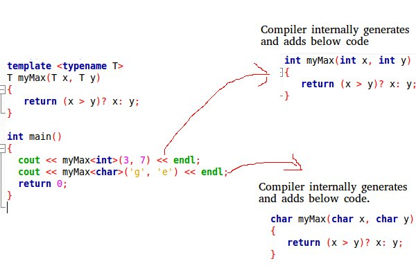
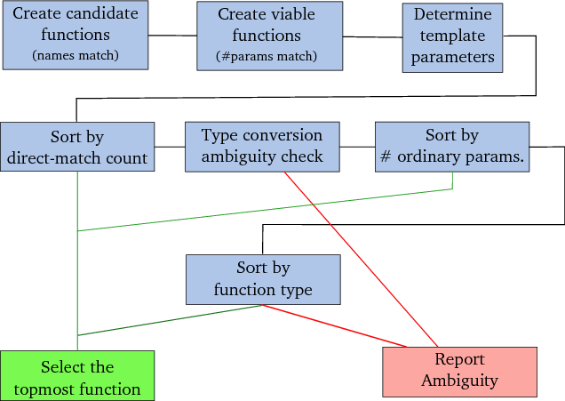
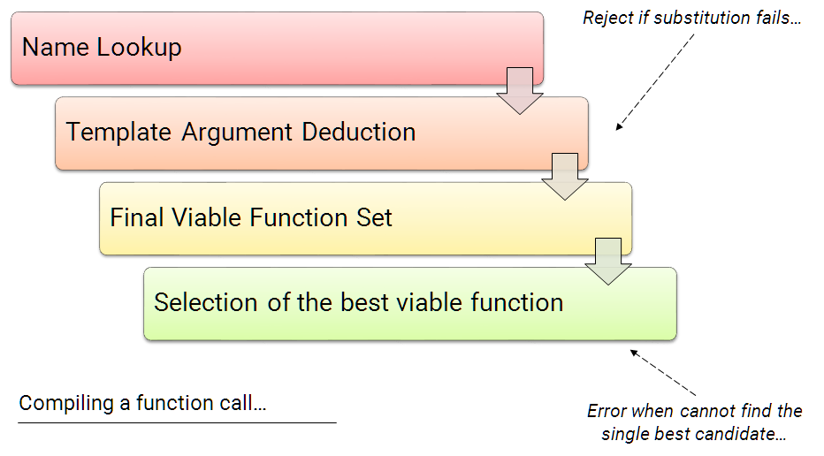

# Advanced C++ Crash Course (Templates)

Author: methylDragon  
Contains an advanced syntax reference for C++  
This time, we'll be going through C++ templates and template metaprogramming!    

------

## Pre-Requisites

**Assumed knowledge (This is a C++ crash course, not a basic coding tutorial)**

- How **variables, loops, conditionals, etc**. work (Basic coding fundamentals will help a lot!)
- Linux (**Terminal/Console proficiency**) (We're going to need to compile our stuff)
- Gone through the all preceding parts of the tutorial


## Table Of Contents <a name="top"></a>

1. [Introduction](#1)    
2. [C++ Templates Reference](#2)    
   2.1 [Template Concept](#2.1)    
   2.2 [Function Templates](#2.2)    
   2.3 [Class Templates](#2.3)    
   2.4 [Template Variables](#2.4)    
   2.5 [Multiple Arguments](#2.5)    
   2.6 [Default Arguments](#2.6)    
   2.7 [Some Notes](#2.7)    
3. [Template Metaprogramming](#3)    
   3.1 [Template Parameters vs Template Arguments](#3.1)    
   3.2 [Template Specialisation](#3.2)    
   3.3 [Partial Specialisation](#3.3)    
   3.4 [Non-Type Template Arguments](#3.4)    
   3.5 [Template Argument Deduction](#3.5)    
   3.6 [SFINAE (Substitution Failure Is Not An Error)](#3.6)    


## 1. Introduction <a name="1"></a>

So we spent the previous section talking about a couple of uses of the STL library. But have you ever wondered what templates are?

>  **Templates** are powerful features of **C++** which allows you to write generic programs. In simple terms, you can create a single function or a class to work with different data types using **templates**. **Templates** are often used in larger codebase for the purpose of code reusability and flexibility of the programs.

- **Functions** operate on **values and references**!

- **Metafunctions** (like those for templates) operate on **types** in addition to **values and references**!


## 2. C++ Templates Reference <a name="2"></a>

### 2.1 Template Concept <a name="2.1"></a>
[go to top](#top)


The idea of templates is a very powerful one. It allows you to wrap C++ with a type of 'metalanguage' that allows you to write generic functions that can deal with a multitude of data types.

**This is done by allowing you to pass data types as parameters** so you don't have to write multiple blocks of code for different data types! You just define them once, and the compiler generates the copies at build time when it detects a call to a templated function or class method. They're like macros!



[Image Source](<https://www.geeksforgeeks.org/templates-cpp/>)


### 2.2 Function Templates <a name="2.2"></a>
[go to top](#top)


Let's look at a simple example for defining function templates!

Notice that the types are passed in the `< >`. It's pretty cool!

```c++
template <typename T> 
T maximise(T x, T y) 
{ 
   return (x > y) ? x : y; // Return the maximum 
} 

// Now you can call it!
std::cout << maximise<int>(3, 7) << std::endl;
std::cout << maximise<double>(3.0, 7.0);

// You can also use the 'class' keyword as opposed to typename
// They're more or less equivalent (in a handwavy fashion)
// But typename is more semantically intuitive
// Use class to indicate that you expect a class to be inputted I suppose?
template <class T> 
T maximise(T x, T y) 
{ 
   return (x > y) ? x : y; // Return the maximum 
} 
```


### 2.3 Class Templates <a name="2.3"></a>
[go to top](#top)


You can template into classes too!

Pretty cool eh!

You'd notice that that's actually what the container classes are doing. Recall `std::vector<int>`? :eyes:

```c++
// Source: https://www.geeksforgeeks.org/templates-cpp/

// Class definition
template <typename T> 
class Array { 
private: 
    T *ptr; 
    int size; 
public: 
    Array(T arr[], int s); 
    void print(); 
}; 

// Class constructor
template <typename T> 
Array<T>::Array(T arr[], int s) { 
    ptr = new T[s]; 
    size = s; 
    for(int i = 0; i < size; i++) 
        ptr[i] = arr[i]; 
} 

// Class print method
template <typename T> 
void Array<T>::print() { 
    for (int i = 0; i < size; i++) 
        std::cout << " " << *(ptr + i); 
    std::cout << std::endl; 
}

// Usage
int main() { 
    int arr[5] = {1, 2, 3, 4, 5}; 
    Array<int> a(arr, 5); 
    a.print(); 
    return 0; 
}
```


### 2.4 Template Variables <a name="2.4"></a>
[go to top](#top)


You can even declare variables as templates!

```c++
template<typename T = long double>
constexpr T pi = T(3.1415926535897932385);

// So now you can instantiate a freely typed pi!
pi<int>; // Will give you 3
pi<double>;
pi<long>; // So on and so forth
```


### 2.5 Multiple Arguments <a name="2.5"></a>
[go to top](#top)


You can pass multiple arguments to templates! Just add on more stuff.

```c++
template <typename T, typename U> 
T maximise(T x, U y) 
{ 
  std::cout << x << std::endl;
  std::cout << y << std::endl;
} 
```


### 2.6 Default Arguments <a name="2.6"></a>
[go to top](#top)


```c++
template <typename T, typename U = int> 
T maximise(T x, U y) 
{ 
  std::cout << x << std::endl;
  std::cout << y << std::endl;
} 
```


### 2.7 Some Notes <a name="2.7"></a>
[go to top](#top)


> **What is the difference between function overloading and templates?**
> Both function overloading and templates are examples of polymorphism feature of OOP. Function overloading is used when multiple functions do similar operations, templates are used when multiple functions do identical operations.
>
> **What happens when there is static member in a template class/function?**
> Each instance of a template contains its own static variable. See [Templates and Static variables](https://www.geeksforgeeks.org/templates-and-static-variables-in-c/) for more details.
>
> <https://www.geeksforgeeks.org/templates-cpp/>

So the reason you have multiple static members is because the templates actually act as macros expand to that refer to separate functions once the program is compiled. Take note of this!

> Additionally, since templates are resolved and rolled out/instantiated at compile time, a template can't be split between headers and source files. **All templates declarations and implementations must be placed in the same file.**


## 3. Template Metaprogramming <a name="3"></a>


Sounds scary I know. But you remember what was said about templates forming essentially a 'metalanguage' around C++? Turns out that the logic surrounding templates can do some pretty interesting stuff. So much so that sometimes it's more intuitive to just treat it as a separate syntax layer that you can program. Hence, **meta**-programming.

Note that there are trade-offs. Heavy use of templates can result in slow build times, but you make up for it with potentially faster execution time!

But the main benefit of using templates to such a degree is greater generality of code.


### 3.1 Template Parameters vs Template Arguments <a name="3.1"></a>
[go to top](#top)


> Example: `template <PARAMETER_LIST> struct <ARGUMENT_LIST>`

```c++
template<> // This first <> is known as the template parameter list
void fun<int>(int a) // This second <> is known as the template argument list
{ 
  std::cout << "Specialized Template for int type: "
            << a << std::endl; 
}
```

Template parameters are used to first decide which template to even use.

Then the arguments serve as a way to further declare explicitly the expected types of the arguments. (Which could use the template argument types.)

```c++
// Example
template <typename T> 
T maximise<T>(T x, T y) 
{ 
   return (x > y) ? x : y; // Return the maximum 
} 
```


### 3.2 Template Specialisation <a name="3.2"></a>
[go to top](#top)


Suppose you have a generic function, but you realise that one particular possible input type can be treated in a far, far more efficient way.

**Turns out you can write a special template function just for that type, so every other input type other than that type resolves the general template definition, but you create a specialised template just for that one input type!**

> Be **very** careful though. Since for functions, base templates overload, while specialisations **do not.** They'll fail if no matching call is found, and then move on to a different template.
>
> I'll just include function template specialisations for completeness' sake. But because of this phenomenon, it is preferable to do function overloading over function-template-specialisation.

> When we write any template based function or class, compiler creates a copy of that function/class whenever compiler sees that being used for a new data type or new set of data types(in case of multiple template arguments).
>
> If a specialized version is present, compiler first checks with the specialized version and then the main template. Compiler first checks with the most specialized version by matching the passed parameter with the data type(s) specified in a specialized version.
>
> <https://www.geeksforgeeks.org/template-specialization-c/>
>
> Note: Interestingly enough, if it fails, the compiler then moves on to the next template to try!

**Function Specialisation**

```c++
// Base template
template <class T> // This first <> is known as the template parameter list
void fun(T a) 
{ 
  std::cout << "The main template fun(): " 
            << a << std::endl; 
} 

// Explicit specialisation
template<>
void fun<int>(int a) // This second <> is known as the template argument list
{ 
  std::cout << "Specialized Template for int type: "
            << a << std::endl; 
}

// You might be able to do this instead also, but it's probably preferable to include the explicit template argument
template<>
void fun(int a) 
{ 
  std::cout << "Specialized Template for int type: "
            << a << std::endl; 
}
```

**Class Specialisation**

```c++
// Base template
template <class T> 
class Test 
{ 
  // Data members of test 
public: 
 Test() 
 { 
     // Initialization of data members 
     cout << "General template object \n"; 
 } 
 // Other methods of Test 
}; 

// Explicit specialisation
template <> 
class Test<int> 
{
public: 
 Test() 
 { 
     // Initialization of data members 
     cout << "Specialized template object\n"; 
 } 
}; 
```

> **Different specialisation syntaxes**
>
> ```cpp
> void foo(int param); //not a specialization, it is an overload
> 
> void foo<int>(int param); //ill-formed
> 
> //this form always works
> template <> void foo<int>(int param); //explicit specialization
> 
> //same as above, but works only if template argument deduction is possible!
> template <> void foo(int param); //explicit specialization
> 
> //same as above, but works only if template argument deduction is possible!
> template void foo(int param); //explicit instantiation
> ```
>
> <https://stackoverflow.com/questions/8323530/c-templates-specialization-syntax>


### 3.3 Partial Specialisation <a name="3.3"></a>
[go to top](#top)


Partial specialisation works for structs and classes.

```c++
// Source: https://www.ibm.com/support/knowledgecenter/en/SSLTBW_2.3.0/com.ibm.zos.v2r3.cbclx01/partial_specialization.htm

#include <iostream>
using namespace std;

template<class T, class U, int I> struct X
  { void f() { cout << "Primary template" << std::endl; } };

template<class T, int I> struct X<T, T*, I>
  { void f() { cout << "Partial specialization 1" << std::endl;
  } };

template<class T, class U, int I> struct X<T*, U, I>
  { void f() { cout << "Partial specialization 2" << std::endl;
  } };

template<class T> struct X<int, T*, 10>
  { void f() { cout << "Partial specialization 3" << std::endl;
  } };

template<class T, class U, int I> struct X<T, U*, I>
  { void f() { cout << "Partial specialization 4" << std::endl;
  } };

int main() {
   X<int, int, 10> a;
   X<int, int*, 5> b;
   X<int*, float, 10> c;
   X<int, char*, 10> d;
   X<float, int*, 10> e;
//   X<int, int*, 10> f;
   a.f(); b.f(); c.f(); d.f(); e.f();
}

// Output:
// Primary template
// Partial specialization 1
// Partial specialization 2
// Partial specialization 3
// Partial specialization 4

// X<int, int*, 10> will be invalid
// It's problematic since there are exact match ties!
// template struct X<T, T*, I>, template struct X<int, T*, 10>, or template struct X<T, U*, I>
```


### 3.4 Non-Type Template Arguments <a name="3.4"></a>
[go to top](#top)


They're like another way to include arguments!

**But beware that they have to be const.** Since the compiler fills them in and resolves the template at compile time.

```c++
// Example
// Source: https://www.geeksforgeeks.org/templates-cpp/

template <class T, int max> 
int arrMin(T arr[], int n) 
{ 
   int m = max; 
   for (int i = 0; i < n; i++) 
      if (arr[i] < m) 
         m = arr[i]; 
   
   return m; 
}

// Example usage
// So in this case, 100 gets substituted into max AT COMPILE TIME.
arrMin<int, 100>(arr1, n1);
```


### 3.5 Template Argument Deduction <a name="3.5"></a>
[go to top](#top)


This diagram shows how the final template is resolved if there are specialisations or multiple declarations of templates involved. **Note again that only base templates are overloaded for function templates!** 



[Image Source](<http://www.icce.rug.nl/documents/cplusplus/cplusplus21.html>)

> - The set of candidate functions is constructed: identical names;
> - The set of viable functions is constructed: correct number of parameters and available type conversions;
> - Template type determination, dropping templates whose type parameters cannot be determined;
> - Decrementally sort the functions by their direct match count values. If there is no draw for the top value the associated function is selected, completing the selection process.
> - Inspect the functions associated with the top value for ambiguities in automatic type conversion sequences. If different sequences are encountered report an ambiguity and terminate the selection process.
> - Decrementally sort the functions associated with the top value by their ordinary parameter count values. If there is no draw for the top value the associated function is selected, completing the selection process.
> - Decrementally sort the functions associated with the top value by their function type values using 2 for ordinary functions, 1 for template explicit specializations and 0 for plain function templates. If there is no draw for the top value the associated function is selected, completing the selection process.
> - Report an ambiguity and terminate the selection process.
>
> <http://www.icce.rug.nl/documents/cplusplus/cplusplus21.html>

If there is generally an exact match for the template arguments after passing the template parameter step, it normally resolves.

(Reminder again that it's template <parameter_list> struct X<argument_list>)


### 3.6 SFINAE (Substitution Failure Is Not An Error) <a name="3.6"></a>
[go to top](#top)


#### **Concept**

Sounds scary. But is pretty simple in principle.

Remember that templates can get substituted in, and if they fail, the compiler **simply moves on to the next best candidate template to use**.

It's a **way for programmers to filter out templated function overloads during overload resolution.**

> ## Overload Resolution
>
> When the compiler tries to compile a function call (simplified):
>
> - Perform a name lookup
>
> - For function templates the template argument values are deduced from the types of the actual arguments passed in to the function.
>
>      - All occurrences of the template parameter (in the return type and parameters types) are substituted with those deduced types.
>  - When this process leads to invalid type (like `int::internalType`) the particular function is removed from the overload resolution set. **(SFINAE)**
> 
> - At the end we have a list of viable functions that can be used for the specific call. If this set is empty, then the compilation fails. If more than one function is chosen, we have an ambiguity. In general, the candidate function, whose parameters match the arguments most closely is the one that is called.
>
> 
>
> <https://www.bfilipek.com/2016/02/notes-on-c-sfinae.html#overload-resolution>

This ability to take substitution failures and not break the entire compilation step is precisely what SFINAE is about!

> A type-problem caused by substituting a type in a template definition is, however, *not* considered an error, but merely an indication that that particular type cannot be used in that particular template. The template is therefore removed from the list of candidate functions.
>
> <http://www.icce.rug.nl/documents/cplusplus/cplusplus21.html>

Let's see this in action!

```c++
// Source code taken from: http://www.icce.rug.nl/documents/cplusplus/cplusplus21.html

// Let's define a struct first
struct Int
{
  typedef int type;
};

// And two templates
// Call this template A
template <typename Type>
  void func(typename Type::type value){}

// Call this template B
template <typename Type>
  void func(Type value){}

// Now we call a function!
func<int>10;
```

When the compiler tries to substitute the templates on a call like `func<int>10`. If it stumbles upon template A, there will be a substitution error due the fact that ints don't have a `type` member. So the compiler **passes over the template resolution and moves on to the next candidate template (B), which resolves properly!**


#### **Before We Move On...**

Before we can really move on, I should first write about a nifty trick that one can use in any C++ implementation which supports `decltype`.

And before we can even talk about that, we should talk about a fairly obscure use of the comma `,` operator.

**Comma Operator**

So normally when you're calling functions you're able to use the comma as a separator of arguments.

```c++
void fun(x, y);
```

**This is not what we're talking about when we're talking about commas as operators.**

The comma as operator is the **lowest priority** operator. Specifically what it does is cause all evaluations before the final evaluation to be evaluated, but also with discarding their results.

```c++
// Example
int i = (5, 10); // Here 5 is evaluated, then discarded. So i = 10
int j = (f_1(), f_2()); // j will equal the return value of f_2()

// Note that if f_1() is invalid/fails, program compilation or execution will fail!
```

**Templates with decltype**

This is super useful because you can basically use it with SFINAE (the later section), once you combine it with `decltype`.

Here's the pertinent example

```c++
// Note in this case declval just lets you check if a class/struct member exists

template<typename T>
struct has_id<T, decltype(std::declval<T>().id, void())> : std::true_type { };

// In this case, if the inserted type T does NOT have a member .id, the substitution will fail, and this template will not be used.

// Otherwise, decltype returns a void type and the struct inherits the std::true_type base class. Which means that if you do has_id::value, it will evaluate to True.

// So basically, a valid substitution will result in this struct being created:
has_id<T, void>; // Which is a child class of std::true_type
```


#### **Why SFINAE is Useful**

You can do some nifty type introspection stuff with SFINAE! **At compile time, with no runtime cost!**

So remember the `decltype` trick that was mentioned earlier? Now we'll use it.

**Harnessing Decltype**

```c++
// Source: https://stackoverflow.com/questions/1005476/how-to-detect-whether-there-is-a-specific-member-variable-in-class

#include <type_traits>

// A
template<typename T, typename = void>
struct has_id : std::false_type { }; // This states an inheritance from std::false_type

// B
template<typename T>
struct has_id<T, decltype(std::declval<T>().id, void())> : std::true_type { };

// Template A is the base template, and B is the specialisation.
// A will only be used if the substitution fails for B, which will only happen if the entered type T does NOT have the member 'id'.

// This means that depending on which template is used, the value of has_id::value will either be true or false! Since the final structure will inherit from different parent classes.

// Usage
struct X { int id; };
struct Y { int foo; };

has_id<X>::value; // Evalutes to true
has_id<Y>::value; // Evaluates to false
}
```

It's really nifty! You can do much more with this!

**enable_if**

`decltype` really simplifies things. But if you want to do it the old fashioned way, there's this really cool function that uses SFINAE to resolve types as well!

```c++
// Base template
template<bool B, class T = void>
struct enable_if {};
 
// Exact match if enable_if<true, type>
// This specialisation introduces a member called type of typename, T
// That is, if you called enable_if<true, T>::type, it will be valid
// Whereas for the base template it will fail
template<class T>
struct enable_if<true, T> { typedef T type; };
```

Usage

```c++
// This template will only be enabled if the type is a floating point type
// std::is_floating_point<T>::value <-- since this will only evaluate to true if T is floating point
// And std::enable_if<>::value will only be valid if the expression is enable_if<true>

// Otherwise the second template argument fails to substitute
// and the template is passed over

template<class T>
class A<T, typename std::enable_if<std::is_floating_point<T>::value>::type> {
}; // specialization for floating point types
```


#### **Common Mistakes**

> **Differences only in Default Arguments**
>
> A common mistake is to declare two function templates that differ only in their default template arguments. This does not work because the declarations are treated as redeclarations of the same function template (default template arguments are not accounted for in [function template equivalence](https://en.cppreference.com/w/cpp/language/function_template#Function_template_overloading)).
>
> ```c++
> /*** WRONG ***/
>  
> struct T {
>     enum { int_t,float_t } m_type;
>     template <typename Integer,
>               typename = std::enable_if_t<std::is_integral<Integer>::value>
>               // ERROR ^^^^^^^^^^^^^^^^^^^^^^^^^^^^^^^^^^^^^^^^^^^^^^^^^^^^
>     >
>     T(Integer) : m_type(int_t) {}
>  
>     template <typename Floating,
>               typename = std::enable_if_t<std::is_floating_point<Floating>::value>
>               // ERROR ^^^^^^^^^^^^^^^^^^^^^^^^^^^^^^^^^^^^^^^^^^^^^^^^^^^^^^^^^^^
>     >
>     T(Floating) : m_type(float_t) {} // error: treated as redefinition
> };
>  
> /* RIGHT */
>  
> struct T {
>     enum { int_t,float_t } m_type;
>     template <typename Integer,
>               std::enable_if_t<std::is_integral<Integer>::value, int> = 0
>     >
>     T(Integer) : m_type(int_t) {}
>  
>     template <typename Floating,
>               std::enable_if_t<std::is_floating_point<Floating>::value, int> = 0
>     >
>     T(Floating) : m_type(float_t) {} // OK
> };
> ```
>
> <https://en.cppreference.com/w/cpp/types/enable_if>


#### **Read More**

<http://jguegant.github.io/blogs/tech/sfinae-introduction.html>


```
                            .     .
                         .  |\-^-/|  .    
                        /| } O.=.O { |\     
```
​        

---

 [.png)](https://www.buymeacoffee.com/methylDragon)