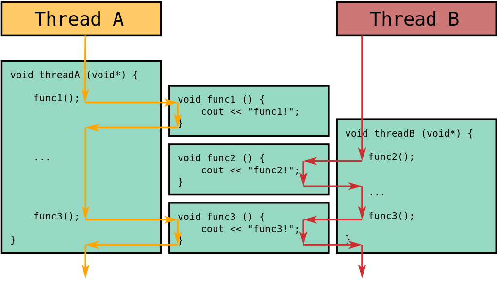
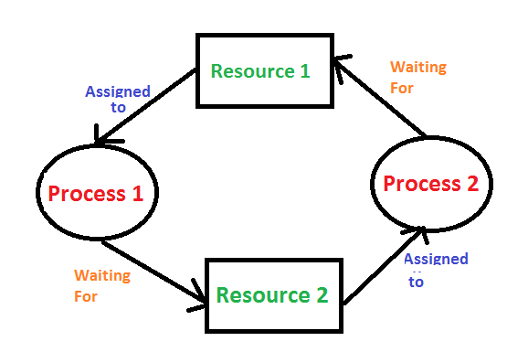
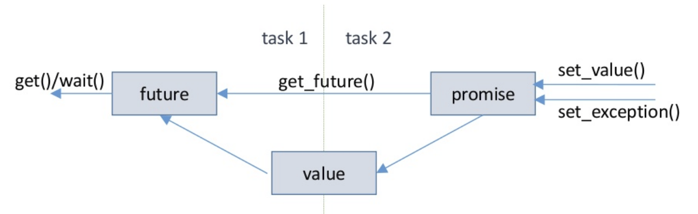
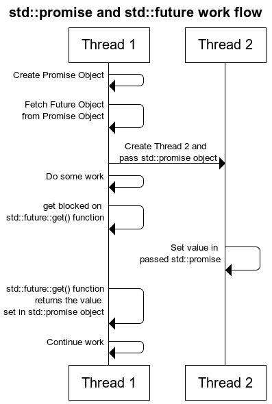

# Advanced C++ Crash Course (Threading and Concurrency)

Author: methylDragon  
Contains an advanced syntax reference for C++  
This time, we'll be going through C++ multithreading and concurrency related stuff!    

------

## Pre-Requisites

**Assumed knowledge (This is a C++ crash course, not a basic coding tutorial)**

- How **variables, loops, conditionals, etc**. work (Basic coding fundamentals will help a lot!)
- Linux (**Terminal/Console proficiency**) (We're going to need to compile our stuff)
- Gone through the all preceding parts of the tutorial
- Some familiarity with threading will help


## Table Of Contents <a name="top"></a>

1. [Introduction](#1)    
2. [C++ Threading Reference](#2)    
   2.1 [Threads](#2.1)    
   2.2 [Creating Threads](#2.2)    
   2.3 [Thread Specific Functions](#2.3)    
   2.4 [Sharing Data](#2.4)    
   2.5 [Waiting, Killing, and Detaching](#2.5)    
   2.6 [Race Conditions](#2.6)    
   2.7 [Atomics](#2.7)    
   2.8 [Mutex and Locks](#2.8)    
   2.9 [A Better Way: Lock Guards](#2.9)    
   2.10 [Lock Guard Types](#2.10)    
   2.11 [Exclusive Locks vs Shared Locks](#2.11)    
   2.12 [Mutex Types](#2.12)    
   2.13 [Event Handling: Condition Variables](#2.13)    
3. [C++ Concurrency Reference](#3)    
   3.1 [Introduction](#3.1)    
   3.2 [When to Use Threads or Tasks](#3.2)    
   3.3 [Promises and Futures](#3.3)    
   3.4 [A Simple Promise-Future Example](#3.4)    
   3.5 [Async](#3.5)    
   3.6 [Async Launch Policies](#3.6)    
   3.7 [Different Ways to Call Async](#3.7)    


## 1. Introduction <a name="1"></a>


[Image Source](<https://msl-network.readthedocs.io/en/latest/concurrency_async.html>)

Everyone likes threading ja. Why not make such an efficient language such as C++ even more efficient with multi-threading.

We're going to talk about the nice `std::thread` class that abstracts away the low level POSIX threads or p threads library in C. We'll also talk about `std::async` for asynchronous thread generation, as well as a bit on locks and atomic types.


## 2. C++ Threading Reference <a name="2"></a>

### 2.1 Threads <a name="2.1"></a>
[go to top](#top)




[Image Source](<https://kholdstare.github.io/technical/2012/08/21/objects-and-threads-in-cpp-1.html>)

You can use the [std::thread](<http://www.cplusplus.com/reference/thread/thread/>) class to start threads. Each instance of this thread represents and wraps and manages a single execution thread.


[Image Source](<https://msl-network.readthedocs.io/en/latest/concurrency_async.html>)

Threads will run **concurrently** if they're on the same processor. But ***in parallel*** if they're on different processors!

Each thread has its own call stack, but **all threads share the heap.**

You can find the maximum number of active threads that you can start. If your number of active threads exceeds this number you won't really get more performance out of it, so take note!

```c++
#include <thread>

unsigned int c = std::thread::hardware_concurrency();
```


### 2.2 Creating Threads <a name="2.2"></a>
[go to top](#top)


There are several ways to create a thread:

- Using a **function pointer**
- Using a **lambda function**
- Using a **functor**

**Function Pointer**

```c++
#include <thread>

// Define a function and start a thread that runs that function
void rawr(param) {}
std::thread rawr_thread(foo, params);
```
**Lambda Function**
```c++
// Define a lambda expression and start a thread that runs that lambda expression
auto rar = [](params) {};
std::thread rar_thread(rar, params);

// Or pass the lambda directly!
std::thread rar_thread([](params) {};, params);
```
**Functor**
```c++
// Define a functor and start a thread that runs the functor's function call
class raa_object_class {
  void operator()(params) {}
}

std::thread raa_thread(raa_class_object(), params);
```

> Don't create threads on the heap with the new operator! Do it automatically on the stack for efficiency like in the examples stated above.


### 2.3 Thread Specific Functions <a name="2.3"></a>
[go to top](#top)


Use `std::this_thread` within threads to refer to the current thread!

**Note that yield() is NOT like the Python yield! It's completely different behaviour.**

```c++
#include <thread>
#include <chrono>

// These can be used within a thread

// Get thread ID of thread
std::this_thread::get_id();

// Give priority to other threads, pause execution
std::this_thread::yield();

// Sleep for some amount of time
std::this_thread::sleep_for(std::chrono::seconds(1));

// Sleep until some time
std::chrono::system_clock::time_point time_point = std::chrono::system_clock::now()
                                                   + std::chrono::seconds(10);
std::this_thread::sleep_until(time_point);
```


### 2.4 Sharing Data <a name="2.4"></a>
[go to top](#top)


**Global Variables**

All global and static variables that are initialised at compile time can be accessed by threads. Since the threads should know the addresses for them.

#### **Passing By Reference**

All parameters passed to a function when starting a thread are **passed by value**, even if you defined in the function to pass by reference!

You need to **explicitly wrap the arguments in std::ref() to pass by reference.**

Example:

```c++
void ref_function(int &a, int b) {}

std::thread ref_function_thread(ref_function, std::ref(1), 2);
```

**Because the thread functions can't return anything, passing by reference is the only way to properly get data out of a thread without using global variables.** Ensure that your thread modifies the data passed in by reference and you should be good to go.

#### **A Note on Static Variables**

Be wary of declaring static variables in a multiple threads though!

```c++
// Suppose this is your thread function
void method()
{
  static int var = 0;
  var++;
}
```

**Note that this does NOT create a separate instance of the static variable per thread instance.** This is because static variables are initialised once when the compiler goes over their declaration.

If you want to have 'static' variables that are static within the scope of each particular thread, use `thread_local` variables instead. Then each thread will have its own version of the static variable, and the static variable will only be destroyed on thread exit.

```c++
void method()
{
  thread_local int var = 0;
  var++;
}
```


### 2.5 Waiting, Killing, and Detaching <a name="2.5"></a>
[go to top](#top)


#### **Waiting to Complete**

You use the `join()` method to wait for a thread to complete.

Calling `join()` will **block the main thread** until the thread that is being waited for completes.

```c++
// Start thread example_thread
std::thread example_thread(some_function); 

// Block and wait for thread to finish
example_thread.join();

// Ok! We're done and good to go on doing other stuff ...
```

**You cannot join a thread if it is not joinable** (maybe you killed it already, or it was detached.)

```c++
// So you can check if a thread is joinable before calling the join method!
if (exmaple_thread.joinable())
{
  example_thread.join(); 
}
```

#### **Kill a Thread**

Use `return`, **not** `std::terminate()`! `terminate()` will kill your entire program process, not an individual thread. 

```c++
return;
```

#### **Detaching a Thread**

You may `detach` a thread. That is, split it from the `std::thread()` object that manages it. Once you do that, you won't be able to manage the thread aside from any mutex or shared resources between the different threads.

Those detached threads will only exit when the main process is terminated or when the top level function exits.

```c++
example_thread.detach();
```


### 2.6 Race Conditions <a name="2.6"></a>
[go to top](#top)


[Image Source](<https://www.modernescpp.com/index.php/c-core-guidelines-rules-for-concurrency-and-parallelism>)

It's always thread-safe if you're only reading variables from multiple threads. But the moment you start writing data from multiple threads, you can potentially crash or create unexpected behaviour.

**Example**

```c++
// Source: https://stackoverflow.com/questions/34510/what-is-a-race-condition

if (x == 5) // The "Check"
{
   y = x * 2; // The "Act"

   // If another thread changed x in between "if (x == 5)" and "y = x * 2" above,
   // y will not be equal to 10.
}
```


### 2.7 Atomics <a name="2.7"></a>
[go to top](#top)


So there are several ways to prevent race conditions. An `std::atomic` is just one way.

An atomic type is mainly a type that implements atomic operations. That is, operations that are thread safe and run independently of any other processes. There can be some overhead, especially when there is a lot of contention around them, but it's hard to get into details for how much overhead exactly, since it's platform and context specific.

Using an atomic type **guarantees no race conditions will occur.** 

> **Use atomic types only when you need them, and native types when you don't. If you care about performance, that is.**

You can check the [Atomic Types Reference](<https://en.cppreference.com/w/cpp/atomic/atomic>) for the full list of how to instantiate them, but here's a couple of examples.

**There's a gigantic list! This table is non-exhaustive:**

|    Type Alias    | Type Instantiation  |
| :--------------: | :-----------------: |
| std::atomic_bool | `std::atomic<bool>` |
| std::atomic_char | `std::atomic<char>` |
| std::atomic_int  | `std::atomic<int>`  |
| std::atomic_long | `std::atomic<long>` |
|        .         |          .          |
|        .         |          .          |
|        .         |          .          |


### 2.8 Mutex and Locks <a name="2.8"></a>
[go to top](#top)


#### **Introduction**

We'll go through this for completeness' sake, but there is a better way to do things (lock guards.)

**Mutexes** are mutual exclusion objects that are used for thread synchronisation. They're a way to keep track of whether a particular thread is using a resource, and will cause threads to block if the resource is currently being taken. It's a way to **protect shared resources and to prevent race conditions.**

They are **owned** by the thread that takes it. Hence, **mutual exclusion!**

This will slow down your threaded program if threads wait too much, so use them sparingly! But you still need to use them to prevent race conditions and to really control the multi-threaded program flow of your program.

They are the **interface** through which you can engage locks for your code!

#### **Deadlocks**

Of course, you need to be careful when you're using mutexes and locks. Overuse of locks will slow down your code, or in certain cases, cause deadlocks, causing your program to completely stall.



[Image Source](<https://www.geeksforgeeks.org/operating-system-process-management-deadlock-introduction/>)

> **Methods for handling deadlock**
>
> 1) **Deadlock prevention or avoidance**: The idea is to not let the system into deadlock state.
> One can zoom into each category individually, Prevention is done by negating one of above mentioned necessary conditions for deadlock.
>
> 2) **Deadlock detection and recovery**: Let deadlock occur, then do preemption to handle it once occurred.
>
> 3) **Ignore the problem all together**: If deadlock is very rare, then let it happen and reboot the system. This is the approach that both Windows and UNIX take.
>
> <https://www.geeksforgeeks.org/operating-system-process-management-deadlock-introduction/>

#### **Example Usage**

> Note that this method is **not recommended**. It's actually an [**anti-pattern**](<http://kayari.org/cxx/antipatterns.html#locking-mutex>) but just included for completeness' sake.

```c++
#include <mutex>

// Create your mutex here
std::mutex my_mutex;

// 
thread_function()
{
  my_mutex.lock(); // Acquire lock
  // Do some non-thread safe stuff...
  my_mutex.unlock(); // Release lock
}
```


### 2.9 A Better Way: Lock Guards <a name="2.9"></a>
[go to top](#top)


It's actually better to just use a lock guard, which manages the lifecycle of a mutex for you.

It's kind of like the `with:` operator in Python.

**Notably, a lock guard releases the lock automatically once the function that it is called in goes out of scope!**

```c++
#include <mutex>

// Create your mutex here
std::mutex my_mutex;
 
thread_function()
{
  std::lock_guard<std::mutex> guard(my_mutex); // Acquire lock
  // Do some non-thread safe stuff...
}
```


### 2.10 Lock Guard Types <a name="2.10"></a>
[go to top](#top)


So there are actually several lock guard types.

You've already seen the standard lock_guard

#### **std::lock_guard<>**

[Reference](<https://en.cppreference.com/w/cpp/thread/lock_guard>)

- Simplest lock guard
- Takes a mutex on construction
- Releases the mutex once it goes out of scope

```c++
std::lock_guard<std::mutex> guard(my_mutex);
```

#### **std::scoped_lock<>**

[Reference](<https://en.cppreference.com/w/cpp/thread/scoped_lock>)

This was introduced in C++17, and is the standard lock guard to use, over `std:;lock_guard<>`, which is included for compatibility.

- It's just a lock guard
- Except it can take **multiple mutexes**

```c++
std::lock_guard<std::mutex, std::mutex> guard(mutex_1, mutex_2);
```

#### **std::unique_lock<>**

[Reference](<https://en.cppreference.com/w/cpp/thread/unique_lock>)

- Just like the normal lock guard, except...
- It initialises an exclusive lock
- It can be returned from the function without releasing the lock (via move semantics)
- It can be released before it is destroyed
- You can also use **nifty lock methods!**

```c++
std::unique_lock<std::mutex> guard(my_mutex);

// Check if guard owns lock (either works)
guard.owns_lock();
bool(guard);

// Return function without releasing the lock
return std::move(guard);

// Release lock before destruction
guard.unlock();
```

If you defer the locks, you can use the **nifty lock methods!**

```c++
// Initialise the lock guard, but don't actually lock yet
std::unique_lock<std::mutex> guard(mutex_1, std::defer_lock);

// Now you can do some of the following!
guard.lock(); // Lock now!
guard.try_lock(); // Won't block if it can't acquire
guard.try_lock_for(); // Only for timed_mutexes
guard.try_lock_until(); // Only for timed_mutexes
```

#### **std::shared_lock<>**

[Reference](<https://en.cppreference.com/w/cpp/thread/shared_lock>)

A shared lock is just like a unique lock, except the lock is a shared lock as opposed to an exclusive one.

- Just like the normal lock guard, except...
- It initialises a shared lock
- It can be returned from the function without releasing the lock (via move semantics)
- It can be released before it is destroyed
- You can also use **nifty lock methods!**

```c++
std::shared_lock<std::mutex> guard(my_mutex);

// Check if guard owns lock (either works)
guard.owns_lock();
bool(guard);

// Return function without releasing the lock
return std::move(guard);

// Release lock before destruction
guard.unlock();
```

If you defer the locks, you can use the **nifty lock methods!**

```c++
// Initialise the lock guard, but don't actually lock yet
std::shared_lock<std::mutex> guard(mutex_1, std::defer_lock);

// Now you can do some of the following!
guard.lock(); // Lock now!
guard.try_lock(); // Won't block if it can't acquire
guard.try_lock_for(); // Only for timed_mutexes
guard.try_lock_until(); // Only for timed_mutexes
```


### 2.11 Exclusive Locks vs Shared Locks <a name="2.11"></a>
[go to top](#top)


**Exclusive locks** (aka write locks) **inhibit all access** from other threads until the lock is released.

**Shared locks** (aka read locks) **inhibit all writes** from other threads until the lock is released. Other threads have to request the lock to be granted the permission to read though.

> Exclusive lock mode prevents the associated resource from being shared. This lock mode is obtained to modify data. The first transaction to lock a resource exclusively is the only transaction that can alter the resource until the exclusive lock is released.
>
> Share lock mode allows the associated resource to be shared, depending on the operations involved. Multiple users reading data can share the data, holding share locks to prevent concurrent access by a writer (who needs an exclusive lock). Several transactions can acquire share locks on the same resource.
>
> ---
>
> Think of a lockable object as a *blackboard* (lockable) in a class room containing a *teacher* (writer) and many *students* (readers).
>
> While a teacher is writing something (exclusive lock) on the board:
>
> 1. Nobody can read it, because it's still being written, and she's blocking your view => ***If an object is exclusively locked, shared locks cannot be obtained*.**
> 2. Other teachers won't come up and start writing either, or the board becomes unreadable, and confuses students => ***If an object is exclusively locked, other exclusive locks cannot be obtained*.**
>
> When the students are reading (shared locks) what is on the board:
>
> 1. They all can read what is on it, together => *Multiple shared locks can co-exist*.
> 2. The teacher waits for them to finish reading before she clears the board to write more => *If one or more shared locks already exist, exclusive locks cannot be obtained*.
>
> <https://stackoverflow.com/questions/11837428/whats-the-difference-between-an-exclusive-lock-and-a-shared-lock>

Notice this means that **if an object is shared locked, you can acquire shared locks, but not exclusive locks.**

Basically: 

- If there are multiple readers, no writers can bind, but readers can bind.
- If there is one writer, no one can bind.


### 2.12 Mutex Types <a name="2.12"></a>
[go to top](#top)


There are [several](<https://en.cppreference.com/w/cpp/thread/mutex>) [types](<https://en.cppreference.com/w/cpp/thread/recursive_mutex>) [of](<https://en.cppreference.com/w/cpp/thread/timed_mutex>) [mutex](<https://en.cppreference.com/w/cpp/thread/recursive_timed_mutex>).

#### **std::mutex**

[Reference](<https://en.cppreference.com/w/cpp/thread/mutex>)

- Just your plain lockable mutex

#### **std::timed_mutex**

[Reference](<https://en.cppreference.com/w/cpp/thread/timed_mutex>)

- Timed mutex
- You can lock for a specified amount of time with `try_lock_for()` and `try_lock_until()`

#### **std::recursive_mutex**

[Reference](<https://en.cppreference.com/w/cpp/thread/recursive_mutex>)

- Multiple locks can be acquired by the same thread
- You need to call unlock the same amount of times you've called lock before the lock is released

#### **std::recursive_timed_mutex**

[Reference](<https://en.cppreference.com/w/cpp/thread/recursive_timed_mutex>)

- Same as the recursive mutex, except it also has the timed locking methods that timed mutexes have

#### **std::shared_timed_mutex**

[Reference](<https://en.cppreference.com/w/cpp/thread/shared_timed_mutex>)

- Read-Write mutex
- Can acquire both exclusive or shared locks (just use the appropriate lock guard type!)

```c++
std::unique_lock<std::shared_timed_mutex> writer_guard(writing_mutex, std::defer_lock);
std::shared_lock<std::shared_timed_mutex> reader_guard(reading_mutex, std::defer_lock);

// Lock them!
std::lock(writer_guard, reader_guard);
```


### 2.13 Event Handling: Condition Variables <a name="2.13"></a>
[go to top](#top)


Sometimes you need to do some nice signal/event handling.

It's possible to do it using a global variable that you constantly lock threads for to check, but it's far more efficient to use **[condition variables](<https://en.cppreference.com/w/cpp/thread/condition_variable>)**.

A condition variable allows you to **wait for some condition to be true** before continuing thread execution. During this time, any locks that were passed to the waiting function are released until the condition is fulfilled. Following which, the lock is reacquired.

> **Example Flow**
>
> 1. Thread **acquires lock**
> 2. Check if condition is false
> 3. If false, call `wait()`, which **releases the lock and blocks the thread until the condition is fulfilled**
> 4. If a condition is fulfilled, the condition variable **must be notified** before it can check
> 5. Once the condition check succeeds, **thread reacquires lock and continues execution**

Let's try it out!

Condition variables use unique_locks, so we'll use that.

#### **Basic Example**

```c++
#include <condition_variable>

// Init
std::condition_variable condition_var;
std::mutex mutex;
bool condition(false);

// Acquire lock
std::unique_lock<std::mutex> guard(mutex);

// Avoid spurious wakeups and 
// ensure wait is only called when the condition has not been fulfilled
while (!condition)
{
  condition_var.wait(guard);
}

// Now in some other thread
{
  // Acquire lock
  std::unique_lock<std::mutex> guard(mutex);

  // We can set the condition to true
  condition = true;

  // And notify one blocked thread by the condition variable that it's ok to wake up
  // (In this case we only have one)
  condition_var.notify_one();

  // If we want to notify all of them instead...
  condition_var.notify_all();
    
  // If we didn't surround the threads with the while (!condition) loop,
  // Notifying the threads will cause the wait to return. So there's no condition check.
  // But this is dangerous since random wakeups can occur without notifications!
}
```

**You may also choose to make the condition be an atomic boolean instead so you can save on lock acquisition for any thread that sets the condition.**

Like so: `std::atomic<bool> condition(true);`

#### **Additional Methods**

```c++
// Wait for some time or until some time is reached
condition_var.wait_for();
condition_var.wait_until();

// There's also a nice function to cleanup any condition variables by a lock acquiring thread
// It's an equivalent call to 
// First: destroying all objects that are meant to destroy on thread exit
// Then: mutex.unlock(); condition_var.notify_all();
std::notify_all_at_thread_exit(condition_var, some_unique_lock);
```

#### **Spurious Wakeups**

A bit tricky. But sometimes condition variables can wakeup on their own due to some [threading technomagic](<https://stackoverflow.com/questions/8594591/why-does-pthread-cond-wait-have-spurious-wakeups>).

It's relatively trivial to guard against it, and it's another layer of protection against human error, so it makes sense to at least try to deal with them explicitly.

```c++
// You guard against spurious wakeups by surrounding the condition variable
// with a check for the condition (you're checking the predicate)
while (!condition)
{
  condition_var.wait(guard);
}

// Alternatively, you can do it this way as well,
// which is neater but slightly less intuitive
condition_var.wait(guard, condition_function);

// If we want to just check a bool called condition we need to use lambdas
condition_var.wait(guard, [](){return condition == true;});
```


## 3. C++ Concurrency Reference <a name="3"></a>

### 3.1 Introduction <a name="3.1"></a>
[go to top](#top)


We just went through manual thread handling in the previous section.

But if you're lazy, or you don't need the tight control the thread, mutex, and lock guard classes offer you, you may choose to adopt **task based parallelism** instead, as opposed to **thread based parallelism**. It's generally considered faster to work with tasks as opposed to threads, especially since the chance of tasks messing up is far lower than that of threads.

With the `std::async` library, manual thread handling is **abstracted away**, and you rely on the library's system to possibly spawn threads, depending on available resources. **The main benefit of this form of parallelism is the great ease in getting returned values from tasks that you start.**

Before, when using threads, you'd have to pass variables via reference and have threads modify the variable. But now with tasks, you can just directly return the result of the task!

So instead of thinking of starting the threads yourself, you can only be concerned with starting **tasks** that will return when they are supposed to. If tasks haven't returned yet, the code will block until it does.


### 3.2 When to Use Threads or Tasks <a name="3.2"></a>
[go to top](#top)


Use **threads** if:

- You need tight control over mutexes
- Need to run long-lived, complex tasks

Use **tasks** if:

- You want fairly simple code and don't care for managing threads
- Are running short tasks


### 3.3 Promises and Futures <a name="3.3"></a>
[go to top](#top)


[Image Source](<https://modoocode.com/284>)



[Image Source](<https://www.slideshare.net/cppfrug/async-await-in-c>)

#### **Header**

```c++
#include <future>
```

#### **Futures**

A [std::future](<https://en.cppreference.com/w/cpp/thread/future>) is a class template that stores a value that will be assigned in the future, and provides a way to access that value (with `get()`). If its value is accessed before the value is assigned, it will block until the value resolves.

Futures are the objects that are **returned** by asynchronous operations (from `std::async`, `std::packaged_task`, or `std::promise`).

**Shared Futures**

A [std::shared_future](<https://en.cppreference.com/w/cpp/thread/shared_future>) works the same way, except it is copyable. Which means that multiple threads are allowed to wait for the same shared state.

#### **Promises**

A [std::promise](<https://en.cppreference.com/w/cpp/thread/promise>) provides a facility to store a value that is later acquired asynchronously via the future **that the promise creates**.

Every promise **is associated with a future**! And a promise **sets** the value of that future. Other objects can then access the future for the value that the promise stores.

#### **A dumb analogy**

> **Today is a Gift. That is why it is called Present.**
>
> You're a parent trying to get a gift for your child.
>
> You give your kid a box, and **promise** them that the gift is inside. The gift is the **future** you are promising. But you tell them to only to check in the future.
>
> If your kid tries to check, you panic, take the box away and, **block** them from checking, until you **fulfill your promise and fill the box** with the gift, then you can give it back and your kid can continue his day having gotten their gift.

#### **A slightly better analogy**

> **Food Analogy**
>
> Let's say you're an office worker. You make an order for lunch from a store across the street via your phone app.
>
> The store owner receives your order, and by the powers of the social contract, makes a **promise** to fulfill your order. He issues you a receipt that is associated with this **promise**, guaranteeing you that you will be able to collect your order in the **future** if he ever fulfills his promise.
>
> You **block** off some time, stop your work at the office, and head down to the store.
>
> But OH NO! The store owner hasn't fulfilled your order yet. And as long as you're waiting to **get()** your order, you can't do any work. Some might even say your **waiting to get your order in the future is blocking your ability to work.**
>
> Once the store owner **sets()** your order down, and lets you **get()** it from his counter though, you're able to **stop getting blocked** and go back to the office to work.


### 3.4 A Simple Promise-Future Example <a name="3.4"></a>
[go to top](#top)




[Image Source](<https://thispointer.com//c11-multithreading-part-8-stdfuture-stdpromise-and-returning-values-from-thread/>)

**Note:** If your promise object is destroyed before you set its value, the `get()` method for its associated future will throw an exception.

**Also note:** Each future's `get()` method can only be called once. If you want a future that can be accessed multiple times, use a shared_future instead. Otherwise, **initialise a different promise future pair.**

```c++
// Create a promise
std::promise<int> promise;

// And get its future
std::future<int> future = promise.get_future();

// You can also get a shared future this way, by the way! (Choose one please)
std::shared_future<int> shared_future = promise.get_future();

// Now suppose we passed promise to a separate thread.
// And in the main thread we call...
int val = future.get(); // This will block!

// Until, that is, we set the future's value via the promise
promise.set_value(10); // In the separate thread

// So now in the main thread, if we try to access val...
std::cout << val << std::endl;

// Output: 10
```

Or, more completely

```c++
// Source: https://thispointer.com//c11-multithreading-part-8-stdfuture-stdpromise-and-returning-values-from-thread/

#include <iostream>
#include <thread>
#include <future>
 
void initiazer(std::promise<int> * promObj)
{
    std::cout<<"Inside Thread"<<std::endl;     promObj->set_value(35);
}
 
int main()
{
    std::promise<int> promiseObj;
    std::future<int> futureObj = promiseObj.get_future();
    std::thread th(initiazer, &promiseObj);
    std::cout<<futureObj.get()<<std::endl;
    th.join();
    return 0;
}
```


### 3.5 Async <a name="3.5"></a>
[go to top](#top)


[std::async](<https://en.cppreference.com/w/cpp/thread/async>)

Now that we've talked about futures and promises we can finally actually get to the real asynchronous coding library.

Async is a function template allows you to spawn threads to do work, then collect the results from them via the **future** mechanism. In fact, calls to `std::async` return a `std::future` object!

**Do note that async does support parallelism, just that the default constructor manages threads for you and may possibly not run the passed functions in a thread. You'll have to explicitly tell it to run the function in a new thread.**

Also, since Linux threads run sequentially by default, it's especially important to force the functions to run in separate threads. We'll see how to do that later.

The simplest call to async is to just pass in a callback function as an argument, and let the system handle it for you.

```c++
auto future = std::async(some_function, arg_1, arg_2);
```


### 3.6 Async Launch Policies <a name="3.6"></a>
[go to top](#top)


You can do better though!

There are three ways to launch an async task:

- `std::launch::async` : Guarantees launch in a separate thread
- `std::launch::deferred`: Function will only be called on `get()`
- `std::launch::async | std::launch::deferred`: Default behaviour. Defer to system.

I like to run async tasks with the `std::launch::async` profile so I can have some semblance of control over the threads. Just **add it in as the first argument!**

```c++
auto future = std::async(std::launch::async, some_function, arg_1, arg_2);
```


### 3.7 Different Ways to Call Async <a name="3.7"></a>
[go to top](#top)


```c++
// Pass in function pointer
auto future = std::async(std::launch::async, some_function, arg_1, arg_2);

// Pass in function reference
auto future = std::async(std::launch::async, &some_function, arg_1, arg_2);

// Pass in function object
struct SomeFunctionObject
{
	void operator() (int arg_1){}
};
auto future = std::async(std::launch::async, SomeFunctionObject(), arg_1);

// Lambda function
auto future = std::async(std::launch::async, [](){});
```


```
                            .     .
                         .  |\-^-/|  .    
                        /| } O.=.O { |\     
```

---

 [.png)](https://www.buymeacoffee.com/methylDragon)
