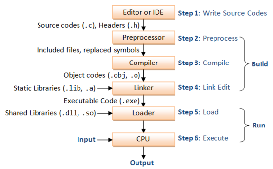
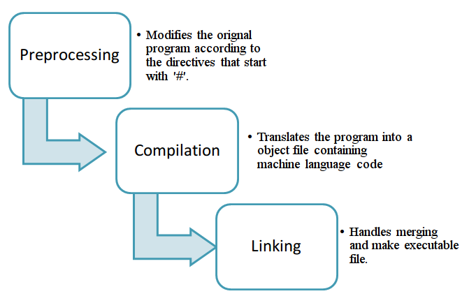

# Advanced C++ Crash Course (Linkages and Preprocessor Directives)

Author: methylDragon  
Contains an advanced syntax reference for C++  
This time, we'll be going through C++ linkages and preprocessor directives!    

------

## Pre-Requisites

**Assumed knowledge (This is a C++ crash course, not a basic coding tutorial)**

- How **variables, loops, conditionals, etc**. work (Basic coding fundamentals will help a lot!)
- Linux (**Terminal/Console proficiency**) (We're going to need to compile our stuff)
- Gone through the all preceding parts of the tutorial
- A background in CMake will be very helpful to contextualise the knowledge you have
- An understanding of the memory structure of a C++ program
  - You can get this in Section 4 of this tutorial: Pointers and Memory


## Table Of Contents <a name="top"></a>

1. [Introduction](#1)    
   1.1 [The C++ Build Process](#1.1)    
   1.2 [Example Build](#1.2)    
2. [C++ Linkages](#2)    
   2.1 [Concept](#2.1)    
   2.2 [Terms](#2.2)    
   2.3 [More on Definitions and Declarations](#2.3)    
   2.4 [Forward Declarations](#2.4)    
   2.5 [The One-Definition Rule](#2.5)    
   2.6 [Scope Refresher](#2.6)    
   2.7 [Internal and External Linkages](#2.7)    
   2.8 [Internal and External Linkage Example](#2.8)    
   2.9 [Caveats for Linkages](#2.9)    
3. [C++ Preprocessor Directives](#3)    
   3.1 [Concept](#3.1)    
   3.2 [Comments](#3.2)    
   3.3 [Global Preprocesses](#3.3)    
   3.4 [#include: Headers](#3.4)    
   3.5 [#define: Macro Basics](#3.5)    
   3.6 [#define: Macro Arguments](#3.6)    
   3.7 [##: Macro Concatenation](#3.7)    
   3.8 [#: Macro Stringification](#3.8)    
   3.9 [#undef: Undefining Macros](#3.9)    
   3.10 [#if, #elif, #else: Conditionals](#3.10)    
   3.11 [#error, #warning: Errors and Warnings](#3.11)    
   3.12 [#pragma: Compiler Specific Macros](#3.12)    
   3.13 [Nice Uses of Macros](#3.13)    
   3.14 [Macro Prescans](#3.14)    
   3.15 [Predefined Macros](#3.15)    
   3.16 [Macro Gotchas](#3.16)    


## 1. Introduction <a name="1"></a>

We spent the last few sections of this tutorial learning the ins and out of writing C++ programs. (To be honest, there's a lot more. The C++ standard has over 1.1k pages after all!, but no one is really expected to know it all.) We've covered most of everything you'll need to function as a competent C++ programmer.

So now it's time to **talk about the compilation process**. Unfortunately this section will not teach you about compilers like GCC, or even the compilation configuration languages like the ones used in make or CMake.

Instead, we will go through relevant sections of the build process and their relevant interfaces in the syntax of a C++ program.


### 1.1 The C++ Build Process <a name="1.1"></a>
[go to top](#top)




[Image Source](<http://www.ikerhurtado.com/relearning-cpp-process-of-writing--building-executing-program>)

That's the entire flow of a C++ program, from writing, to execution.

This section of the tutorial will focus on the parts relevant to the **Build Process**. Namely, the **Preprocessor** and **Linker** steps. We will go through linking first because it is simpler to explain, then talk about the preprocessor.


[Image Source](<https://www3.ntu.edu.sg/home/ehchua/programming/cpp/gcc_make.html>)

> The compilation of a C++ program involves three main steps:
>
> 1. **Preprocessing**: the preprocessor takes a C++ source code file and deals with the `#include`s, `#define`s and other preprocessor directives. The output of this step is a "pure" C++ file without pre-processor directives.
>
>    - Preprocessor directives will be essentially completely replaced with some form of text, and the output of preprocessing should be a completely compiler parseable C++ file.
>    - Outputs a **translation unit**.
>
> 2. **Compilation**: the compiler takes the pre-processor's output and produces an object file from it.
>
>    - This is pretty cool, because you can compile each source file separately. You won't need to recompile everything if you make changes!
>    - Notably, the compilers won't care if there are declarations of symbols but no definitions of them. (Symbols can be things like the names for variables and functions.)
>    - Outputs **assembly code** that will be assembled to form an **object file**.
>
>    - Syntax errors and failed overload resolution errors are found here
>
> 3. **Linking**: the linker takes the object files produced by the compiler and produces either a library or an executable file.
>
>    - Outputs a **binary executable**
>    - This works by having the linker replace the references to undefined symbols with the correct ones
>      - And this works because the final executable will have one single stack-heap, bss, data, etc. memory block to deal with
>    - Redefinition or missing definition errors are found here
>
> Adapted from: <https://stackoverflow.com/questions/6264249/how-does-the-compilation-linking-process-work>

To sum up:



[Image Source](<http://www.cplusplus.com/articles/2v07M4Gy/>)


### 1.2 Example Build <a name="1.2"></a>
[go to top](#top)


[Image Source](<https://www.cs.odu.edu/~zeil/cs252/s17/Public/compilation/index.html>)

Notice that each individual cpp is actually compiled into separate object files. Then the object files are linked together with the std library to eventually produce the executable program!

This program would have a CMakeLists.txt like this!

```cmake
cmake_minimum_required(VERSION 2.8)
project(program)

# Specify the header locations
include_directories(
  include # This should store rectangle.h
)

# Internally, each source file should then have #includes that will get preprocessed
# Then the preprocessed source will get compiled

# Now target the build of the executable called program
# By linking the object files generated from main and rectangle!
add_executable(program src/main.cpp src/rectangle.cpp)
target_link_libraries(main some_lib) # And any other static library you want to link!
```


## 2. C++ Linkages <a name="2"></a>

Some parts of this section will be heavily adapted from [these](<http://www.goldsborough.me/c/c++/linker/2016/03/30/19-34-25-internal_and_external_linkage_in_c++/>) [tutorials](<http://cs.stmarys.ca/~porter/csc/common_341_342/notes/storage_linkage.html>).


### 2.1 Concept <a name="2.1"></a>
[go to top](#top)


Ok. So if you read the previous section, you should have an understanding that linkages happen to combine several object files (and static libraries) into a **single executable**.

Now also note, that that single executable will have its own memory segment stored to it!

So if you recall from the Pointers and Memory section (section 4 of this tutorial) the executable's memory will look like this:


[Image Source](<https://www.geeksforgeeks.org/memory-layout-of-c-program/>)


[Image Source](<https://www.quora.com/Is-it-a-design-fault-that-C++-itself-has-no-garbage-collection>)

So technically, every piece of data in the executable is obtainable at runtime, **as long as you have the memory address of that data**! 

And if you recall, there's a structured way to organise your data.

The linker doesn't care so much for runtime/dynamic data, since the memory addresses then are generated on the fly. But for **static and global data**, there are meaningful differences!

> Also note, linkers can do optimisations as well! Such as removing duplicate declarations once it combines everything together. It's a really deep rabbit hole, especially if you also consider the next step -- loading, which allows for linking with external dynamic libraries for still as yet undefined references.


### 2.2 Terms <a name="2.2"></a>
[go to top](#top)


Let's just get some terms out of the way first.

#### **Symbols**

A symbol is any sort of 'code entity' that exists in your code.

```c++
int a;
```

In this case, a is the symbol, and we know that it is an integer.

This works for variables, functions, classes, and structs.

#### **Translation Unit**

A translation unit is merely the pure C++ code that is generated from the preprocessor!

So for example, if your code was:

```c++
#include <iostream>
#define A 1

int main(){
  std::cout << A << std::endl;
  return 0;
}
```

The translation unit that is generated is

```c++
[lots of code from the library header named "iostream"]

int main(){
  std::cout << 1 << std::endl;
  return 0;
}
```

Simple text replacement! Cool eh?

#### **Definition vs Declaration**

When you **declare** something, you let the compiler know that a symbol exists.

When you **define** something, you let the compiler know that a symbol exists, and also how much memory to allocate to it, and what value its memory address contains.


### 2.3 More on Definitions and Declarations <a name="2.3"></a>
[go to top](#top)


The confusing bit is that **what constitutes a definition and a declaration is different for different types of symbols!**

#### **Functions, Methods, Classes, and Structs**

These are as expected

```c++
int a(); // Declaration
int a(){ return 1; } // Definition

// Classes and Structs not shown, but they work the same way.
```

#### **Variables, and Class Members**

Declarations are not separate unless you explicitly say so!

```c++
int x; // This is a definition! Just that x has junk data since it is not initialised

// This is also a definition! But static variables are initialised to their default
// In this case, 0
static int x;
```

If you want to separate the two, use the `extern` keyword.

```c++
extern int x; // Declaration
int x = 1; // Definition
```


### 2.4 Forward Declarations <a name="2.4"></a>
[go to top](#top)


This is when you declare a symbol without giving it a complete definition in the same file.

This is because compilers require that declarations of a symbol in a particular translation unit are seen first before allowing the unit to compile.

Consider this.

main.cpp:

```c++
f(); // Forward declaration here

int main(){
  f(); // This works even though there's no definition!
  return 0;
}
```

func.cpp:

```c++
f() {return 1;} // Definition here
```

This works as long as you link `func.cpp` and `main.cpp` together!!

Ultimately, all that matters is, **in order to use something, you must have declared it somewhere in the translation unit**, that is the reason why headers work and headers are included, even though the headers don't technically usually specify the definitions! (Since you'll link the source files that contain the definitions later on.)


### 2.5 The One-Definition Rule <a name="2.5"></a>
[go to top](#top)


> - **You can declare something multiple times across all translation units for a particular exectuable**.
> - **You cannot define something multiple times across all translation units for a particular executable**.
>
> Every declared symbol should have a definition somewhere in any of the object files being linked. Otherwise you'll get a missing definition error!

There can only be **ONE** definition per symbol within each translation unit!


### 2.6 Scope Refresher <a name="2.6"></a>
[go to top](#top)


Make sure that before proceeding with this part you're familiar with the concepts of the **Global, Static, Function/Local, and Namespace scopes**.

But if not, here's a refresher.

```c++
int GLOBAL_SCOPED_VAR(1);
static int STATIC_SCOPED_VAR(1);

namespace
{
  int NAMESPACE_SCOPED_VAR(1);
  static int ALSO_STATIC_SCOPED_VAR(1);
}

namespace RAWR
{
  int NAMESPACE_RAWR_SCOPED_VAR(1);
  static int ANOTHER_STATIC_SCOPED_VAR(1);
}

int GLOBAL_SCOPED_FUNCTION()
{
  int FUNCTION_SCOPED_VAR(1);
  return FUNCTION_SCOPED_VAR;
}
```

Remember again that as global and static symbols get pushed into the data segment of memory for an executable, they persist and are accessible from anywhere in the file.

Whereas for the others, those symbols can't be used out of scope.


### 2.7 Internal and External Linkages <a name="2.7"></a>
[go to top](#top)


So then that begs the question. **What is the meaningful difference between global and statically scoped symbols?**

```c++
static int i; // Static variable
int j; // Global variable
```

In order to understand that we'll need to look at the difference between internal and external linkages.

- **Global** symbols are accessible in other source files using the `extern` keyword
  - They're externally linked! That is, they're accessible outside the linker scope. **Accessible outside the translation unit**. (As long as the objects are linked.)
  - These symbols are also known to have **program scope**
- **Static** symbols are only accessible in the source file it is declared in
  - They're internally linked! That is, they're local to the linker scope. **Local to the translation unit**.
  - These symbols are also known to have **file scope**

> - `extern` extends the scope of a variable.
> - `static` restricts the scope of a variable.


### 2.8 Internal and External Linkage Example <a name="2.8"></a>
[go to top](#top)


Let's look at an example! Suppose we want to make an executable that links the following source files together.

**Note that this is a bad example that won't compile!**

**vars.h**

```c++
int wow(5);
```

**A.cpp**

```c++
#include "vars.h"
```

**B.cpp**

```c++
#include "vars.h"
```

Now, because A.cpp and B.cpp get preprocessed into this, each:

```c++
int wow(5);
```

When you link both A.cpp and B.cpp together, you actually get a **redefinition error!**


**You fix it by declaring the variable as extern in the header instead so there is only one definition**

**vars.h**

```c++
extern int wow;
```

**vars.cpp**

```c++
#include "vars.h" // Nice but not necessary if you link properly

int wow(5);
```

**A.cpp**

```c++
#include "vars.h" // This is so wow is declared!

static int a(1); // a here is 1!
int b(1);

// We also have access to wow! As it has been declared in this translation unit!
```

**B.cpp**

```c++
#include "vars.h" // This is so wow is declared!

static int a(2); // a here is 2!
extern int b; // b here will refer to A.cpp's b

// We also have access to wow! As it has been declared in this translation unit!
```

This is **valid**! Even if it looks like there are multiple definitions of a, there actually aren't, since those definitions are **link-local** and not visible outside each source file!


### 2.9 Caveats for Linkages <a name="2.9"></a>
[go to top](#top)


- All function symbols are implicitly defined `extern`. If you want them to not be, write `static`.
- Locally defined variables cannot be `extern`ed. Only global variables declared outside of function or namespace scope can!
- All `const` objects declared at global scope have internal linkage by default
  - It's equivalent to saying `static const`
  - The linker will treat consts as globals once there is an `extern const` declaration somewhere though!


## 3. C++ Preprocessor Directives <a name="3"></a>

Ok! Cool, now we have some understanding of linkages, we can go ahead and mess around with preprocessor stuff.

We'll base some of this on [this tutorial](<https://www.math.utah.edu/docs/info/cpp_1.html>), but note that this tutorial will not serve as an exhaustive treatise on preprocessor invocations. Just good enough to help you tremendously with writing programs.

>  **FAIR WARNING IS TO BE HAD**: It is important to not abuse C++ macros/preprocessor directives as it can make your code obnoxiously hard to debug, and has a very high chance of introducing bugs into your code.
>
> **If you can afford to not use them, you'd best not.** (Save for maybe the `#include` directive and a couple of other handy stuff like header guards.)


### 3.1 Concept <a name="3.1"></a>
[go to top](#top)


We know from the first section that the preprocessor kicks in as the first step in the build process.


[Image Source](<https://www3.ntu.edu.sg/home/ehchua/programming/cpp/gcc_make.html>)

Pre-processor commands are generally denoted by the `#` symbol. There's quite a few of them, but just think of pre-processor stuff as literal **text replacement of the source code** that eventually produces a single translation unit.

So for example...

**A.hpp**

```c++
int a = 5;
```

**A.cpp**

```c++
#include "A.hpp"

int main()
{
  a + 5;
  return 0;
}
```

The eventual preprocessed output will be

```c++
int a = 5;

int main()
{
  a + 5;
  return 0;
}
```

Text replacement! In this case the `#include` statement just copy pastes the entirety of the contents of A.hpp into the place it is included in.

Let's go through one more example before we start.

**B.cpp**

```c++
#define HI 1
#define wow 2

int main()
{
  HI + wow;
  return 0;
}
```

Gets preprocessed into

```c++
int main()
{
  1 + 2;
  return 0;
}
```

Nice! More text replacement.

> **Note**: The preprocessor allows whitespaces after the `#` as well!

Ok! Now we're good to jump into the wild wild world of preprocessor directives! There are a lot of them, and I'm not sure if I can cover all the subtleties, but let's see where this takes us!


### 3.2 Comments <a name="3.2"></a>
[go to top](#top)


You should use C style comments `/* like this */` if you want to have comments inside preprocessor directive statements.

```c++
#include "wow.h" /* like so */
```


### 3.3 Global Preprocesses <a name="3.3"></a>
[go to top](#top)


These are stuff that happens always, regardless of whether you explicitly invoke the preprocessor with a directive or not!

- All C style comments `/* like this one */` are replaced with single spaces

- All backslashes `\` that precede a newline character will cause both the `\` and the newline to be deleted

  ```c++
  int so_\
  this\
  ()
  {
    return 1;
  }
  
  // Will become this
  int so_this()
  {
    return 1;
  }
  
  // Handy for neatening your code!
  ```

- Predefined macros are also expanded (eg. `__FILE__`)

> **Note**: These won't apply in these cases:
>
> - Inside `< >` inside a `#include` directive
> - Within a char or string constant
> - The backslash replacement will not apply inside a trigraph, but we won't go through trigraphs since they're pretty messy and unintuitive


### 3.4 #include: Headers <a name="3.4"></a>
[go to top](#top)


You should be very familiar with this already. The `#include` directive call replaces the call with the contents of the header file being included.

There are three variants:

- `#include <file>`
  - Searches for the file in a list of specified directories (invoked by the include_dirs statement in CMake, for example), and then in the standard system directories
  - Generally used for system header files
- `#include "file"`
  - Searches for the file first in the current directory, and then same as the above variant
- `#include something_else_entirely`
  - something_else_entirely will be a macro that's expanded to fit one of the two conventions above. It's good for changing the includes dynamically on the fly


### 3.5 #define: Macro Basics <a name="3.5"></a>
[go to top](#top)


Define stuff. You can only define them once! Otherwise you'll get a redefinition error.

**Basic**

```c++
#define WOW 100 /* Definition */
WOW; // Usage

// When preprocessed will become
100;
```

**Indirect References**

```c++
// Definitions
#define RAWR 100
#define RAA RAWR

// Usage
RAA;

// Becomes
100;

// If you change RAWR's preprocessor macro value,
// RAA will reflect the current value of RAWR

// Note that this happens at compile time, not runtime!
```

>  If, however, RAWR is not defined, then it becomes
>
> ```c++
> RAWR;
> ```
>
> Which will give an error if RAWR is not defined as a variable name.


### 3.6 #define: Macro Arguments <a name="3.6"></a>
[go to top](#top)


They can take arguments too!

```c++
#define PRINT_THIS(X) std::cout << X; /* Definition */
PRINT_THIS("A"); // Usage

// When preprocessed, becomes
std::cout << "A";
```

It also works with multiple arguments

```c++
#define min(X, Y)  ((X) < (Y) ? (X) : (Y)) /* Definition */
min(1, 2); // Usage

// When preprocessed, becomes
((1) < (2) ? (1) : (2));

// It supports arbitrary arguments too!
min(x + y, foo(z));

// Becomes
// Beware with this, since foo(z) gets called twice as a result of this macro expansion
((x + y) < (foo(z)) ? (x + y) : (foo(z)));
```


### 3.7 ##: Macro Concatenation <a name="3.7"></a>
[go to top](#top)


Use `##`

```c++
#define WOW(NAME, VALUE) int wow_var_ ## NAME = VALUE; /* Definition */
WOW(A, 5) // Usage
    
// When preprocessed, becomes
int wow_var_A = 5;
```

Cool!


### 3.8 #: Macro Stringification <a name="3.8"></a>
[go to top](#top)


Prepend the macro call with #

```c++
#define PRINT_ME(SOME_STR) printf("%s", #SOME_STR);
PRINT_ME(AAA) // Usage
    
// When preprocessed, becomes
printf("%s", "AAA"); // Neat!
```


### 3.9 #undef: Undefining Macros <a name="3.9"></a>
[go to top](#top)


Note that this only undefines the macro, not the substitutions!

```c++
#define RAWR 4
x = RAWR;
#undef RAWR
y = RAWR;
#define RAWR 3
z = RAWR;

// When preprocessed, becomes
x = 4;
y = RAWR; // Might give you an error if the variable name RAWR isn't defined
z = 3;
```

So this is a way for you to reassign the value of a particular macro.


### 3.10 #if, #elif, #else: Conditionals <a name="3.10"></a>
[go to top](#top)


If, Else, Else If. Nice.

```c++
#define X 5;

#if X == 5
// THE STUFF HERE WON'T RUN IF X ISN'T 5
#elif X == 3
// MMM... RUNS THIS IF X is 3
#else
// OTHERWISE, IT'LL RUN HERE
#endif
```

There's also one for checking if a macro name is defined or not. They're useful for **header guards** (check the header section for that one)

```c++
#ifdef SOME_MACRO_NAME
// RUN THIS IS SOME_MACRO_NAME IS DEFINED
#endif

#ifndef SOME_OTHER_NAME
// RUN THIS IF SOME_OTTHER_NAME IS NOT DEFINED
#endif

// These are equivalent to
#if defined (SOME_MACRO_NAME)
#endif

// And
#if ! defined (SOME_OTHER_NAME)
#endif
```

Standard header guard use is like so

```c++
#ifndef HEADER_FLAG_
#define HEADER_FLAG_

// Header stuff

#endif

// This prevents redefinitions or redeclarations of the header stuff! So it ensures that the header is only substituted once in a single translation unit.
```


### 3.11 #error, #warning: Errors and Warnings <a name="3.11"></a>
[go to top](#top)


You can use these inside a conditional to halt compilation!

Use `#error` and `#warning`

```c++
#if SOME_CONDITION
#error THROW THIS ERROR MSSAGE
#endif

#if SOME_OTHER_CONDITION
#warning THROW THIS WARNING MESSAGE
#endif
```


### 3.12 #pragma: Compiler Specific Macros <a name="3.12"></a>
[go to top](#top)


The `#pragma` call is for compiler specific stuff. So when you see it, it's best to Google it.

Here's an example of a call. (This works on major compilers like Clang, GCC, Intel C++, and MSVC.)

```c++
// In a header file

#pragma once
// Stuff that will be included once, no matter how many times the header is included
```

That particular call achieves something like a header guard.


### 3.13 Nice Uses of Macros <a name="3.13"></a>
[go to top](#top)


You can use macros to define batches of variables at once!

```c++
#define DOUBLE_VAR(n, v) int int_ ## n(v);\
double double_ ## n(v);

// Usage
DOUBLE_VAR(a, 1)

// Becomes
int int_a(1);
double double_a(1);
```

Pretty cool! You can also use it to define functions too!

```c++
#define STORE_VAR(n, v) int n(void)\
{\
  static stored_var_ ## n = v;\
  return stored_var_ ## n;\
}

// Usage
STORE_VAR(A, 5);
A();

// Becomes
int A()
{
  static int stored_var_A = 5;
  return stored_var_A;
}
A();
```

Pretty nifty!


### 3.14 Macro Prescans <a name="3.14"></a>
[go to top](#top)


Heavily adapted from [here](<https://www.math.utah.edu/docs/info/cpp_1.html>).

We should spend some time talking about how nested macro expansions actually work, since it'll help with debugging and writing nested macro calls.

So let's suppose we have a macro defined as such

```c++
#define MACRO_NAME MACRO_TEXT
```

The actual process for macro expansion is as follows:

**Parse**

- Parse the directive indicated by the `#` symbol, from this we know that we want to #define a macro
- Parse and substitute in the arguments

**Prescan**

- Now, parse each word in `MACRO_TEXT` for defined macros
- Substitute any macros found into `MACRO_TEXT`

**Expand**

- Now, calls to MACRO_NAME will expand out the expanded MACRO_TEXT

Here's an example

```c++
#define str(s) #s lose(s)
#define RAWR 4

str(RAWR)
    
// This becomes
"RAWR" lose(4) // Notice in the first scan that s got substituted from RAWR to 4
```

Now, the reason why this is important is if you want to control the flow of your substitutions with nested calls.

```c++
// Suppose we define these
#define foo  a, b
#define bar(x) lose(x)
#define lose(x) (1 + (x))

// We'd like this to become
// (1 + (foo))
bar(foo)
    
// But it actually becomes this in the prescan:
lose(a, b) // Which the subsequently fails as lose takes 1 argument

// In order to fix it, we need to use parentheses
#define foo (a, b)
#define bar(x) lose((x))
#define lose(x) (1 + (x))
    
// So now,
bar(foo)
// Becomes, in the prescan
lose((a, b)) // Which works and becomes...
(1 + ((a, b)))
```

> **Note**: If you decided to use #s to stringify a macro call, the name of the macro will immediately get stringified instead of getting prescanned.
>
> So for example:
>
> ```c++
> #define str(s) #s
> #define foo 4
> str (foo)
>     
> // Will become "foo"
> ```
>
> If you wanted to stringify it, you can use the prescan mechanism to do it
>
> ```c++
> #define xstr(s) str(s)
> #define str(s) #s
> #define foo 4
> xstr (foo)
> ```
>
> <https://www.math.utah.edu/docs/info/cpp_1.html>

If in doubt also, just surround your macro call with `()` parentheses to convert them into an expression.


### 3.15 Predefined Macros <a name="3.15"></a>
[go to top](#top)


There's a couple of predefined macros. You can find the full list [here](<https://gcc.gnu.org/onlinedocs/cpp/Predefined-Macros.html>), but I'll just go through a couple.

There's **a lot more**, mostly to see what sort of C or C++ standard or compile settings you're using.

| Macro      | Type           | Description                                                  |
| ---------- | -------------- | ------------------------------------------------------------ |
| `__FILE__` | const C string | Name of the input argument, or the one specified in #include |
| `__LINE__` | const int      | Current input line number                                    |
| `__DATE__` | const string   | Current date: Like "Jan 1 2000"                              |
| `__TIME__` | const string   | Current time: Like "23:59:59"                                |

There's a couple of compiler specific ones as well.


### 3.16 Macro Gotchas <a name="3.16"></a>
[go to top](#top)


#### **Self References Don't Work**

This is by design!

```c++
// Take this for example
#define X (2 + X)

// When you use it like this
X;

// It becomes this:
(2 + X); // It doesn't get re-expanded, and you get a wrong syntax error!
```

This also applies for indirect references

```c++
// Recall this:
// Definitions
#define RAWR 100
#define RAA RAWR

// Usage
RAA;

// Becomes
100;
```

```c++
// Now, if we do this, and make sure there is no macro
// Definition
#define A B
#define B A

// Usage
A;
B;

// When preprocessed, becomes
B;
A;

// And you'll get a syntax error if A and B are not defined variables
```


#### **Unintended Grouping for Arithmetic**

Notice that since macros are just text replacement, you can get unintended orders of operations with arithmetic if you're not careful.

```c++
#define SUM(X, Y) X + Y

// Now suppose we used it like this
float a = SUM(1, 3);

// It becomes
float a = 1 + 3; // This is fine.
```

The problem comes when you expect your user to treat `SUM(X, Y)` as a single number

```c++
float b = SUM(1, 3) / 2;

// As a user reading this, you would expect something like 4 / 2 = 2
// But actually it resolves to
float b = 1 + 3 / 2; // Which gives you 2.5
```

Luckily there is an easy way to resolve this, by **wrapping every argument, and the entire expression with parentheses**. (You wrap each argument so any extra stuff that you input also is treated as a singular expression.)

```c++
#define SUM(X, Y) ((X) + (Y)) /* Easy! */
```


#### **Unintended Multiple Function Calls**

Suppose we have a function `rawr()` that has some side effect.

Let's recall our min() preprocessor macro as well.

```c++
#define min(X, Y)  ((X) < (Y) ? (X) : (Y)) /* Definition */

// Now suppose we use it this way
min(x + y, rawr(z));

// It becomes
((x + y) < (rawr(z)) ? (x + y) : (rawr(z)));
```

But now we have some troublesome stuff! Notice the multiple uses of `rawr()`? If it has side effects and you are not aware of this, you'll get multiple calls to `rawr()` and its side effects will fire multiple times. So just be very aware of this!


```
                            .     .
                         .  |\-^-/|  .    
                        /| } O.=.O { |\     
```

---

 [.png)](https://www.buymeacoffee.com/methylDragon)
