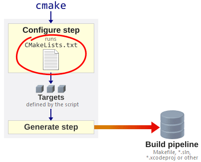
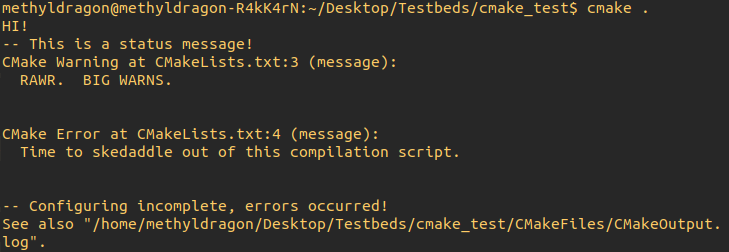
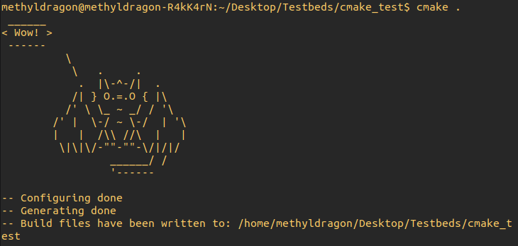
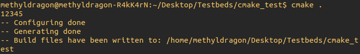
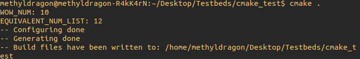
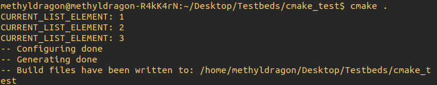
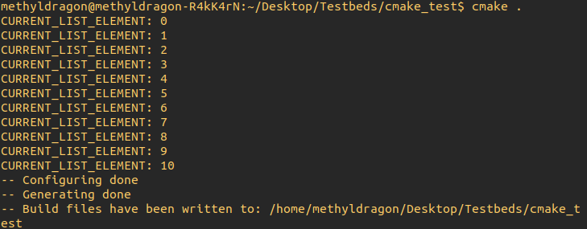
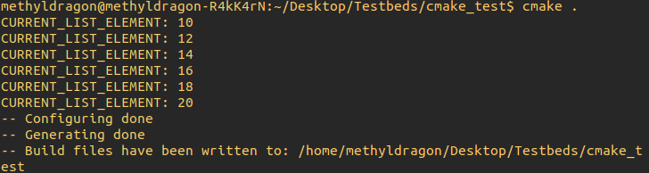
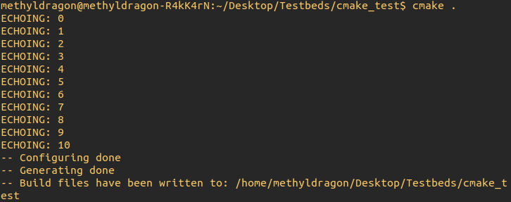

# CMake Crash Course - Basics and Scripting

Author: methylDragon  
Contains a syntax reference for CMake. We'll be going through some concepts, the CLI, and scripting with CMake!    

------

## Pre-Requisites

**Assumed knowledge**

- Have a rudimentary understanding of C/C++
  - Since CMake is used to build C/C++ projects!
- Understood the linkage and build concepts from [this tutorial](../C++/08%20C++%20-%20Linkages%20and%20Preprocessor%20Directives.md)
- The tutorial is written with Linux users in mind, specifically Ubuntu
  - But the scripting section should apply in general


## Table Of Contents <a name="top"></a>

1. [Introduction](#1)    
2. [CMake Concepts and Command Line](#2)    
   2.1 [Installation](#2.1)    
   2.2 [CMakeLists.txt](#2.2)    
   2.3 [CMake Build Order](#2.3)    
   2.4 [Project Structure](#2.4)    
   2.5 [Invoking CMake](#2.5)    
   2.6 [Configuring CMake](#2.6)    
   2.7 [Ordering](#2.7)    
3. [CMake Scripting](#3)    
   3.1 [Code Style](#3.1)    
   3.2 [Minimal CMakeLists.txt](#3.2)    
   3.3 [Comments](#3.3)    
   3.4 [Printing](#3.4)    
   3.5 [Variables](#3.5)    
   3.6 [Variable Scope and Directories](#3.6)    
   3.7 [User Input: Cache Variables](#3.7)    
   3.8 [User Input: Options](#3.8)    
   3.9 [Prefixes](#3.9)    
   3.10 [Conditionals](#3.10)    
   3.11 [Loops](#3.11)    
   3.12 [Functions](#3.12)    
   3.13 [Macros](#3.13)    


## 1. Introduction <a name="1"></a>

CMake is **Cross-platform Make**, where `Make` is the utility for building programs from source code.

> CMake is an extensible, open-source system that manages the build process in an operating system and compiler-independent manner. Unlike many cross-platform systems, CMake is designed to be used in conjunction with the native build environment. Simple configuration files placed in each source directory (called CMakeLists.txt files) are used to generate standard build files (e.g., makefiles on Unix and projects/workspaces in Windows MSVC) which are used in the usual way.
>
> <https://cmake.org/overview/>

In other words, **CMake is used to generate files that are used with Make to build a project**. It's like a meta-build system. (Though, actually, it can be used with a lot more build pipelines like Visual Studio, XCode, and more!)

Additionally, **CMake** is more generally used nowadays due to its convenience and simplicity (relative to pure `Make`), and so, it is far more useful to learn as a build tool. This is especially true since anything you can do in `make`, you can do in CMake.

> When comparing CMake with Make, there are several advantages of using CMake:
>
> - Cross platform discovery of system libraries.
> - Automatic discovery and configuration of the toolchain.
> - Easier to compile your files into a shared library in a platform agnostic way, and in general easier to use than make.
>
> <https://prateekvjoshi.com/2014/02/01/cmake-vs-make/>

Also note, **this tutorial will not serve to be an exhaustive guide on everything CMake**, but is designed to be just enough to get you up to speed and able to work somewhat effectively on projects.

Additionally, since CMake is mostly used with C or C++, this tutorial will focus on use of CMake with those languages.

**In this section, we'll go through some concepts, the command line interface, and scripting basics.**


## 2. CMake Concepts and Command Line <a name="2"></a>

Before we can even begin trying to code with CMake, we need to know what it actually does, and how to use it from the command line. So let's take a look!

### 2.1 Installation <a name="2.1"></a>
[go to top](#top)


```shell
sudo apt install cmake
```

Wow! So easy! If this doesn't work, check your software repositories, or seek out a **PPA** repository.


### 2.2 CMakeLists.txt <a name="2.2"></a>
[go to top](#top)


CMake is **invoked by using a `CMakeLists.txt` file placed in the root directory of a project** (though you can nest projects too!) This file tells CMake what to do and configures the final `makefile` that is produced, which will then be subsequently used with `Make` to build your project.


### 2.3 CMake Build Order <a name="2.3"></a>
[go to top](#top)




[Image Source](<https://preshing.com/20170522/learn-cmakes-scripting-language-in-15-minutes/>)

CMake first configures itself by checking the `CMakeLists.txt` file. The configuration should specify the targets for build, their linkages, as well as any build properties or configurations, as well as run any configuration time logic.

Then, it runs that configuration through a generation step to produce a Makefile or some other build pipeline that can be used to actually build your targets.


### 2.4 Project Structure <a name="2.4"></a>
[go to top](#top)


There's no standardised way to structure a C++ project, but here is a generally acceptable project structure.

This is especially important since **CMake will generate a whole bunch of files where the `cmake` command is invoked**. And no one wants generated files clogging up their source directories.

```
my_project
-	src/
-	include/
-	build/
-	CMakeLists.txt
```

There are also a couple of additional folder directories that you can put in, and a couple of other files that you can place in your project directory. Here's a full description of them!

Also, do note that you **can nest projects**!

**Folders**

| Name       | Description                                                  |
| ---------- | ------------------------------------------------------------ |
| `src/`     | Stores source files and private headers                      |
| `include/` | Stores public headers for using the project's public API     |
| `build/`   | Invoke CMake from within this folder for neatness' sake, so all CMake-generated files go in here |
| `extern/`  | External projects go here. Cool thing is that these projects can have their own CMakeLists.txt and you can invoke those files in the parent project's CMakeLists.txt |
| `doc/`     | Store documentation                                          |
| `test/`    | Stores test scripts                                          |
| `data/`    | Stores files that are used by the executables                |

**Files**

| Name             |                                                              |
| ---------------- | ------------------------------------------------------------ |
| `CMakeLists.txt` | Input to CMake build system for building software packages   |
| `README.md`      | README for the project. Check out [how to write a good one](<https://www.makeareadme.com/>)! |
| `LICENSE`        | License for your code                                        |


### 2.5 Invoking CMake <a name="2.5"></a>
[go to top](#top)


We'll assume your project follows the structure detailed in the previous section, and that it already has a preconfigured `CMakeLists.txt`. As such, we'll build our project in the `build/` directory.

```bash
# So, starting in the project directory...

cd build
cmake ..
make
```

So we:

- Move into the `build/` directory
- Invoke CMake on the `CMakeLists.txt` in the project directory to generate the makefile
- And call Make to build the project based off of the generated `Makefile`


### 2.6 Configuring CMake <a name="2.6"></a>
[go to top](#top)


You can also configure CMake further with command line arguments though! **I can't go through all of them, but here are a couple of handy ones**.

#### **Specify a non-default generator**

The default pipeline that is created when CMake is invoked are makefiles. But you can specify a custom one to use!

Just use the `-G` flag!

```bash
cmake --help # See all available generators

cmake -G "GENERATOR_NAME_HERE"
cmake -G "Ninja" # Example
```


#### **Set Variable (Example: Change Build Type)**

Use the `-D` flag!

So for example, to change the build type,

```shell
cmake -DCMAKE_BUILD_TYPE=Debug # Build unoptimised code with debug flags
cmake -DCMAKE_BUILD_TYPE=MinSizeRel # Build optimised code, but at minimal size
cmake -DCMAKE_BUILD_TYPE=RelWithDebInfo # Build optimised code with debug flags
cmake -DCMAKE_BUILD_TYPE=Release # Build optimised code with no debug flags

cmake -D CMAKE_BUILD_TYPE=Release # This also works!
```

> Additionally, do note that this is actually the **best practice for invoking CMake**


#### **View Cached Variables**

So you can see what variables were used during the latest invocation of CMake

```bash
cmake -L -N .
```


#### **Setting Build Directory**

So, actually, you don't have to call CMake from inside the build folder because you can actually just specify the build folder to build into using a couple of flags.

So your usual invocation of

```bash
cd build
cmake ..
make
```

Becomes

```bash
cmake .. -B build
make
```


### 2.7 Ordering <a name="2.7"></a>
[go to top](#top)


You should **think of CMake as a kind of scripting language that eventually produces files that are used to command the build of a project**. (Because it actually IS a scripting language.)

As such, it is important to keep in mind the fact that **the order of calls in the CMakeLists file matters**.


## 3. CMake Scripting <a name="3"></a>

Now that we have a rough understanding of how to use CMake. Let's look at some basic programming constructs within CMake!

We'll cover this before the actual build configuration part of CMake because it helps give a good background understanding moving forward, especially once variables and conditions start getting thrown all around.

**So do be patient**!

### 3.1 Code Style <a name="3.1"></a>
[go to top](#top)


If you've seen `CMakeLists.txt` files from projects around the web, you'll notice that there's a whole mix of styles being used, some with lowercase function names, some with uppercase, and a lot more.

Here's a very rough code style guide that I like to use, and that is used in this tutorial:

- Keywords and function names are all lowercase

  - Eg. `if`, `for`, `message`, etc.

- CMake function and macro arguments are all UPPERCASE

  - Eg. `message(STATUS "message body here...)`

- Indentation is in spaces, and each level of indent is 2 spaces

- You may split function arguments into multiple lines, but do so indented

  - Eg.

    ```cmake
    # Split
    message(STATUS
      1
      2
      3
      4
      5
    )
    
    # Not split
    message(STATUS 1 2 3 4 5)
    ```

- And finally, string variables should be wrapped in double-quotes

  - Eg. 

    ```cmake
    # Do this
    message("Rawr")
    
    # Don't do this
    message(Rawr)
    ```


### 3.2 Minimal CMakeLists.txt <a name="3.2"></a>
[go to top](#top)


But before we can even begin, if you'd like to test your code, you need to write `CMakeLists.txt` files. So let's just start with an example of how a minimal CMakeLists file that builds code.

The bare minimum CMakeLists that does meaningful work involves three things

- CMake requirements
- Project name
- Build **targets**

> But actually, if you just want to test the basic programming stuff in CMake, you can have an empty `CMakeLists.txt` file with just the statements to test (in most cases!) It won't build anything, but it's good enough.
>
> But to be safe, at least include the `cmake_minimum_required()` statement. Lots of statements require it.

So suppose our file structure was as such

```
minimal_example
-	build/
-	src/
	- example.cpp
-	CMakeLists.txt
```

Then the corresponding **CMakeLists.txt** will look like this

```cmake
cmake_minimum_required(VERSION 2.6)
project(minimal_example)

add_executable(Example src/example.cpp)
```

So we target src/example.cpp for compilation into the Example executable. Very simple! 

(In this care the executable is only made of one translation unit. You can add more after the first to link them together)

You can also compile libraries, and link them! So for example, in some other directory...

```cmake
cmake_minimum_required(VERSION 2.6)
project(another_example)

add_library(WOW somelib.cpp)
target_include_directories(WOW include) # Specifying the header locations

add_executable(Example src/example.cpp)
target_link_libraries(Example WOW)
```

As we move on, you'll notice that more and more stuff will get added, but usually only after the `project()` call. **But just keep this basic structure in mind**.

> Also, it is important to notice that in this case, we had to build the `WOW` library **before** linking it to the executable.
>
> This is another example of the importance of the **order of statements** inside a `CMakeLists.txt` file! So in this case it is **necessary to run `add_library()` before `add_executable()`**.


### 3.3 Comments <a name="3.3"></a>
[go to top](#top)


```cmake
# This is a comment
# It's nothing special
```


### 3.4 Printing <a name="3.4"></a>
[go to top](#top)


General syntax

```cmake
message([<mode>] "message to display" ...)
```

Where the modes are:

| Name             | Description                                                  |
| ---------------- | ------------------------------------------------------------ |
| (None)           | Important Info                                               |
| `STATUS`         | Status Info                                                  |
| `WARNING`        | Warning Info                                                 |
| `AUTHOR_WARNING` | Warning for Devs                                             |
| `SEND_ERROR`     | Error, skip generation, but continue processing              |
| `FATAL_ERROR`    | Error, stop processing and generation                        |
| `DEPRECIATION`   | Warning only if `CMAKE_ERROR_DEPRECIATED` or `CMAKE_WARN_DEPRECIATED` is enabled |

There are also a couple others in the more recent versions of CMake, but at the time of writing the tutorial those versions don't come shipped in an easily installable distribution of CMake.


| Name      | Description                                                  |
| --------- | ------------------------------------------------------------ |
| `VERBOSE` | Detailed messages enabled by setting `CMAKE_VERBOSE_MAKEFILE` to `ON` |
| `DEBUG`   | Debug messages enabled by calling CMake with `--debug-output` |

**Example usage**



```cmake
message("HI!")
message(STATUS "This is a status message!")
message(WARNING "RAWR. BIG WARNS.")
message(FATAL_ERROR "Time to skedaddle out of this compilation script.")
message("This message shouldn't be printing")
```

Nice! **Multi-line works within the quotation marks too!**

(And of course, the backslash escapes characters.)



```cmake
message(" ______
< Wow! >
 ------
          \\           
           \\   .     .
            .  |\\-^-/|  .    
           /| } O.=.O { |\\  
          /' \\ \\_ ~ _/ / '\\
        /' |  \\-/ ~ \\-/  | '\\
        |   |  /\\\\ //\\  |   | 
         \\|\\|\\/-\"\"-\"\"-\\/|/|/
                 ______/ /
                 '------ 
")
```

Furthermore, subsequent arguments are just concatenated together



```cmake
message(1 2 3 4 5)
```


### 3.5 Variables <a name="3.5"></a>
[go to top](#top)


```cmake
# Set variables
set(VARIABLE_NAME "value")
set(WOW_NUM 10)

# Or even as a list!
# Lists are just semi-colon delimited strings!
set(SOME_LIST "a" "b")
set(EQUIVALENT_LIST "a;b") # These are the same!

set(NUM_LIST 1 2)
set(EQUIVALENT_NUM_LIST 1;2)

# You can even append to the lists!
set(NUM_LIST ${NUM_LIST} 3 4) # So-so way
list(APPEND NUM_LIST 5 6) # Better way

# Use variables
message("WOW_NUM: ${WOW_NUM}")
message("EQUIVALENT_NUM_LIST: ${EQUIVALENT_NUM_LIST}")

# And yes, variables can be called even within a string declaration!
# Escape the characters if you don't want this to happen
# Like so: message("EQUIVALENT_NUM_LIST: \${EQUIVALENT_NUM_LIST}")
```

Output



> **Note**: Variable names are case sensitive!

Additionally, there are some pre-defined **environment or CMake variables** that are set automatically! You can access them by using them in much the same way. The full list of environment variables will be put below.

But here's an example call.

```cmake
# Example CMake variable call
message(${CMAKE_MAJOR_VERSION})

# Environment variable set and get
set(ENV{variable_name} 10)
message($ENV{variable_name})
```


### 3.6 Variable Scope and Directories <a name="3.6"></a>
[go to top](#top)


[Image Source](<https://preshing.com/20170522/learn-cmakes-scripting-language-in-15-minutes/>)

Variables are created in the scope they are set in. And scopes are defined by directories and functions.

> **Directories!?**
>
> Yes! Directories! Since each `CMakeLists.txt` file governs its directory, so treat them modularly like that

So just think of C++ scopes, and you should be fine.

Luckily, there is a way to state that a variable is set in its parent scope, instead of its current scope.

```cmake
# Just use the PARENT_SCOPE argument!
set(PARENT_SCOPED_VAR 10 PARENT_SCOPE)
```


### 3.7 User Input: Cache Variables <a name="3.7"></a>
[go to top](#top)


CMake uses a cache, which is really just a text file called `CMakeCache.txt` to remember settings so you don't have to restate them when running CMake.

Normal variables aren't placed in the cache unless you explicitly tell CMake to though! **Adding a variable as a cache variable also exposes them in the command line**. If you don't set them in the command line, they'll use their default value, so it's a good way to create **settable variables with default values**!


#### **Listing Cache Variables**

You can list out all the available settable cache variables from the command line!

Just use these commands:

```shell
cmake -L # List all non-advanced cache variables
cmake -LA # List all cache varialbes (including advanced ones)
cmake -LAH # List all cache variables, and also display help for them
```


#### **Setting Cache Variables in the Command Line**

Same as setting variables in the command line.

```shell
cmake -DCACHE_VAR_NAME=rawr

# Or with type hints
cmake -DTYPED_CACHE_VAR_NAME:STRING=raa
```


#### **Setting Cache Variables**

```cmake
# General call
set(<variable> <value>... CACHE <type> <docstring> [FORCE])
```

The available types are

| Name       | Description                                        |
| ---------- | -------------------------------------------------- |
| `BOOL`     | `ON` or `OFF`                                      |
| `FILEPATH` | Path to a file on disk                             |
| `PATH`     | Path to a directory on disk                        |
| `STRING`   | Line of text                                       |
| `INTERNAL` | Line of text (does not show up inside `cmake-gui`) |

> **Important**: Variables will only go into the cache if it doesn't exist yet in the cache. So command line cache variable setting will override these `set()` calls. Unless, of course, you use the `FORCE` argument.
>
> **Additionally**: Normal variables bound to the same name as a cache variable will be deleted when the cache variable is set.

**Example usage**

```cmake
# Example call, no force
# In this case, 10 will be CACHE_VAR's default value, if it isn't set in the command line
set(CACHE_VAR 10 CACHE STRING "Here's some description of the var...")

# Example call, force
# In this case, FORCED_VAR will overwrite whatever was stated in the command line
set(FORCED_VAR 10 CACHE STRING FORCE)
```

> Recall:
>
> You can set variables into the cache like so
>
> ```shell
> # In this case we are setting the variable: VAR_NAME
> cmake . -DVAR_NAME=10
> 
> # You can also do it with an explicit typing!
> cmake.  -DVAR_NAME:STRING=10
> ```


### 3.8 User Input: Options <a name="3.8"></a>

[go to top](#top)

These are just boolean cache variables that you can set ON or OFF in the command line.


#### **Listing Options**

If you want to use options, you can use the same cache variable interface.

> You can list out all the available settable cache variables from the command line!
>
> Just use these commands:
>
> ```shell
> cmake -L # List all non-advanced cache variables
> cmake -LA # List all cache varialbes (including advanced ones)
> cmake -LAH # List all cache variables, and also display help for them
> ```


#### **Setting Options in the Command Line**

Same as setting variables in the command line.

```shell
cmake -DOPTION_NAME=ON
```


#### **Setting Options**

```cmake
option(OPTION_NAME "SOME_RANDOM_DOCSTRINGS" ON) # OPTION_NAME is default ON

# You can also set a dependent option!
# This one defaults to ON 
# If and only if ON_ME_BEING_ON is ON and AND_ON_ME_BEING_OFF is OFF
CMAKE_DEPENDENT_OPTION(DEP_OPTION "I'm dependent!!" ON
                       "ON_ME_BEING_ON;NOT AND_ON_ME_BEING_OFF" OFF)
```


### 3.9 Prefixes <a name="3.9"></a>

[go to top](#top)


You can simulate data types or structures by using prefixes. Like: `METHYL_A`, `METHYL_B`, `METHYL_C`

The cool thing is **you can resolve variables when within the declaration of the name of a variable**! So it's one very easy way to state prefixes!

```cmake
set(PREFIX "methyl")

set(${PREFIX}_A 1)
set(${PREFIX}_B 2)
set(${PREFIX}_C 3)

# These generate: methyl_A, methyl_B, and methyl_C
# Which contain: 1, 2, and 3 respectively
```


### 3.10 Conditionals <a name="3.10"></a>
[go to top](#top)


```cmake
if(CONDITION)
  # Do stuff
elseif(CONDITION)
  # Otherwise, do stuff
else()
  # Or, do this if everything else fails
endif()
```

Cool! You can control program flow depending on whether stuff evaluates `TRUE` or `FALSE`.


#### **Boolean Constants**

Named constants are case-insensitive.

| True   | False   |
| ------ | ------- |
| 1      | `0`     |
| `ON`   | `OFF`   |
| `YES`  | `NO`    |
| `TRUE` | `FALSE` |
| `Y`    | `N`     |

Additionally, the following are evaluated to false:

`IGNORE`, `NOTFOUND`, an empty string, or strings that end with the suffix "-NOTFOUND"


#### **Example Usage**

```cmake
set(VAR TRUE)

if(VAR)
  message("Wow")
else()
  message("Oh no")
endif()

# This should message "Wow"
```

>  **Wait a sec. Why wasn't VAR encapsulated by ${}?**
>
> The `if()` statement is a little weird in this regard, because it takes in both variables and constants! In this case, if we wrapped VAR and passed it in as `if(${VAR})`, the if statement evaluates it as the string "TRUE" as opposed to the boolean constant `TRUE`.


#### **Logic**

You can do logic with the expressions that go into `if()`!

Here's a handy list. But for the full list please check [the reference](<https://cmake.org/cmake/help/v3.0/command/if.html>)

```cmake
# Logical Operations
if(NOT <expression>) # Negation
if(<expression_1> AND <expression_2>) # AND
if(<expression_1> OR <expression_2) # OR

if( (<expression_1> AND <expression_2>) OR <expression_3> ) # Parentheses

# Comparisons
if(<expression_1> LESS <expression_2>) # Less than
if(<expression_1> GREATER <expression_2>) # Greater than
if(<expression_1> EQUAL <expression_2>) # Equals to

# Existence Checking
if(DEFINED <variable>) # Check if variable is defined
if(EXISTS <path>) # Check if path exists

# Misc
if(<string> MATCHES regex) # Regex matching
```


### 3.11 Loops <a name="3.11"></a>
[go to top](#top)


#### **For Loop**



Notice that in this case, loop_var is each successive element in the list passed into the for loop.

```cmake
cmake_minimum_required(VERSION 3.10)

set(LIST_VAR 1 2 3)

foreach(loop_var ${LIST_VAR})
  message("CURRENT_LIST_ELEMENT: ${loop_var}")
endforeach()
```

You can also pass in individual elements, of course! So, these two code snippets have equivalent outputs

```cmake
cmake_minimum_required(VERSION 3.10)

foreach(loop_var 1 2 3)
  message("CURRENT_LIST_ELEMENT: ${loop_var}")
endforeach()
```

There's also alternate syntax, like so

```cmake
cmake_minimum_required(VERSION 3.10)

set(LIST_VAR 1 2 3)

foreach(loop_var IN LISTS LIST_VAR)
  message("CURRENT_LIST_ELEMENT: ${loop_var}")
endforeach()
```


#### **For Loop over a Range**



```cmake
cmake_minimum_required(VERSION 3.10)

foreach(loop_var RANGE 10)
  message("CURRENT_LIST_ELEMENT: ${loop_var}")
endforeach()
```

Or to have a specified start top and a step:



```cmake
cmake_minimum_required(VERSION 3.10)

foreach(loop_var RANGE 10 20 2) # Start, stop, step
  message("CURRENT_LIST_ELEMENT: ${loop_var}")
endforeach()
```


#### **While Loop**

The while loop conditions are resolved in the same way the `if()` command resolves conditions.

```cmake
while(<condition>)
  # do stuff
endwhile()
```


### 3.12 Functions <a name="3.12"></a>
[go to top](#top)


Define your own functions for convenience!

The signature is `function(<NEW_FUNCTION_NAME> [ARG_1 ARG_2 ARG_3...])`



```cmake
cmake_minimum_required(VERSION 3.10)

function(echo_stuff num_argument)
  foreach(i RANGE ${num_argument})
    message("ECHOING: ${i}")
  endforeach()
endfunction()

echo_stuff(10)
```

Also note that any variables `set()` within a function is local to its function's scope, and cannot be accessed outside of the function.


### 3.13 Macros <a name="3.13"></a>
[go to top](#top)


Macros are just like functions, except instead of being called normally, when macros are called, they [inline](<https://en.wikipedia.org/wiki/Inline_expansion>) the contents of the macro.

As such, while functions run in their own scope, macros don't! (Since the variables are inlined directly.)

```cmake
cmake_minimum_required(VERSION 3.10)

macro(echo_stuff num_argument)
  set(n ${num_argument})
  foreach(i RANGE ${num_argument})
    message("ECHOING: ${i}")
  endforeach()
endmacro()

echo_stuff(10)
message(${n}) # This is legal! Since macros constrain no scopes
```


```
                            .     .
                         .  |\-^-/|  .    
                        /| } O.=.O { |\
```

---

[.png)](https://www.buymeacoffee.com/methylDragon)