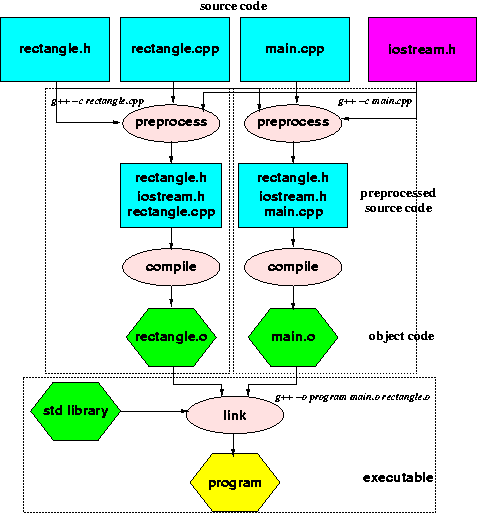
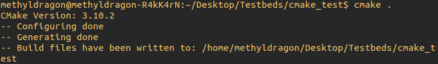
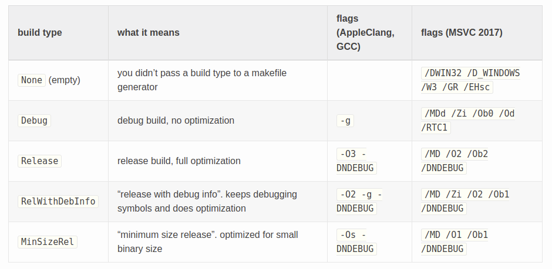
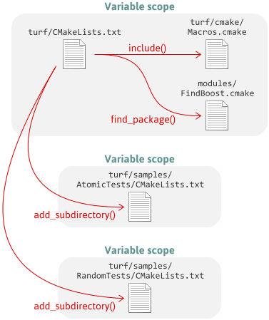

# CMake Crash Course - Building

Author: methylDragon  
Contains a syntax reference for CMake. We'll be going through the use of CMake as a buildtool!    

------

## Pre-Requisites

**Assumed knowledge**

- Have a rudimentary understanding of C/C++
  - Since CMake is used to build C/C++ projects!
- Understood the linkage and build concepts from [this tutorial](../C++/08%20C++%20-%20Linkages%20and%20Preprocessor%20Directives.md)
- The tutorial is written with Linux users in mind, specifically Ubuntu
  - But the scripting section should apply in general
- Went through the previous sections of this tutorial


## Table Of Contents <a name="top"></a>

1. [Introduction](#1)    
2. [Building With CMake](#2)    
   2.1 [Introduction and Refresher](#2.1)    
   2.2 [Overview](#2.2)    
   2.3 [Targets and Properties](#2.3)    
   2.4 [Linkage Refresher](#2.4)    
   2.5 [Project Settings](#2.5)    
   2.6 [Setting CMake Version](#2.6)    
   2.7 [Finding CMake Version](#2.7)    
   2.8 [Check System Type](#2.8)    
   2.9 [CMake Variables](#2.9)    
   2.10 [Setting The C++ Standard](#2.10)    
   2.11 [Configuring Build Flags](#2.11)    
   2.12 [Compile Options](#2.12)    
   2.13 [Including Other CMake Scripts](#2.13)    
   2.14 [Checking if Packages are Found](#2.14)    
   2.15 [Specifying Include Directories](#2.15)    
   2.16 [Core Step: Specifying Targets](#2.16)    
   2.17 [Target Properties](#2.17)    
   2.18 [Getting and Setting Properties](#2.18)    
   2.19 [Installing](#2.19)    
   2.20 [Adding Tests](#2.20)    


## 1. Introduction <a name="1"></a>

Now that we've gone through basic scripting, and some concepts related to CMake, we can finally move on with the meaty parts of CMake that deal with what it was designed for -- configuring builds!

This section is going to go through most of the commonly used CMake function calls, and can get quite hefty due to all the new calls to learn (which aren't related to abstract programming concepts per se..) So hang on tight!


## 2. Building With CMake <a name="2"></a>

### 2.1 Introduction and Refresher <a name="2.1"></a>
[go to top](#top)


Ok! Now that we're acquainted with the CMake scripting language, we can start learning the calls that actually build and link code into executables and libraries!

> Recall:
>
> A minimal CMakeLists looks like this
>
> ```cmake
> cmake_minimum_required(VERSION 2.6)
> project(minimal_example)
> 
> add_executable(Example src/example.cpp)
> ```


### 2.2 Overview <a name="2.2"></a>
[go to top](#top)


So if you remember from the previous section of the tutorial, the **order** in which you write your CMake commands in the `CMakeLists.txt` file matters.

So here's a **rough guideline** for how to order everything. But do be flexible if things don't work out nicely for you!

|  #   |                          Step                           |                      Relevant Commands                       |       Additional Optional Steps        |
| :--: | :-----------------------------------------------------: | :----------------------------------------------------------: | :------------------------------------: |
|  1   |            Declare **CMake version number**             |                  `cmake_minimum_required()`                  |                                        |
|  2   |                Declare **project name**                 |                         `project()`                          |                                        |
|  3   |          Declare **CMake build configuration**          | `set(CMAKE_CXX_FLAGS ...)`, `set(CMAKE_STANDARD_REQUIRED ON)`, `set(CMAKE_CXX_STANDARD ...)` | Enable testing with `enable_testing()` |
|  4   |             Add in **variables and logic**              |                    `set()`, `if()`, etc.                     |                                        |
|  5   | Add in any **external and internal module directories** |     `include_directories()`, `add_subdirectory()`, etc.      |                                        |
|  6   |             **Add and link build targets**              | `add_library()`, `add_executable()`, `target_link_libraries()`, etc. |                                        |
|  7   |                 Add **install targets**                 |                      `install()`, etc.                       |                                        |
|  8   |                      Add **tests**                      |                         `add_test()`                         |                                        |

We will roughly be going through these in order in this tutorial.


### 2.3 Targets and Properties <a name="2.3"></a>
[go to top](#top)


Modern CMake is all about **targets** and their **properties**. Targets have properties.

- **Targets** are the components of your application
  - These can be executables, or libraries.
  - These can be linked together, or linked with static libraries!
- **Properties** are the properties of the target
  - These can be the specific source files they're built from
  - The compiler flags that govern their build process
  - The libraries they are linked with
  - And a lot more!

If you remember from the refresher in the introduction of this tutorial, you'd notice that there was an executable called Example that was **targeted** for build. We didn't add any non-default properties to them, but it's just something to keep in mind.


### 2.4 Linkage Refresher <a name="2.4"></a>
[go to top](#top)


Let's also remind ourselves how linkage works in the build process for a program (at least in C/C++ anyway.)



Each piece of source code is preprocessed and compiled into what is known as a **translation unit**.

Translation units are then **linked together with other translation units as well as static libraries** by a linker to produce the final executable.

So, in a `CMakeLists.txt` file like this:

```cmake
cmake_minimum_required(VERSION 2.6)
project(linkage_example)

add_library(WOW somelib.cpp)
target_include_directories(WOW include) # Specifying the header locations

add_executable(Example src/example.cpp src/another_source.cpp)
target_link_libraries(Example WOW)
```

We can see that the object code files for the translation units for `example.cpp` and `another_source.cpp` are linked together with the static library `WOW` that came from `somelib.cpp`.

Nice!

> Again, it is important to notice that in this case, we had to build the `WOW` library **before** linking it to the executable.
>
> This is another example of the importance of the **order of statements** inside a `CMakeLists.txt` file! So in this case it is **necessary to run `add_library()` before `add_executable()`**.


### 2.5 Project Settings <a name="2.5"></a>
[go to top](#top)


There's a few more arguments you can put in the `project()` call.

```cmake
project(minimal_example VERSION 1.0
						DESCRIPTION "Wow!"
						LANGUAGES CXX)
				
# The version argument sets the minimal_example_VERSION and PROJECT_VERSION variables

# The available languages are C, CXX, Fortran, ASM, CUDA, CSharp, and Swift
# (CUDA and CSharp requires CMake 3.8+, and SWIFT requires CMake 3.15+ experimental)
# If not stated, the default will be C and CXX
```

For version numbering standards [check out this guide]([https://semver.org](https://semver.org/))!


### 2.6 Setting CMake Version <a name="2.6"></a>
[go to top](#top)


You already saw this in the example

```cmake
cmake_minimum_required(VERSION 2.8)

# But did you know you can make it throw an error otherwise?
cmake_minimum_required(VERSION 2.8 FATAL_ERROR)
```


### 2.7 Finding CMake Version <a name="2.7"></a>
[go to top](#top)


This is handy to see if certain CMake functionalities are available.



(Your version might be different from the one shown in the image.)

```cmake
message(
  "CMake Version: " 
  ${CMAKE_MAJOR_VERSION} . 
  ${CMAKE_MINOR_VERSION} . 
  ${CMAKE_PATCH_VERSION}
)
```


### 2.8 Check System Type <a name="2.8"></a>
[go to top](#top)


This might be useful if you need to change some flags around depending on the system type.

[Source](<https://medium.com/@onur.dundar1/cmake-tutorial-585dd180109b>)

```cmake
# UNIX, WIN32, WINRT, CYGWIN, APPLE are environment variables as flags set by default system
if(UNIX)
    message("This is a ${CMAKE_SYSTEM_NAME} system")
elseif(WIN32)
    message("This is a Windows System")
endif()
```


### 2.9 CMake Variables <a name="2.9"></a>
[go to top](#top)


[Full](<https://cmake.org/cmake/help/latest/manual/cmake-env-variables.7.html>) [list](<https://cmake.org/cmake/help/latest/manual/cmake-variables.7.html>)

CMake variables are variables that usually define the **initialisation values** of many compilation properties for each build target, and are usually prepended with `CMAKE_<property_name>`.

As such, changing them is akin to changing the global defaults for a particular property.

So for example,

```cmake
# This
set_property(TARGET TargetName
             PROPERTY CXX_STANDARD 11)
             
# Could be removed if you did this instead at the top, as it would change the default
# value of the CXX_STANDARD property to 11 for all targets
set(CMAKE_CXX_STANDARD 11)
```

**Here are a couple of handy ones**. We might go through some more commonly used ones as they become relevant.


#### **Handy List**

**CMake Version**

If versioning was vA.B.C as per [semver.org](<https://semver.org/>).

| Name                  | Description |
| --------------------- | ----------- |
| `CMAKE_MAJOR_VERSION` | X.0.0       |
| `CMAKE_MINOR_VERSION` | 0.X.0       |
| `CMAKE_PATCH_VERSION` | 0.0.X       |

**Compilation**

| Name                          | Description                                                  |
| ----------------------------- | ------------------------------------------------------------ |
| `CMAKE_CXX_STANDARD`          | What C++ standard to use when compiling C++ source files     |
| `CMAKE_CXX_STANDARD_REQUIRED` | Flag to initialise compiling properties with CMAKE_CXX_STANDARD |
| `CMAKE_CXX_EXTENSIONS`        | Specifies whether compiler specific extensions should be used |

**Directories**

| Name                        | Description                                                  |
| --------------------------- | ------------------------------------------------------------ |
| `CMAKE_SOURCE_DIR`          | Path to the top level of the source tree (contains the top level `CMakeLists.txt`, unless otherwise specified.) |
| `CMAKE_CURRENT_SOURCE_DIR`  | Path to the directory containing the `CMakeLists.txt` file currently being processed |
| `PROJECT_SOURCE_DIR`        | Top level source directory for the current project. (The directory that contains the most recent `CMakeLists.txt` file that defines a project.) |
| `<project_name>_SOURCE_DIR` | Source directory for the named project. (So you can refer to a specific project's source directory in other CMake scripts.) |
| `CMAKE_BINARY_DIR`          | Path to the top level of the build tree (usually the directory in which you ran the CMake command. Unless otherwise specified.) |
| `CMAKE_CURRENT_BINARY_DIR`  | Path to the binary directory currently being processed. (This changes whenever `add_subdirectory()` is called.) |
| `PROJECT_BINARY_DIR`        | Top level binary directory for the current project. (The directory that contains the most recent `CMakeLists.txt` file that defines a project.) |
| `<project_name>_BINARY_DIR` | Binary directory for the named project. (So you can refer to a specific project's binary directory in other CMake scripts.) |


### 2.10 Setting The C++ Standard <a name="2.10"></a>
[go to top](#top)


You can do this by setting the global properties (less recommended, but more convenient)

```cmake
set(CMAKE_CXX_STANDARD 11) # Here we are saying we want to use C++11
set(CMAKE_CXX_STANDARD_REQUIRED ON)

# You'll probably have to use this too, since it might target different libraries otherwise
set(CMAKE_CXX_EXTENSIONS OFF)
```

Or by setting it for each target (more recommended and modular, but can be quite a bit of a pain)

```cmake
set_target_properties(myTarget PROPERTIES
    CXX_STANDARD 11
    CXX_STANDARD_REQUIRED YES
    CXX_EXTENSIONS NO
)
```

Or you can even do it by specifying the features that your source code uses, then letting CMake figure it out for you automatically!

For the full list of features check [this reference](<http://www.cmake.org/cmake/help/latest/prop_gbl/CMAKE_CXX_KNOWN_FEATURES.html>).

```cmake
# Example
target_compile_features(myTarget
    PUBLIC
        cxx_variadic_templates
        cxx_nullptr
    PRIVATE
        cxx_lambdas
)

# Or to see all available features
message("Supported features = ${CMAKE_CXX_COMPILE_FEATURES}")
```


### 2.11 Configuring Build Flags <a name="2.11"></a>
[go to top](#top)


You can set build flags to both the compiler and linker from within a `CMakeLists.txt` file by using several commands or changing the value of certain CMake variables or properties.

**Do note that these flags are appended to the default flags that are set when setting a build type**. So let's talk about build types first!

> **Note**: I'm skipping over the old and unrecommended `add_definitions()` way of setting compile flags. It's a hacky way that doesn't follow the design of `add_definitions()`, which is to add pre-processor definitions, not compilation flags.


#### **Build Type Flags**

It's good practice to set a default build type, like so.

```cmake
# This example sets the default as Release

if (NOT CMAKE_BUILD_TYPE)
   message(STATUS "No build type selected, default to Release")
   set(CMAKE_BUILD_TYPE "Release")
endif()
```

If you'd like to see what flags each build type adds, simply echo the corresponding CMake variables.

```cmake
message("CMAKE_C_FLAGS_DEBUG is ${CMAKE_C_FLAGS_DEBUG}")
message("CMAKE_C_FLAGS_RELEASE is ${CMAKE_C_FLAGS_RELEASE}")
message("CMAKE_C_FLAGS_RELWITHDEBINFO is ${CMAKE_C_FLAGS_RELWITHDEBINFO}")
message("CMAKE_C_FLAGS_MINSIZEREL is ${CMAKE_C_FLAGS_MINSIZEREL}")

message("CMAKE_CXX_FLAGS_DEBUG is ${CMAKE_CXX_FLAGS_DEBUG}")
message("CMAKE_CXX_FLAGS_RELEASE is ${CMAKE_CXX_FLAGS_RELEASE}")
message("CMAKE_CXX_FLAGS_RELWITHDEBINFO is ${CMAKE_CXX_FLAGS_RELWITHDEBINFO}")
message("CMAKE_CXX_FLAGS_MINSIZEREL is ${CMAKE_CXX_FLAGS_MINSIZEREL}")
```



[Image Source](<http://www.brianlheim.com/2018/04/09/cmake-cheat-sheet.html>)


#### **Adding Additional Compile and Linker Flags**

**Do not edit the CMake variables related to each build type**, instead, edit these variables: 

- `CMAKE_C_FLAGS`/`CMAKE_CXX_FLAGS` - used by the compiler
- `CMAKE_EXE_LINKER_FLAGS` - used by the linker when linking executables
- `CMAKE_SHARED_LINKER_FLAGS` - used by linker when linking shared object libraries
- `CMAKE_MODULE_LINKER_FLAGS` - used by linker when linking modules (i don’t know what this means)
- `CMAKE_STATIC_LINKER_FLAGS` - used by linker when linking static object libraries

> **Although, technically, this is still the LESS RECOMMENDED WAY OF DOING THINGS**. It's a lot cleaner to use target specific compile properties, which we will go over immediately after this.
>
> I'm just including this here for completions' sake, and also because many `CMakeLists.txt` files out there on the net make heavy use of these.

Again, when calling a build type, the corresponding `CMAKE_CXX_FLAGS_<BUILD_TYPE>` variable gets **appended** to `CMAKE_CXX_FLAGS`. And the same for the other languages.

```cmake
# So for example, for setting C compiler flags, use CMAKE_C_FLAGS
set (CMAKE_C_FLAGS "${CMAKE_C_FLAGS} -std=gnu99")

# Or if we want to compile with OpenMP flags too
set(CMAKE_CXX_FLAGS "${CMAKE_CXX_FLAGS} ${OpenMP_CXX_FLAGS}")
```

Additionally, **notice that we actually append to the flag variables when setting it instead of replacing it**. This way we can keep adding on flags modularly, and we also preserve any previous settings any child subdirectory CMake scripts have set.


#### **Recommended Flags**

There's a [list of recommended flags for GCC](<https://developers.redhat.com/blog/2018/03/21/compiler-and-linker-flags-gcc/>). You'll have to find your own if you're using another compiler.

Or for the full list, check out the [GCC docs](<https://gcc.gnu.org/onlinedocs/gcc/Option-Summary.html>). Fair warning though, there are **a lot**! (Or you can just use `man gcc`.)


### 2.12 Compile Options <a name="2.12"></a>
[go to top](#top)


Alternatively, you can set **compile options**, which works much like setting the `CMAKE_CXX_FLAGS` CMake variable, but only for the directory and sub-directories, or for specific targets. 

**This is the more recommended way, especially if you're doing it specific to targets**.

**Note that adding compile options doesn't actually change CMAKE_CXX_FLAGS**! In fact, as stated before, CMake variables are the initialisation point from which other options and properties start from, so actually compile options will be added on to `CMAKE_CXX_FLAGS` and then finally turned into the build pipeline after running CMake.


#### **Add Compile Options to Directory and Sub-Directory**

>  Adding compile options to your `CMakeLists.txt` sets it as the default options appended to the flags set by `CMAKE_CXX_FLAGS` for the current and all child directories.

If you're not caught up on directories, here's another refresher.



Remember that each `CMakeLists.txt` governs its own directories. So in this case, setting compile options will set them as the default compile options (on top of the flags set by `CMAKE_CXX_FLAGS`) for the current and all child directories.

**This will not apply globally**, and will not affect parent directories! So it's a good way of modularising default compile options that only propagate to children.

Just use `add_compile_options()`, like so:

```cmake
add_compile_options(-your -flags -here)
```


#### **Add Compile Options to Target**

Alternatively, the **more recommended way to do it is to specify compile options for targets only**. We'll go through targets later on, but just remember that you can add these after the `add_executables()` or `add_library()` or related calls.

```cmake
# Add some nice flags
target_compile_options(target_name -Wall -Wextra -Wpedantic -Werror)

# These are added in addition to CMAKE_CXX_FLAGS
```


### 2.13 Including Other CMake Scripts <a name="2.13"></a>
[go to top](#top)


#### **CMake Scripts**

CMake scripts can take two forms:

- `.cmake` files
  - For functions and definitions only
- `CMakeLists.txt`
  - For including more than just those
  - Like setting build targets!


#### **Three Ways of Including Scripts**

There are **three ways** of including CMake scripts. Some of which alter the included scripts' **variable scope**.

- `include()`
  - This just includes a child CMake script in the same variable scope as your current `CMakeLists.txt`
  - This can either be a `.cmake` file (if it just contains functions and definitions)
  - Or a `CMakeLists.txt` file (if it contains more than just those)
- `find_package()`
  - This works just like `include()`, but you specify the project name instead
  - The call will look for a `.cmake` file called `FIND<project_name>.cmake`
  - So, for example, if you're looking for Boost, it will look for `FINDBoost.cmake`
  - **You can use this to import handy CMake modules!**
- `add_subdirectory()`
  - Includes the `CMakeLists.txt` file in the included subdirectory in its own variable scope


[Image Source](<https://preshing.com/20170522/learn-cmakes-scripting-language-in-15-minutes/>)


#### **Examples**

```cmake
# include and find_package look in the paths specified by CMAKE_MODULE_PATH
# Which is a list variable

# You can add to CMAKE_MODULE_PATH by appending to it like this!
set(CMAKE_MODULE_PATH "${CMAKE_MODULE_PATH};${CMAKE_CURRENT_SOURCE_DIR}/SOME_OTHER_PATH")

# Then you can run include like this
include(SOME_SCRIPT.cmake)

# Or find_package like this
find_package(Boost)

# Or add a subdirectory like this
# Relative paths are resolved from ${CMAKE_CURRENT_SOURCE_DIR}
add_subdirectory(rawr_directory) # Make sure there is a CMakeLists.txt file in here!
```

Additionally, you can do some other cool stuff with the arguments!

**Include**

```cmake
# This makes the include optional
# And some_script_result will be set to the full filename if it has been included
# or NOTFOUND if it failed
include(some_script.cmake OPTIONAL RESULT_VAR some_script_result)
```
**Find Package**

```cmake
# Make CMake not scream at you if it can't find a package
find_package(OpenCV QUIET)

# This lets you specify specific versions for found packages
find_package(OpenCV 3)
find_package(OpenCV 3.1 EXACT) # Or make it an exact match only

# Or require it, since otherwise even though CMake will throw a lot of warnings
# It won't throw an error otherwise
find_package(OpenCV 3 REQUIRED)

# Additionally, you can also just include the components of a package
# This way, you don't have to literally include everything
find_package(catkin REQUIRED COMPONENTS
  roscpp
  nodelet
  sensor_msgs
)
```

**Add Subdirectory**

```cmake
# Specify a non-default binary directory for the subdirectory
add_subdirectory(rawr rawr/bin)
```

You can also get more information about [include](<https://cmake.org/cmake/help/latest/command/include.html>), [find_package](<https://cmake.org/cmake/help/latest/command/find_package.html>), and [add_subdirectory](<https://cmake.org/cmake/help/latest/command/add_subdirectory.html>) from the docs!


### 2.14 Checking if Packages are Found <a name="2.14"></a>
[go to top](#top)


This is really handy if you want optional features to build without any special user input!

Just make use of the fact that if a package is found or not found, the corresponding `_FOUND` variable will be set!

**Just an example**

```cmake
find_package(catkin QUIET) # We set to quiet to fail gracefully

if (catkin_FOUND) # Check for find here!
  message("[CATKIN FOUND] Configuring for ROS library compatible compilation!")
  # Do some catkin related stuff here, like setting includes and configuring the package
else()
  message("[CATKIN NOT FOUND] Skipping ROS relevant compile steps...")
endif()
```


### 2.15 Specifying Include Directories <a name="2.15"></a>
[go to top](#top)


CMake needs to know where your headers are to be able to let whatever compiler you are using find relevant header files that are included inside your source files.

You can either do this globally (less recommended), or on a per-target basis (more recommended).

```cmake
# Relative paths are resolved from ${CMAKE_CURRENT_SOURCE_DIR}

include_directories(DIRECTORY_PATH) # Add them globally
target_include_directories(some_target PRIVATE DIRECTORY_PATH) # Or not!
```

Additionally, there are some cool options you can use! (I won't go through all of them, but some of the more handy ones.)

Check out the docs for more info! [include_directories()](<https://cmake.org/cmake/help/latest/command/include_directories.html>), [target_include_directories()](<https://cmake.org/cmake/help/latest/command/target_include_directories.html>)

```cmake
# Change prepend or append priority
include_directories(BEFORE DIRECTORY_PATH) # Prepend the path to the list
include_directories(AFTER DIRECTORY_PATH) # Append the path to the list
target_include_directories(some_target BEFORE DIRECTORY_PATH) # Prepend the path

# Or set explicit inheritance rules for targets
# INTERFACE: Populates INTERFACE_INCLUDE_DIRECTORIES property of the target
# PRIVATE: Populates INCLUDE_DIRECTORIES property of the target
# PUBLIC: Populates both
target_include_directories(some_target
  INTERFACE some_path # You just need at least one of these
  PUBLIC some_other_path
  PRIVATE some_last_path
)
```


### 2.16 Core Step: Specifying Targets <a name="2.16"></a>
[go to top](#top)


**This is one of the most important steps to do productive work with CMake!** It's kind of a shame it's so simple that the section can be missed easily, so I'm going to put a .gif here just to call attention to it.

![[video-to-gif output image]](assets/ezgif-3-92cffd6c4e0f.gif)

Just add them. It's fairly simple. Just ensure that you really specify all your sources correctly!

```cmake
# Relative paths are resolved from ${CMAKE_CURRENT_SOURCE_DIR}

# Each specified source/header file is compiled as its own translation unit
# And everything is linked together
add_executable(TARGET_NAME source_1.cpp src/source_3.cpp header_1.h)
add_library(TARGET_LIBRARY_NAME source_1.cpp src/source_3.cpp header_1.h)

# Libraries are a bit special because they can be specified in three ways
# STATIC: An object file is built and then linked
# SHARED: The library is linked dynamically and loaded at runtime
# MODULE: Not linked, and may be loaded dynamically using dlopen
# The default is STATIC or SHARED dependning on the value of ${BUILD_SHARED_LIBS}
add_library(TARGET_LIBRARY_NAME STATIC
  source_1.cpp
  src/source_3.cpp
  header_1.h
)

add_library(TARGET_LIBRARY_NAME SHARED
  source_1.cpp
  src/source_3.cpp
  header_1.h
)

add_library(TARGET_LIBRARY_NAME MODULE
  source_1.cpp
  src/source_3.cpp
  header_1.h
)

# There's a final kind of library called an INTERFACE library
# This kind of library consists of only headers
# So CMake doesn't build with it.
# But you can still attach properties that are passed on to any linked targets!
add_library(SOME_LIB INTERFACE)
```


### 2.17 Target Properties <a name="2.17"></a>
[go to top](#top)


There's [a lot of different properties](<https://cmake.org/cmake/help/latest/manual/cmake-properties.7.html#target-properties>) that you can set for targets. Let's go through a few ones that you can set using native CMake commands instead of interfacing directly with the property interfaces.

For specific information about what specifying links or target options as `PUBLIC`, `PRIVATE`, or `INTERFACE`, do check out the references by clicking on each command!

| Command                                                      | Description                                                  |
| ------------------------------------------------------------ | ------------------------------------------------------------ |
| [`target_link_libraries()`](<https://cmake.org/cmake/help/latest/command/target_link_libraries.html#command:target_link_libraries>) | Specifies libraries or flags to use when linking a given target and/or its dependents. |
| [`target_link_options()`](<https://cmake.org/cmake/help/latest/command/target_link_options.html#command:target_link_options>) | Adds options/flags to the link step for the specified target. |
| [`target_include_directories()`](<https://cmake.org/cmake/help/latest/command/target_include_directories.html#command:target_include_directories>) | Adds include directories to a target (for the compiler to find header interfaces) |
| [`target_compile_options()`](<https://cmake.org/cmake/help/latest/command/target_compile_options.html#command:target_compile_options>) | Adds options/flags to the compile step for the specified target |
| [`target_compile_definitions()`](<https://cmake.org/cmake/help/latest/command/target_compile_definitions.html#command:target_compile_definitions>) | Adds preprocessor definitions to the specified target        |
| [`target_sources()`](<https://cmake.org/cmake/help/latest/command/target_sources.html#command:target_sources>) | Adds sources to a target                                     |

We won't go through all of them, just the more commonly used ones.

#### **Basic Examples**

```cmake
add_executable(TARGET_NAME src.cpp)
target_link_libraries(TARGET_NAME lib.cpp) # Link libraries
target_include_directories(TARGET_NAME lib) # Add header directories

# Then you can just keep adding them on!
target_compile_options(TARGET_NAME -Wall -Wextra -Wpedantic -Werror)
target_compile_definitions(TARGET_NAME PUBLIC WOW="WOW")
```

You may specify inheritance priority (public, private, interface) for most of these, as well as a host of other options. Do take a look at the docs!


### 2.18 Getting and Setting Properties <a name="2.18"></a>
[go to top](#top)


Once you've created a target, you can get and set properties related to that target! Here's a couple of examples.

But you can look at the docs for [`set_property()`](<https://cmake.org/cmake/help/latest/command/set_property.html>) and [`get_property()`](<https://cmake.org/cmake/help/latest/command/get_property.html>).

```cmake
# Set property on target
set_property(TARGET target_1 target_2 PROPERTY property_name value_1 value_2)

# Get property on target
# The gotten property is stored in the variable called var in this case
get_property(var TARGET target_1 PROPERTY property_name)
```

Cool!


### 2.19 Installing <a name="2.19"></a>
[go to top](#top)


#### **Introduction**

You can configure CMake to install certain files, headers, or built targets in the `${CMAKE_INSTALL_PREFIX}` (usually `/usr/local/` for Linux.) (We'll call these files, headers, or built targets "stuff" for this section. Haha.)

If configured properly, CMake will generate an install build target, which will then install the stuff you've configured upon calling: `make install`.

After which, if you did everything properly, using your installed stuff should be as simple as doing:

```cmake
find_package(stuff_project_name REQUIRED)
target_link_libraries(some_target PUBLIC stuff_project_library_name)
```


#### **Specifying Install Targets**

[Source](<https://cliutils.gitlab.io/modern-cmake/chapters/install/installing.html>)

| Export Type | Purpose                 |
| ----------- | ----------------------- |
| `LIBRARY`   | Module/Shared Libraries |
| `ARCHIVE`   | Static Libraries        |
| `RUNTIME`   | Executables             |

For the full list of export types, check out [the docs](<https://cmake.org/cmake/help/v3.0/command/install.html>).

The `INCLUDES` destination specifies the list of directories that will be added to the `INTERFACE_INCLUDE_DIRECTORIES` target property.

```cmake
# Inside your CMakeLists.txt, in a project called MyLib, add these lines:

# Add targets as you require them
install(TARGETS MyLib EXPORT MyLibTargets # Create an export target called MyLibTargets
  LIBRARY DESTINATION lib # Install to ${CMAKE_INSTALL_PREFIX}/DESTINATION
  ARCHIVE DESTINATION lib
  RUNTIME DESTINATION bin
  INCLUDES DESTINATION include
)

# Create a library version
include(CMakePackageConfigHelpers)
write_basic_package_version_file(
    MyLibConfigVersion.cmake
    VERSION ${PACKAGE_VERSION}
    COMPATIBILITY AnyNewerVersion
)

# Then export your targets
install(EXPORT MyLibTargets
        FILE MyLibTargets.cmake # This generates a MyLibTargets.cmake file
        NAMESPACE MyLib::
        DESTINATION lib/cmake/MyLib
)

# And install the configuration files
# Notice it's MyLib<<Config>>, which is what CMake uses when find_package() is called
# We created a non-config file for including dependencies, which install() can't generate
install(FILES "${CMAKE_CURRENT_BINARY_DIR}/MyLibConfig.cmake"
              "${CMAKE_CURRENT_BINARY_DIR}/MyLibConfigVersion.cmake"
        DESTINATION lib/cmake/MyLib
)
```

In order for your installed targets to be found, you **need** to create the `version.cmake` file. And in order for your installed targets to be found via `find_package()`, you **need** to specify some `.cmake` file that governs the export rules.


#### **Configuring the Install**

[Source](<https://cliutils.gitlab.io/modern-cmake/chapters/install/installing.html>)

As said before, you need a corresponding `.cmake` file to govern the export rules. Specifically, a `[...]Config.cmake` file.

Luckily there's a bunch of macros to do it for us!

> If you'd like to avoid the macros, check out [this tutorial](<https://foonathan.net/blog/2016/03/03/cmake-install.html>).

```cmake
# In this case, it's called MyLibConfig.cmake

include(CMakeFindDependencyMacro)

# Capturing values from configure (optional)
# We'll talk about configuring files at a later section
set(my-config-var @my-config-var@)

# Same syntax as find_package, if you have any dependencies
find_dependency(MYDEP REQUIRED)

# Any extra setup...

# Add the targets file, which has our export settings
# When find_package() is used, it'll look for <PROJECT_NAME>Config.cmake
include("${CMAKE_CURRENT_LIST_DIR}/MyLibTargets.cmake")
```

> **Note**: We created an additional `.cmake` file instead of having the prior `install(EXPORT)` call export directly to the `<PROJECT_NAME>Config.cmake` file because this is the only way to include dependencies for your exportable projects.
>
> If you **do not have any extra dependencies, you can just export directly to a `<PROJECT_NAME>Config.cmake`** file in the `install(EXPORT)` call!


#### **Exporting and Packaging**

Exporting (using another project's build directory), and packaging (shipping production binary packages) are not covered in this tutorial.

Do check out the relevant sections from this other tutorial by someone more proficient than me for [exporting](<https://cliutils.gitlab.io/modern-cmake/chapters/install/exporting.html>) and [packaging](<https://cliutils.gitlab.io/modern-cmake/chapters/install/packaging.html>)!


### 2.20 Adding Tests <a name="2.20"></a>
[go to top](#top)


[`add_test()` docs](<https://cmake.org/cmake/help/latest/command/add_test.html>)

#### **Introduction**

CMake has a testing framework called **CTest** that we can leverage for running unit tests!

Since it's good form to keep your tests separate from your code, we'll make use of a `test/` directory.

So our project will look something like this.

```
my_project
-	src/
-	build/
-	tests/
	- CMakeLists.txt
	- test_1.cpp
	...
-	CMakeLists.txt
```

Notice that the `tests/` directory has its own `CMakeLists.txt` file, **which will be used for compiling the tests**.

Some notes:

- **Tests run independently** and **are not necessarily connected to targets**.
- Additionally, each test that you write **should return 0 (for passing) or a non-zero integer value (for failure.)**


#### **Running Tests**

CMake will create a new build target called `test` that you can run to run the tests!

```shell
cmake .
make test
```

Alternatively, you can use **CTest** after running `cmake .`

```cmake
ctest # Run all tests
ctest -I 3,4 # Run tests 3 and 4 only

# List tests
ctest -N # Show all tests that are available without running them

# Regex [You can combine these!]
ctest -R REGEX_VAL # Runs all tests that include REGEX_VAL in the name
ctest -E NO_PLS # Runs all tests EXCEPT the ones that include NO_PLS in the name
```


#### **Specifying Tests in CMake**

It's pretty simple! Especially if you modularise your tests in their own `tests/` folder.

**Top Level CMakeLists.txt**

```cmake
cmake_minimum_required(VERSION 2.6)
project(test_example)

enable_testing()
add_subdirectory(tests) # Runs the tests/CMakeLists.txt

# Then you can add any non-test executable build instructions here
```

**tests/CMakeLists.txt**

```cmake
# No project statements here since this is a subdirectory!

# Compile the test
add_executable(test_1_target_name test_1.cpp)

# And add it!
add_test(TEST_NAME test_1_target_name) # You can add any args after the target name
```


#### **Writing Tests**

Again, just make sure your tests return **0 for success, and non-zero integers for failure**.

Yes. Literally just that. If you want to test your modules, just include them so you can use them. Simple enough ja.

```c++
#include "some_testable_interface.h"

int main()
{
  // Do some stuff to set up your test
    
  if (SOME_TESTABLE_CONDITION)
  {
    return 0;
  }
  else
  {
    return 1;
  }
  
  // Then rinse and repeat
}
```


```
                            .     .
                         .  |\-^-/|  .    
                        /| } O.=.O { |\
```

​    

---

 [.png)](https://www.buymeacoffee.com/methylDragon)
