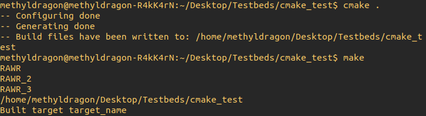
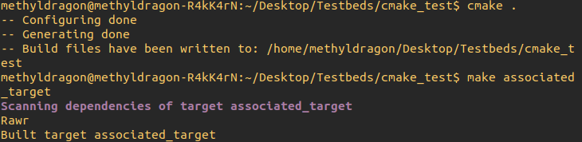
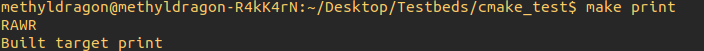
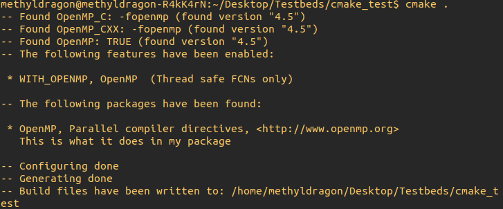

# CMake Crash Course - Advanced Scripting and Modules

Author: methylDragon  
Contains a syntax reference for CMake. We'll be going through some more nifty stuff you can do with CMake, and some includable modules!!    

------

## Pre-Requisites

**Assumed knowledge**

- Have a rudimentary understanding of C/C++
  - Since CMake is used to build C/C++ projects!
- Understood the linkage and build concepts from [this tutorial](../C++/08%20C++%20-%20Linkages%20and%20Preprocessor%20Directives.md)
- The tutorial is written with Linux users in mind, specifically Ubuntu
  - But the scripting section should apply in general
- Went through the previous sections of this tutorial


## Table Of Contents <a name="top"></a>

1. [Introduction](#1)    
2. [CMake Advanced Scripting](#2)    
   2.1 [Configuring Files](#2.1)    
   2.2 [Reading Files](#2.2)    
   2.3 [Parse Arguments](#2.3)    
   2.4 [Calling Custom Terminal Commands](#2.4)    
   2.5 [Generating Files and Triggering Build Events](#2.5)    
   2.6 [Generator Expressions](#2.6)    
   2.7 [Try Compile and Try Run](#2.7)    
   2.8 [CMake Command Reference](#2.8)    
3. [Useful CMake Modules](#3)    
   3.1 [Source Introspection: `CheckFunctionExists`](#3.1)    
   3.2 [Set Dependent Options: `CMakeDependentOption`](#3.2)    
   3.3 [Print Helpers: `CMakePrintHelpers`](#3.3)    
   3.4 [Check If Flags are Supported: `CheckCXXCompilerFlag`](#3.4)    
   3.5 [Detect Features as Options and Generate Backward Compatibility Implementations: `WriteCompilerDetectionHeader`](#3.5)    
   3.6 [Add and Print Feature Summaries: `FeatureSummary`](#3.6)    


## 1. Introduction <a name="1"></a>

While the previous two sections of the tutorial should more or less give you enough to build and configure projects all on your own, the rabbit hole of CMake goes really deep. So here's a cursory foray into some of the powerful tools and tricks available to you!

We'll be going through some advanced scripting commands, as well as go through some useful CMake modules that you might want to use.

A lot of this tutorial would not be possible without [this tutorial](<https://cliutils.gitlab.io/modern-cmake>), so I'd like to give credit where it is due. Thanks a lot for the great reference!


## 2. CMake Advanced Scripting <a name="2"></a>

### 2.1 Configuring Files <a name="2.1"></a>
[go to top](#top)


[Reference](<https://cmake.org/cmake/help/v3.0/command/configure_file.html>)

The `configure_file()` command copies an input file into an output file, substituting variables (from CMake) referenced in the input into that output file.

In other words, it's a great way for you to to **edit code dynamically at build time**! And it's all possible using CMake!

> Input files are normally specified as such using the `.in` extension.
>
> So if you wanted to generate a file like `rawr.cpp`, the input file that you would create will be `rawr.cpp.in`!

```cmake
# General call
configure_file(<input> <output>
               [COPYONLY] [ESCAPE_QUOTES] [@ONLY]
               [NEWLINE_STYLE [UNIX|DOS|WIN32|LF|CRLF] ])

# Example usage
configure_file("${PROJECT_SOURCE_DIR}/src/rawr.cpp.in"
               "${PROJECT_SOURCE_DIR}/src/rawr.cpp"
               @ONLY
)
```

**Arguments**

| Name            | Description                                                  |
| --------------- | ------------------------------------------------------------ |
| `COPYONLY`      | Disable variable substitution.                               |
| `ESCAPE_QUOTES` | Any substituted quotes are C-style escaped. (With backslash.) |
| `@ONLY`         | Disables substitution of `${VAR}` references. (Only allows `@VAR@` specifications instead of both.) |
| `NEWLINE_STYLE` | Adjust newline style. (Cannot be used with `COPYONLY`.)      |

> Newline styles
>
> ```
> 'UNIX' or 'LF' for \n, 'DOS', 'WIN32' or 'CRLF' for \r\n.
> ```


#### **Example Input File**

```c++
#define MY_VERSION_MAJOR @PROJECT_VERSION_MAJOR@
#define MY_VERSION_MINOR @PROJECT_VERSION_MINOR@
#define MY_VERSION_PATCH @PROJECT_VERSION_PATCH@
#define MY_VERSION_TWEAK @PROJECT_VERSION_TWEAK@

// You can also have it replace ${PROJECT_VERSION_MAJOR}
// But due to how common that sort of syntax is in some types of files
// It's less recommended, and it's recommended to use @ONLY
```

This should output something like this (in this case we're on version 1.0.0), assuming the variable was defined in the `CMakeLists.txt` that called `configure_file()` with `@ONLY` engaged.

```c++
#define MY_VERSION_MAJOR 1
#define MY_VERSION_MINOR 0
#define MY_VERSION_PATCH 0
#define MY_VERSION_TWEAK 0

// You can also have it replace ${PROJECT_VERSION_MAJOR}
// But due to how common that sort of syntax is in some types of files
// It's less recommended, and it's recommended to use @ONLY
```

Neat!


### 2.2 Reading Files <a name="2.2"></a>
[go to top](#top)


[Reference](<https://cmake.org/cmake/help/latest/command/file.html>)

Use the `file()` command to manipulate files! You can technically write to them as well, but here we just use them to read.

You can even apply regex!

[Source](<https://cliutils.gitlab.io/modern-cmake/chapters/basics/comms.html>)

```cmake
# Assuming the canonical version is listed in a single line
# This would be in several parts if picking up from MAJOR, MINOR, etc.
set(VERSION_REGEX "#define MY_VERSION[ \t]+\"(.+)\"")

# Read in the line containing the version
file(STRINGS "${CMAKE_CURRENT_SOURCE_DIR}/include/My/Version.hpp"
    VERSION_STRING REGEX ${VERSION_REGEX})

# Pick out just the version
string(REGEX REPLACE ${VERSION_REGEX} "\\1" VERSION_STRING "${VERSION_STRING}")

# Automatically getting PROJECT_VERSION_MAJOR, My_VERSION_MAJOR, etc.
project(My LANGUAGES CXX VERSION ${VERSION_STRING})
```


### 2.3 Parse Arguments <a name="2.3"></a>
[go to top](#top)


Create named arguments for functions and macros in CMake!

> **Note**: This feature only works from CMake 3.5 onwards. If you want to use it in a CMake version lower than that, include the `CMakeParseArguments` module.

```cmake
function(my_func)
  cmake_parse_arguments(
    NAMED_ARGUMENT_PREFIX
    "OPTION_1;OPTION_2" # These are option variables
    "SINGLE_VAL_1;SINGLE_VAL_2" # These are single non-list variables
    "LIST_VAR_1;LIST_VAR_2"
    ${ARGN} # Then pass in ${ARGN}, which contains all arguments
  )
endfunction()

# So now when you call this
my_func(OPTION_1 SINGLE_VAL_1 rawr LIST_VAR_1 raa rer)

# Inside the function, you should see these variables
# NAMED_ARGUMENT_PREFIX_OPTION_1: True
# NAMED_ARGUMENT_PREFIX_OPTION_2: False
# NAMED_ARGUMENT_PREFIX_SINGLE_VAL_1: rawr
# NAMED_ARGUMENT_PREFIX_SINGLE_VAL_2: <UNDEFINED>
# NAMED_ARGUMENT_PREFIX_LIST_VAR_1: "raa;rer"
# NAMED_ARGUMENT_PREFIX_LIST_VAR_2: <UNDEFINED>
```

Pretty neat!


### 2.4 Calling Custom Terminal Commands <a name="2.4"></a>
[go to top](#top)


[Command Reference](<https://cmake.org/cmake/help/latest/command/add_custom_target.html>)

You can use `add_custom_target()` to create a build pipeline target that **executes a certain command**. Adding a custom target like this **does not produce any output, so it will always run if it is called**.

> **Confusingly enough, the command to run commands is not `add_custom_command()`, but `add_custom_target()` instead!**

#### **Minimal Call**

```cmake
# General Call
add_custom_target(Name [ALL] [command1 [args1...]]
                  [COMMAND command2 [args2...] ...]
                  [DEPENDS depend depend depend ... ]
                  [BYPRODUCTS [files...]]
                  [WORKING_DIRECTORY dir]
                  [COMMENT comment]
                  [JOB_POOL job_pool]
                  [VERBATIM] [USES_TERMINAL]
                  [COMMAND_EXPAND_LISTS]
                  [SOURCES src1 [src2...]])
                  
# Minimally Practical Call
# This just runs 'echo "RAWR"' on calling make
add_custom_target(target_name ALL echo "RAWR")
```

> If we didn't include the **ALL** argument, we would have to call `make target_name` to invoke the custom target, which will then run the command.
>
> This is because the **ALL** argument adds the custom target to the default build target.

#### **Multiple Calls**

We can also specify multiple commands to run! And they will correspondingly run in order, though not necessarily composed into a stateful shell or batch script. If you want that to happen, it is probably better to run a file that is generated (perhaps using `configure_file()`.)



```cmake
cmake_minimum_required(VERSION 3.10)

add_custom_target(target_name ALL echo "RAWR"
                  COMMAND echo "RAWR_2"
                  COMMAND echo "RAWR_3"
                  COMMAND pwd)
```

#### **Calls as Dependencies**

Alternatively, you may choose to omit the **ALL** argument and use `add_dependencies()` to cause commands to run before the compilation of another target, as a sort of custom preprocessing step.

**To be safe, please only specify one `add_dependency()` per custom target specified this way!**

```cmake
add_custom_target(custom_target_name echo "RAWR")
add_dependencies(needy_target_name custom_target_name)
```

So with this, `custom_target_name` will be 'built' (that is, have its command run), **before** `needy_target_name` is built!


### 2.5 Generating Files and Triggering Build Events <a name="2.5"></a>
[go to top](#top)


[Command Reference](<https://cmake.org/cmake/help/latest/command/add_custom_command.html>)

> **Again, confusingly enough, `add_custom_command()` is used only for running commands that either generate files, or trigger as a result of another target**.
>
> Note that this is especially confusing because the latter functionality (triggering as a result of another target) serves almost the same functionality as the pattern in `add_custom_target()`, where declaring the custom target as a dependency for another target causes the custom target to run.
>
> Using `add_custom_command()` for this latter functionality is more powerful though, since for `add_custom_target()`, we are constrained to causing the target to run **before** the other target is built, whereas for `add_custom_command()`, we are able to specify when we actually want the commands to run (pre-build, pre-link, and post-build.)

#### **General Calls**

```cmake
# General Call for Generating Files
add_custom_command(OUTPUT output1 [output2 ...]
                   COMMAND command1 [ARGS] [args1...]
                   [COMMAND command2 [ARGS] [args2...] ...]
                   [MAIN_DEPENDENCY depend]
                   [DEPENDS [depends...]]
                   [BYPRODUCTS [files...]]
                   [IMPLICIT_DEPENDS <lang1> depend1
                                    [<lang2> depend2] ...]
                   [WORKING_DIRECTORY dir]
                   [COMMENT comment]
                   [DEPFILE depfile]
                   [JOB_POOL job_pool]
                   [VERBATIM] [APPEND] [USES_TERMINAL]
                   [COMMAND_EXPAND_LISTS])
                   
# General Call for Build Events
add_custom_command(TARGET <target>
                   PRE_BUILD | PRE_LINK | POST_BUILD
                   COMMAND command1 [ARGS] [args1...]
                   [COMMAND command2 [ARGS] [args2...] ...]
                   [BYPRODUCTS [files...]]
                   [WORKING_DIRECTORY dir]
                   [COMMENT comment]
                   [VERBATIM] [USES_TERMINAL])
```

#### **Generating Files**

We can specify a custom command to generate a file, and then specify a target that depends on the output of that command in order to ensure that the command runs.

```cmake
add_custom_command(OUTPUT some_output.h
  COMMAND touch some_output.h # Run this command to produce some_output.h
  WORKING_DIRECTORY "${CMAKE_CURRENT_BINARY_DIR}/include" # Specify working directory
  COMMENT "I WILL ECHO THIS BEFORE THIS CUSTOM COMMAND IS RUN"
  VERBATIM # All arguments are escaped properly
)
add_custom_target(command_target_name DEPENDS some_output.h)
```

So in effect, calling `make command_target_name` will attempt to build the target, but since the target depends on the **OUTPUT** of the specified `add_custom_command()`, the command will be run!

Note that once the dependency is built, the command will no longer be run. And of course, if no targets are called that depend on the output of the custom command, the command will not be run.

> Of course, if you want to write a script in another language (like Python) to produce the output file, you can! In fact, it's probably recommended.
>
> Just remember to call it in the command argument, and to also ensure you specify any dependencies.

#### **Build Events**

Alternatively, `add_custom_command()` has an alternative call signature that allows for build events to trigger during the build process of a target.



```cmake
add_custom_target(associated_target)
add_custom_command(TARGET associated_target PRE_BUILD COMMAND echo "Rawr")
```

Now, running `make associated_target` (after you run `cmake .` to generate the build pipeline) should result in the command running, and then associated_target getting 'built'.

You can also specify `PRE_LINK` or `POST_BUILD` to change the exact timing of the invocation of the command during the building of any specific target.


### 2.6 Generator Expressions <a name="2.6"></a>
[go to top](#top)


[Full List of Generator Expressions](<https://cmake.org/cmake/help/latest/manual/cmake-generator-expressions.7.html>)

Generator expressions are expressions that are evaluated at build time or install, not config time like the `if()` statement is.

But generally, **generator expressions are expressions that, if the condition for the specific generator expression is 'correct', will evaluate to a certain value, or nothing/something else if the condition is 'wrong'.** (I'm not using true and false here because not all generator expressions work that way. And actually, there are some expressions that will evaluate to 0 or 1, or affect the input in some way (like turning all characters in a string uppercase.))

- The gist is that all expressions will **generate something** (even if that something is an empty string), hence the name!
- More importantly, **you can nest them**! This lets you do some really cool stuff!

Let's go through a simple example, using some commonly used expressions.

```cmake
# But first, let's look at a really basic pair of generator expressions

$<0:...>
# Empty string (ignores ...)

$<1:...>
# Content of ...

# So,
$<1: "AAA"> # Will become "AAA" at compile time
```

So, imagine what would happen if you did this?

```cmake
$<$<CXX_COMPILER_ID:GNU>:-Wno-psabi>
```

That expression will be replaced with `-Wno-psabi` if your system's C++ compiler ID is GNU (that is, if you are using `gcc` as your compiler!) If you aren't it'll evaluate to nothing!

This is really powerful because you can use generator expressions to optionally add flags, or options at compile time to fine-tune  your build configuration based off of your the current configuration!

You could technically do this with variables and conditionals too, but that happens at configuration time, and if you're checking for many different conditions, can get quite unwieldy.

> **Note**: Because generator expressions are evaluated at build time, using them with `message()` won't work, since `message()` resolves at compile time.


#### **Echo Snippet**

If you want to see how a generator expression behaves, you can use this code snippet to give it a try.

```cmake
cmake_minimum_required(VERSION 3.10)

set(LIST_VAR <EXPRESSION_HERE>)

# Example
set(LIST_VAR $<UPPER_CASE:"rawr">)

# Add a custom make target called print, which will echo the generator expression
add_custom_target(print
        ${CMAKE_COMMAND} -E echo ${LIST_VAR}
)
```

Run it with

```shell
cmake .
make print
```

You should get an echo of the generator expression's output. In this case, `RAWR`.




### 2.7 Try Compile and Try Run <a name="2.7"></a>
[go to top](#top)


You can attempt to try to compile a target, and try to run some source files at configure time.

#### **Try Compile**

[Reference](<https://cmake.org/cmake/help/latest/command/try_compile.html>)

The result variable will contain `TRUE` or `FALSE` if the compilation succeeded or not.

```cmake
try_compile(<result_var> <bindir> SOURCES try_this_source.cpp)
```

You can also try with a full project!

```cmake
try_compile(<result_var> <bindir> <srcdir> <project_name>)
```

#### **Try Run**

[Reference](<https://cmake.org/cmake/help/latest/command/try_run.html>)

You will try to both compile, and then run!

```cmake
try_run(<run_result_var> <compile_result_var> <bindir> <srcfile>)
```


### 2.8 CMake Command Reference <a name="2.8"></a>
[go to top](#top)


Here's a [list of all CMake commands](<https://cmake.org/cmake/help/latest/manual/cmake-commands.7.html>) in case you want to see what I haven't covered here.


## 3. Useful CMake Modules <a name="3"></a>

There are [so many modules](<https://cmake.org/cmake/help/latest/manual/cmake-modules.7.html>)! Here's a selection of some of them, courtesy of [this tutorial](<https://cliutils.gitlab.io/modern-cmake/chapters/features/modules.html>) and [this tutorial](<https://cmake.org/cmake-tutorial/>).


### 3.1 Source Introspection: `CheckFunctionExists` <a name="3.1"></a>
[go to top](#top)


[Reference](<https://cmake.org/cmake/help/latest/module/CheckFunctionExists.html>)

CMake can check for function definitions!

You can then use the knowledge of whether certain functions are defined to alter input files that CMake can configure, which then correspondingly can be used in source code to alter behaviour!

Here's an example.

**CMakeLists.txt**

```cmake
# Include the module
include (CheckFunctionExists)

# Check if log() and exp() exists
# Depending on whether they do, set the corresponding variable
check_function_exists (log HAVE_LOG)
check_function_exists (exp HAVE_EXP)
```

**Config.h.in**

Your input pre-configured file that will eventually be imported into your source file

```c++
// This will get replaced with #define HAVE_LOG or nothing depending on
// whether CMake found the log() function or not
#cmakedefine HAVE_LOG

// This will get replaced with #define HAVE_EXP or nothing depending on
// whether CMake found the exp() function or not
#cmakedefine HAVE_EXP
```

**source.cpp**

```c++
#include "Config.h"

#if defined (HAVE_LOG) && defined (HAVE_EXP)
  // Do some stuff using log() and exp()
#else
  // Use some other implementation that doesn't use log() and exp()
#endif
```

Pretty nifty!


### 3.2 Set Dependent Options: `CMakeDependentOption` <a name="3.2"></a>
[go to top](#top)


[Reference](<https://cmake.org/cmake/help/latest/module/CMakeDependentOption.html>)

Set the default state of an option given the state of other options.

```cmake
include(CMakeDependentOption)

# Like ternary operators!
# Set BUILD_TESTS ON if VAL1 and VAL2 are ON, else OFF
cmake_dependent_option(BUILD_TESTS "Build your tests" ON "VAL1;VAL2" OFF)
```

Which is actually a shorthand for

```cmake
if(VAL1 AND VAL2)
    set(BUILD_TESTS_DEFAULT ON)
else()
    set(BUILD_TESTS_DEFAULT OFF)
endif()

option(BUILD_TESTS "Build your tests" ${BUILD_TESTS_DEFAULT})

if(NOT BUILD_TESTS_DEFAULT)
    mark_as_advanced(BUILD_TESTS)
endif()
```


### 3.3 Print Helpers: `CMakePrintHelpers` <a name="3.3"></a>
[go to top](#top)


[Reference](<https://cmake.org/cmake/help/latest/module/CMakePrintHelpers.html>)

```cmake
include(CMakePrintHelpers)

# Print properties of targets
cmake_print_properties([TARGETS target1 ..  targetN]
                      [SOURCES source1 .. sourceN]
                      [DIRECTORIES dir1 .. dirN]
                      [TESTS test1 .. testN]
                      [CACHE_ENTRIES entry1 .. entryN]
                      PROPERTIES prop1 .. propN )

# Print variable names and values
cmake_print_variables(var1 var2)
```


### 3.4 Check If Flags are Supported: `CheckCXXCompilerFlag` <a name="3.4"></a>
[go to top](#top)


[Reference](<https://cmake.org/cmake/help/latest/module/CheckCXXCompilerFlag.html>)

Check if a build flag is supported, and store the result of that check in an output variable. (This means that you can ultimately pass it to your code using `configure_file()`!)

```cmake
include(CheckCXXCompilerFlag)
check_cxx_compiler_flag(-someflag OUTPUT_VARIABLE)
```


### 3.5 Detect Features as Options and Generate Backward Compatibility Implementations: `WriteCompilerDetectionHeader` <a name="3.5"></a>
[go to top](#top)


[Reference](<https://cmake.org/cmake/help/latest/module/WriteCompilerDetectionHeader.html>)

This one is a little bit weird. So we'll have to go through some examples.

You will **need to specify what compilers you want to check compatibility for**.

We'll talk through this topic using the material from [here](<https://stackoverflow.com/questions/41220265/check-if-a-c11-feature-is-enabled-in-compiler-with-cmake>).

Suppose we had this in our `CMakeLists.txt` file,

```cmake
include(WriteCompilerDetectionHeader)
write_compiler_detection_header(
    FILE foo_compiler_detection.h
    PREFIX FOO
    COMPILERS GNU MSVC
    FEATURES cxx_constexpr cxx_nullptr
)
```

A header file will be generated, with `FOO_COMPILER_CXX_CONSTEXPR` defined if `constexpr` is available.

**We can then write some code that includes this header file, and write alternative implementations if a particular feature is not available to the compiler**.

```c++
#include "foo_compiler_detection.h"

#if FOO_COMPILER_CXX_CONSTEXPR

// implementation with constexpr available
constexpr int bar = 0;

#else

// implementation with constexpr not available
const int bar = 0;

#endif
```

Additionally, `FOO_CONSTEPR` and `FOO_NULLPTR` will be defined and expand to the corresponding feature keyword, **or either a compatibility implementation, or nothing, depending on whether there is one available to CMake or not**.

```c++
#include "foo_compiler_detection.h"

FOO_CONSTEXPR int bar = 0;

void baz(int* p = FOO_NULLPTR);
```

So in this case, if the compiler does not support `constexpr`, `FOO_CONSTEXPR` will resolve to nothing instead, since it has no backwards compatible implementations available to CMake. But luckily, `FOO_NULLPTR` will resolve to `NULL` in the absence of any `nullptr` feature.


### 3.6 Add and Print Feature Summaries: `FeatureSummary` <a name="3.6"></a>
[go to top](#top)


[Reference](<https://cmake.org/cmake/help/latest/module/FeatureSummary.html>)

You may add package information, as well as mark options as part of the feature summary.

In this case, we're adding descriptions to packages we include in our project.



```cmake
cmake_minimum_required(VERSION 3.10)
include(FeatureSummary)
project(my_project)

# Add information about the use of specific packages in your project
find_package(OpenMP)
set_package_properties(OpenMP PROPERTIES
    URL "http://www.openmp.org"
    DESCRIPTION "Parallel compiler directives"
    PURPOSE "This is what it does in my package")
    
# Add information about a feature with a given name
# In this case, the feature WITH_OPENMP will be listed under ENABLED_FEATURES
# if OpenMP_CXX_FOUND is TRUE, and in DISABLED_FEATURES if not
add_feature_info(WITH_OPENMP OpenMP_CXX_FOUND "OpenMP  (Thread safe FCNs only)")

# Then we can print feature info!
if(CMAKE_PROJECT_NAME STREQUAL PROJECT_NAME)
    feature_summary(WHAT ENABLED_FEATURES DISABLED_FEATURES PACKAGES_FOUND)
    
    # Or even log it to a file!
    feature_summary(FILENAME ${CMAKE_CURRENT_BINARY_DIR}/features.log WHAT ALL)
endif()
```

Nifty!


```
                            .     .
                         .  |\-^-/|  .    
                        /| } O.=.O { |\
```

​    

---

 [.png)](https://www.buymeacoffee.com/methylDragon)
