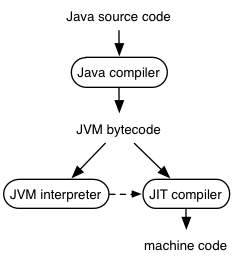
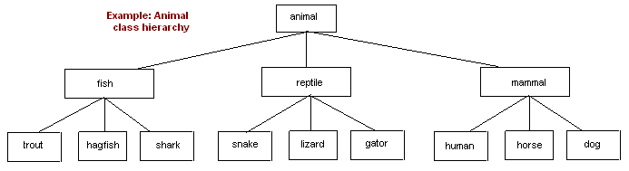
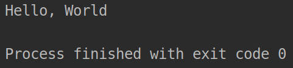

# Java Crash Course - Introduction (WIP)

Author: methylDragon  
Contains a syntax reference for Java!  
I'll be adapting it from lots of tutorials all around

------

## Pre-Requisites

- Basic coding knowledge will be presumed
  - You know basic programming constructs like variables, variable types, conditions, and functions.
  - If you don't have these, it'll be good to [Start with Python first](../Python%203/03%20Python%203%20-%20Object-Oriented%20Syntax.md)

### Good to know

- **Prior experience with OOP**


## Table Of Contents


## Introduction

Java is one of the most popular programming languages in the world, and is used widely in many different contexts, spanning web, applets, mobile, and many other platforms.

Its popularity is due in part to its design as a portable language you can write once, and run anywhere (the WORA principle.)

> Specifically, it is built to be:
>
> - Object Oriented
>   - Everything in Java is an object that can be extended
> - Platform independent
>   - Java is compiled into platform-independent byte code, and then interpreted
> - Simple
> - Secure
> - Architecture neutral
> - Portable
> - Robust
>   - With compile-time error checking and runtime checking!

**However, do note that developing in Java is best done in an integrated development environment (IDE), although you can handle compilation yourself with a text editor.**

Recommended IDEs to use are:

- IntelliJ
- Eclipse
- Netbeans
- Or any other IDEs you are used to

I will be using [IntelliJ IDEA](https://www.youtube.com/watch?v=H_XxH66lm3U)!

This introduction will go a little bit into setting up a project, adding dependencies, and the norms of how to package a project. I know I normally go into the syntax right away, but with Java, properly packaging a package is very important, so I'll go through that first..


### On IDEs

Java is a language where using an IDE is more or less mandatory due to the extreme amount of convenience the IDE provides you for managing packages, classes, as well as compiling and running your Java projects!

So please, PLEASE ensure you have an IDE installed.

Furthermore, we'll using the [Maven package manager](https://maven.apache.org/) to manage our dependencies. It'll allow us to get dependencies by simply typing them down in some `XML` file. And it can help us do a lot of other stuff.

Still not convinced on Maven? [Click here to find out.](https://wasiqb.github.io/blogs/mavenproject-vs-javaproject)

Also... for IntelliJ, `Ctrl-J` (Intellisense) is cool.


### On Compiling Code Using IntelliJ

If you have multiple classes already, I find it more useful to directly right click on the class to make sure the proper compilating configuration profile is selected.

You can also use `Ctrl-Shift-F10` to run the current source file you are on.


### Javadoc

Also when you're in doubt or need to read the documentation of any particular symbol, press `Ctrl-Q` to bring up the documentation using javadoc!


## Basic Concept Primer

### How Java is Run



[Image Source](http://www.cs.cornell.edu/courses/cs2112/2018fa/recitations/recitation.html?id=14jvm)

It makes sense to know what's actually going on with your code when you build it. Especially since we'll be doing a lot of it.

Java can be interpreted, or compiled. When you actually build your code, your source code gets initially compiled to an intermediary bytecode form. Following which, this bytecode is loaded and then executed by the Java Virtual Machine (JVM.)

The JVM decides when to compile segments of frequently-run code **at runtime**, automatically, which speeds up execution of that section. This is known as [Just-In-Time compilation (JIT)](https://www.reddit.com/r/explainlikeimfive/comments/580znf/eli5_what_does_just_in_time_compiling_mean_and/). This is because compiling stuff before runtime will take time, while interpreting code slows down execution speed because the instructions have to be interpreted.

It is because of this fact, that Java can be **faster or slower than programming languages like Python**. (The default implementation of Python, which is interpreted, that is.)

> Source code is compiled to JVM bytecode. This bytecode can immediately be interpreted by the JVM interpreter. The interpreter also monitors how much each piece of bytecode is executed (**run-time profiling**) and hands off frequently executed code (the **hot spots**) to the just-in-time (JIT) compiler. The JIT compiler converts the bytecode into corresponding machine code to be used instead. Because the JIT knows what code is frequently executed, and which classes are actually loaded into the current JVM, it can optimize code in ways that an ordinary offline compiler could not. It generates reasonably good code even though it does not include some (expensive) optimizations and even though the Java compiler generates bytecode in a straightforward way.
>
> The Java architecture thus allows code to run on any machine to which the JVM interpreter has been ported and to run fast on any machine for which the JIT interpreter has also been designed to target. Serious code optimization effort is reserved for the hot spots in the code.
>
> [Source](http://www.cs.cornell.edu/courses/cs2112/2018fa/recitations/recitation.html?id=14jvm)


### OOP from the Start

Unfortunately, due to Java's structure of having everything as an object, we'll have to introduce the idea of object oriented programming (OOP) right from the start.

So if this is your first time learning a programming language, I'd recommend checking out a different tutorial (like the one for [Python](../Python%203/03%20Python%203%20-%20Object-Oriented%20Syntax.md)) for you to get a better grasp of the topic first.

> **Very Brief Object Oriented Programming Concept** (OOP)
>
> OOP focuses on the manipulation of **objects**. Where **objects** are instances of a **class**, and have **properties** (things that the object **has** (attributes), or things that the object **can do** (methods)).
>
> For example:
>
> **methylDragon** can be an object of the **Dragon** class, and has the following properties:
>
> - Attributes:
>   - Name: methylDragon
>   - Sound: :musical_note:
>   - Colour: Black
>   - Breath: [Song, Fire]
> - Methods:
>   - makeSound()
>   - doDragonStuff()
>
> All objects of a particular class share attribute **fields**, and methods. But each object instance can have different values filling those fields.
>
> And **classes can be children of parent/superclasses as well**. (So for example, the **Dragon** class can be a sub-class of the animal class, where the animal class can have stuff like Name and Sound as attributes, and `makeSound()` method, with Dragon adding the Colour and Breath attributes, and the `doDragonStuff()` method.)

**Additionally, note that Java does not support multiple inheritance.** That is, Java classes can't inherit from more than one class at a time. Although they may implement multiple interfaces. That is, a particular subclass can inherit from one parent only, but one subclass can have many superclasses (if each parent has their own single parent, and so on.)

So this is a valid inheritance tree.



[Image Source](http://archive.oreilly.com/oreillyschool/courses/java3/java304.html)


### Hello World

Most things in Java are objects, and you'll see this in the most basic hello world program you can write!

This snippet, when compiled and run, prints `Hello, World` to the terminal.



```java
public class HelloWorld
{
   public static void main(String[] args)
   {
      System.out.println("Hello, World");
   }
}
```

We'll eventually learn what all the different stuff mean. 

But the takeaway from this code snippet is to simply notice **that the function that is run when you actually run the code is the `main()` function**, and the `main()` function has to take in a String array of arguments.

**And notably, you actually run the class, and keep the `main()` function within the class that you run!** There's no non-class-encapsulated procedural code in sight!


### Running Java Programs

Just for your information...

If you just have one class that doesn't depend on other classes defined in packages, then you can compile and run your Java code in the Linux terminal.

```shell
# Compile
javac <source_name>.java

# Run compiled bytecode
java ClassName # Not the file name!
```

But for everything else, it is probably better to use an IDE.

Remember that when you run a class, you will run the `main()` method of that class!


## Packaging Projects

### Packages

[Source](https://docs.oracle.com/javase/tutorial/java/concepts/package.html)

> A package is a namespace that organizes a set of related classes and interfaces. Conceptually you can think of packages as being similar to different folders on your computer. You might keep HTML pages in one folder, images in another, and scripts or applications in yet another. Because software written in the Java programming language can be composed of hundreds or *thousands* of individual classes, it makes sense to keep things organized by placing related classes and interfaces into packages.

Again, while I don't like introducing non-code concepts like project packaging right at the start of a code reference, I have to do it for Java...


### Adding Dependencies

Remember that we're using Maven on IntelliJ. 

You can add dependencies to Maven by adding dependencies to the `pom.xml` in your Java project's root. In this case you can see that I've added `junit`, which is the Java unit testing tool.

> After adding your dependencies, simply click on the "Load Maven Changes" button that appears.
>
> /image-20210224233948818.png)

```xml
<?xml version="1.0" encoding="UTF-8"?>
<project xmlns="http://maven.apache.org/POM/4.0.0"
         xmlns:xsi="http://www.w3.org/2001/XMLSchema-instance"
         xsi:schemaLocation="http://maven.apache.org/POM/4.0.0 http://maven.apache.org/xsd/maven-4.0.0.xsd">
    <modelVersion>4.0.0</modelVersion>

    <groupId>org.example</groupId>
    <artifactId>maven_testing</artifactId>
    <version>1.0-SNAPSHOT</version>

    <properties>
        <maven.compiler.source>14</maven.compiler.source>
        <maven.compiler.target>14</maven.compiler.target>
    </properties>

    <dependencies>
        <dependency>
            <groupId>junit</groupId>
            <artifactId>junit</artifactId>
            <version>4.13</version>
            <scope>test</scope>
        </dependency>
    </dependencies>

</project>
```


Since we're using Maven, we'll follow the standard [Maven directory structure](https://www.baeldung.com/maven-directory-structure), especially since this is what most of the open source Java projects out there are using. 

It's structured like so:

/image-20210224234856306.png)

We mainly care about `pom.xml`, `src/main`, and `src/test`.

Later on, when your code is compiled, it'll go into a `target` directory that we don't have to care about.


### The `src/main` directory

This is where your sources go! There's a couple of subdirectories:

- `src/main/java`: Java source code
- `src/main/resources`: Configuration files and other non-source files
- `src/main/webapp`: For JavaScript, CSS, HTML, etc. for webapps
- `src/main/filters`: For files that inject values into your config files

You'll mostly be working in `src/main/java`


### The `src/test` directory

This is where your tests go. Its subdirectories are like `src/main`:

- `src/test/java`
- `src/test/resources`
- `src/test/filters`


### Package Naming

[Source](https://docs.oracle.com/javase/tutorial/java/package/namingpkgs.html)

Package names must be:

- All lowercase

- The inverse of your domain name!

  - Begin with your internet domain (like... `com`, or `org`), then your name, then the package, and then after that any subclasses

  - >  For example, `com.example.mypackage` for a package named `mypackage` created by a programmer at `example.com`.
    >
    > [Source](https://docs.oracle.com/javase/tutorial/java/package/namingpkgs.html)

Notice then that `com` and `org` are literally just from the back of an internet domain! They don't really mean anything else super special...

> Packages that are in the Java language itself begin with `java.` or `javax.`

Additionally:

- If there are hyphens, convert them to underscores
- If any name begins with a non-alphabetical character, add an underscore before the name

> /image-20210224235651731.png)
>
> [Image Source](https://docs.oracle.com/javase/tutorial/java/package/namingpkgs.html)


### Packaging Classes

Each class is its own source file within a package!

Name your source files with the same name as the classes they represent!


### Packaging Tests

/image-20210224235752129.png)

Just mirror the packaging!


## Java Syntax Reference (WIP)

### Comments

```java
// this is a comment

/* multi
line comment! */

/**
 * JavaDoc comments look like this. Used to describe the Class or various
 * attributes of a Class.
 * Main attributes:
 *
 * @author         Name (and contact information such as email) of author(s).
 * @version     Current version of the program.
 * @since        When this part of the program was first added.
 * @param         For describing the different parameters for a method.
 * @return        For describing what the method returns.
 * @deprecated  For showing the code is outdated or shouldn't be used.
 * @see         Links to another part of documentation.
*/
```


### Printing

```java
System.out.print("Hello world!");
System.out.println("Hellp world!");  // Adds a newline after the print
```


### Variables and Data Types

**Variables are like containers for data**

Variable names can contain letters, underscores or numbers, but they **MUST NOT** start off with a number. You assign them values by using the `=` sign.

Let's make a variable of type double (which means it's a decimal number that can store more decimal numbers than the float type)

`double PI = 3.1415926535;` DON'T FORGET YOUR semicolons!

**Note**: When you declare variables inside of a function, **local** and can only be read by the function in question.


**Some other variable data types you have are**:

[Docs](https://docs.oracle.com/javase/tutorial/java/nutsandbolts/datatypes.html)

- `String`: (A string)
- `char` (Stores a single character, a single byte)
- `int`  (Whole numbers)
- `float` (Decimals, accurate up to 6 .dp)
- `boolean` (Contains TRUE or FALSE, i.e. 1 or 0)
- `short` (Int of 16 bits)
- `long` (int of 32 bits)


#### **Type Casting**

You can convert variable types into other types, if possible!

There are two kinds of type casts:

- Widening cast (happens automatically)
  - When converting from a smaller type to a larger type
  - E.g.: `byte` -> `short` -> `char` -> `int` -> `long` -> `float` -> `double`
- Narrowing cast (called manually)
  - When converting from a larger type to a smaller type
  - E.g.: `int num = (int) someDouble;`


#### **String Casting**

To cast to `String`, if you have an `Object` (not a primitive), you can use `toString()`.

```java
Integer.toString(123);
```

 Or build a String directly:

```java
// Either directly
String.valueOf(5); // "5"

// Or using StringBuffer or StringBuilder to do it iteratively
Integer i = new Integer(123);
StringBuilder sb = new StringBuilder(); // or StringBuffer
sb.append(i);
```


#### **Parsing**

Certain primitive wrappers have a `parseXXX()` method that you can use!

```java
// For example
Integer.parseString("5");
```


#### **Primitives vs. Primitive Wrapper Classes**

[Source](https://www.tutorialspoint.com/difference-between-an-integer-and-int-in-java)

An `int` is not an `Integer`. The `int` is a primitive data type, while `Integer` is a class that is meant to wrap the `int` into an object.

With the wrapper class you can very easily 


#### **Get Types**

Use `instanceof` or `getClass` to programmatically get the type of an **object**. For example:

```java
Integer a;
(a instanceof Integer); // true
a.getClass(); // java.lang.Integer
a.getClass().getName(); // "java.lang.Integer"
```

You can resolve the type of a primitive by casting it to an object or by using `isInstance`!

```java
// Cast to Object
((Object)x).getClass().getName(); // "java.lang.Integer"

// Or use isInstance
Integer.class.isInstance(a); // true
```


### Arithmetic

```java
a++; // Increment
a--; // Decrement

+ // Add: 3 + 2 equals 5
- // Subtract: 3 - 2 equals 1
* // Multiply: 3 * 2 equals 6
/ // Divide: 3 / 2 equals 1.5

%  // Modulo: 3 % 2 equals 1 (Modulo returns the remainder!)
```

You can also do your operations and assign at the same time!

```java
// For example:
int a = 5;

a += 5; // Is the same as a = a + 5;

// And so on for the other operators
```


### More Math

```java
Math.pow(); // Exponentiate: Math.pow(3, 2) equals 9
Math.floorDiv(); // Floor Divide: Math.floorDiv(3, 2) equals 1 (Removes any decimals)
Math.sqrt(); // Square root: Math.sqrt(4) equals 2
Math.random(); // Get a random double between 0.0 and 1.0 (inclusive)
```


### Importing Packages and Classes

[Source](https://learnxinyminutes.com/docs/java/)

```java
// Import specific class
// In this case, import the ArrayList class inside of the java.util package
import java.util.ArrayList;

// Import all classes in a package
// In this case, import all classes inside of the java.security package
import java.security.*;
```

You do not need to import a class if it is in the same package as a class you are in!


### Access Modifiers

Java has 4 levels of access. We'll go through them from most permissive to least:

- `public`
- default (when you don't use any keyword)
- `protected`
- `private`

Access modifiers do different things depending on whether you are using them on a **class** or something else! You can slap them on almost anything to control their access!

```java
// See how ModifierExample is a -public- class?
public class ModifierExample {
	private int a; // With a -private- variable!
}
```


**For classes:**

You can only use `public` or the default

| Modifier | Example                        | Description                                              |
| -------- | ------------------------------ | -------------------------------------------------------- |
| `public` | `public class ModifierExample` | Class is accessible by any other class                   |
| default  | `class ModifierExample`        | Class is only accessible by other classes in its package |


**For anything else**: (e.g. attributes, methods, and constructors)

| Modifier    | Example              | Description                                                  |
| ----------- | -------------------- | ------------------------------------------------------------ |
| `public`    | `public int var;`    | Accessible to all classes                                    |
| default     | `int var;`           | Accessible to all classes in the same package                |
| `protected` | `protected int var;` | Accessible to all classes in the same package, and **subclasses** outside the package |
| `private`   | `private int var;`   | Only accessible within the same class                        |

/access-modifier.png)

[Image Source](http://net-informations.com/java/basics/modifiers.htm)


### Other Modifiers

Beyond access modifiers, you can also slap on other modifiers. These are placed **after** the access modifier!

Again, they mean different things depending on whether you use them on a class or something else.


**For classes**:

You can only use `final` and `abstract`.

| Modifier   | Example                                 | Description                                                  |
| ---------- | --------------------------------------- | ------------------------------------------------------------ |
| `final`    | `public final class ModifierExample`    | Cannot be subclassed (cannot be inherited by other classes.) |
| `abstract` | `public abstract class ModifierExample` | Cannot be instantiated as-is. Must be subclassed.            |

Abstract classes can have non-abstract members! But they must be subclassed!


**For anything else**: (e.g. attributes, methods, and constructors)

| Modifier   | Example                    | Description                                                  |
| ---------- | -------------------------- | ------------------------------------------------------------ |
| `final`    | `public final int var;`    | Cannot be overridden or modified.                            |
| `static`   | `public static int var;`   | Belongs to the class, not the object. (Class-wide.)          |
| `abstract` | `public abstract int var;` | Can only be used on methods in an abstract class. Necessitates overriding. |


> **More modifiers**
>
> There are some less common modifiers too!
>
> - `transient`: Skipped when serialising the object containing them. [See reference](https://www.geeksforgeeks.org/transient-keyword-java/)
> - `synchronized`: Can only be accessed by a single thread at a time. [See reference](https://www.geeksforgeeks.org/synchronized-in-java/)
> - `volatile`: Value is cached from 'main memory', not thread local. [See reference](https://www.geeksforgeeks.org/volatile-keyword-in-java/)


>  **Notes**:
>
> - You can use **more than one of these other non-access modifiers**! E.g. `public static final int var;`
> - `final` prevents modification of the **reference**! But if the variable points to some mutable type, the underlying internal state of the mutable type (like... an ArrayList), that state can be modified!


#### **Declaring Constants**

To declare constants, use `static final`, then name your variable in all caps by convention.

```java
static final double PI = 3.141592653589793
```


### Constructors and Class Instantiation (`new`)

Instantiate your class! If you omit your constructor, you can still instantiate your class. The default constructor just does nothing.

A constructor must have the **same name** as your class!

Then, to instantiate your class, use the `new` keyword! This will call the constructor.

```java
public class Example {
    public Example() {
        System.out.println("Example Constructed!");
    }

    public static void main(String[] args) {
        Example example = new Example(); // This calls the constructor
    }
}

// Output: Example Constructed!
```


### Accessing Class Members

#### **Direct Access**

Access class-internal members using the `this` keyword.

Then access class members using `.`

```java
public class AccessExample {
    public int a;
    
    // Remember static variables are shared across all instances of the class!
    public static int b;
    
    public Example(int a) {
        this.a = a;
        b = a + a;
    }

    public static void main(String[] args) {
        AccessExample example = new AccessExample(5);
        example.a; // This gets the instance variable a: 5
    	AccessExample.b; // This gets the static variable b: 10 
    }
}
```

> **Note:** You can actually access static members by using the instance instead of the class. But this is not recommended since it obscures whether the static variable is actually an instance variable or static.

#### **Getters and Setters**

It's usually a good idea to write getters and setters instead of accessing members directly.

The reason for this is because you might want to have implementation specific validation or data pre/post-processing! Abstracting away this means that instead of having to change every direct access, you just need to change the implementation of the getter and setter instead.

This concept is known as **encapsulation**.

Getters and setters are implemented like so.

```java
public class MyClass {
    int field;

    public int getField() {
        return field;
    }

    public void setField(int field) {
        this.field = field;
    }
}
```

Luckily, since we have an IDE, we can [generate them automatically](https://www.jetbrains.com/help/idea/generating-code.html#generate-tostring).


### Inheritance

#### **Overview**

/typesofinheritance.jpg)

[Image Source](https://www.javatpoint.com/inheritance-in-java#:~:text=Inheritance%20in%20Java%20is%20a,behaviors%20of%20a%20parent%20object.&text=The%20idea%20behind%20inheritance%20in,fields%20of%20the%20parent%20class.)

Java supports three kinds of inheritance.

> **Note:** In this case the arrows mean that the **source** inherits from the **destination**.
>
> In other words, for Single inheritance, B is a subclass of A.

If we want multiple or hybrid inheritance, we need to use **interfaces** with the `interface` keyword. These are **not supported** if you are just using classes instead of interfaces.

/multiple.jpg)

[Image Source](https://www.javatpoint.com/inheritance-in-java#:~:text=Inheritance%20in%20Java%20is%20a,behaviors%20of%20a%20parent%20object.&text=The%20idea%20behind%20inheritance%20in,fields%20of%20the%20parent%20class.)


#### **`Extends`**

You can inherit from a superclass using the `extends` keyword!

```java
public class Animal {
    public static final bool ISLIVING = true;
    
    protected String name;
    protected int weight;
    
    protected static int numberOfAnimals = 0;

	public Animal() {
        numberOfAnimals++;
        System.out.println("New Animal created");
    }
    
    public void Sound() {
        System.out.println("Sound: Animal");
    }
}
```

Now, in another file, we create a `Dragon` class. This is an example of single inheritance.

```java
// Now we inherit from Animal!
// Note, this should be in a different file, since it is also public
public class Dragon extends Animal {
    @Override  // We can override methods using @Override
    public void Sound() {
        System.out.println("Sound: Dragon");
    }
    
    public static void main(String[] args) {
        Dragon dragon = new Dragon();
    }
}
```

When we run it, we get:

```
New Animal created
```

> **Note**: Using `@Override` is not mandatory, but it is highly recommended since it helps with code readability and extracts a warning from the compiler if you didn't actually override anything!


#### **`super`**

The `super` keyword when used in a subclass refers to the immediate parent/superclass. You can only use this from within a class though! So be careful!

The way this works is when you instantiate a subclass, you also implicitly instantiate the superclass! So suppose we made a new constructor for the `Dragon` class...

```java
public Dragon(){
    super(); // Call Animal's constructor
    super.Sound(); // Then Animal's sound
    Sound(); // Then Dragon's sound
}
```

This outputs:

```
New Animal created
Sound: Animal
Sound: Dragon
```

> Actually if you didn't use the `super()` constructor call for the superclass, the compiler will put it as the first line anyway.
>
> ```java
> // So if we do this, we ac
> public Dragon(){
>     // super(); // Call Animal's constructor
>     super.Sound(); // Then Animal's sound
>     Sound(); // Then Dragon's sound
> }
> ```

> **Note**: Be very careful though! If your superclass' method calls another superclass method that happens to be overridden by your subclass, it will **call the overridden version**!
>
> If you do not want this to happen, compose your parent class instead and call the composed class' method instead.


#### **`interface`**

We can define interfaces as well! Interfaces are 'blueprints' for implementing a class. They cannot be used to implement any functionality. They also cannot be instantiated! You must implement them!

They also can't contain any class-local variables, but they can contain `final static` (constant) variables!

- Interface methods are by default: `abstract` and `public`
- Interface attributes are by default: `public`, `static`, and `final`

> **Interfaces vs Abstract Classes**
>
> An abstract class permits you to make functionality that subclasses can implement or override whereas an interface only permits you to state functionality but not to implement it. A class can extend only one abstract class while a class can implement multiple interfaces.
>
> [Source](https://www.guru99.com/interface-vs-abstract-class-java.html)

Declare interfaces using the `interface` keyword! And declare implementations of said interface by using the `implements` keyword!

```java
// interface
interface Animal {
  public void animalSound(); // interface method (does not have a body)
  public void run(); // interface method (does not have a body)
}

// Dragon "implements" the Animal interface
class Pig implements Animal {
  public void animalSound() {
    // The body of animalSound() is provided here
    System.out.println("The pig says: wee wee");
  }
  public void sleep() {
    // The body of sleep() is provided here
    System.out.println("Zzz");
  }
}
```


Now that we know how to create and run classes, we can finally get on to the rest of the syntax reference.


### Conditionals

```python
== # equal to 
!= # NOT equal to
> # more than
< # less than
>= #  more than or equal to
<= # less than or equal to

is # Checks if something is the same object as something else
# Eg.
# 1 == true (Returns true)
# 1 is true (Returns false, as 1 does not refer to the same object)
```

> **Note:** 
>
> `==` is **NOT** `=`, `==` compares, `=` assigns values

#### **Logical Operators**

```python
&& # Logical And. E.g.: (a && b) is True
|| # Logical Or. E.g.: (a || b) is True
! # Logical Not. E.g.: !(a && b) is False
^ # Logical XOR. Returns true if and only if one operand is true and the other is false.
```

#### **`if`, `else`, `else if`**

```java
if (condition1) {
  // block of code to be executed if condition1 is true
} else if (condition2) {
  // block of code to be executed if the condition1 is false and condition2 is true
} else {
  // block of code to be executed if the condition1 is false and condition2 is false
}
```

You can also do ternary operators!

```java
variable = (condition) ? expressionIfTrue :  expressionIfFalse;
```

**switch**

```java
switch(expression) {
  case x:  // If expression == x
    // Run if expression == x
    break;
  case y:
    // Run if expression == y
    break;
  default:
    // Run otherwise
}
```

Just a simple switch case! Selects which code block to execute depending on some expression.

> **Note**: You must break if you intend for the cases to be mutually exclusive! Otherwise the program will continue to run the next line (which might be code meant for another case!)


### User Input

```java
static Scanner userinput = new Scanner(system.in);

System.out.println("Enter some input:");

if(userInput.hasNextLine()) {
    userInput.nextLine(); // Get the data entered!
}
```


### Arrays

/java_array.jpg)

[Image source](https://www.tutorialspoint.com/java/java_arrays.htm#:~:text=Advertisements,variables%20of%20the%20same%20type.)

Arrays store multiple values of the **same datatype**. They're like 'boxes in memory'. Values are stored contiguously in memory.

You need to define how many boxes there are in the array in the beginning, and this can't be changed.

#### **Examples**

```java
int[] uninitialisedNums = new int[5]; // Create an array of ints with size 5
int[] initialisedNums = {1, 2, 3, 4, 5}; // Or you can just directly initialise

// In both cases you can get the length of the array like so
initialisedNums.length; // 5

// Index elements like so (the index starts at 0 and goes to length - 1)
initialisedNums[3]; // 4

// To pass an array to a method... (We'll cover methods later on)
printArray(new int[]{3, 1, 2, 6, 4, 2});
```

> **Note:** You can technically also declare an array like `int myFavNums[]`, but this is not recommended.
>
> Notably, this non-recommended way is the way C++ does its array declarations, and Java allows this to accommodate C++ developers (like me!)

You can also make them multi-dimensional!

```java
int[][] twoDim = {{1}, {2}, {3}}; // This is a two-dimensional array: int[3][1]
```


#### **Array Utilities**

`java.util.Arrays` has a bunch of handy utilities to manipulate arrays with!

```java
int[] copied_nums = Arrays.copyOf(nums); // Copy!
int found_index = Arrays.binarySearch(nums, 5); // Binary search!

Arrays.equals(copied_nums, nums); // Array equality!
Arrays.sort(nums); // In-place sort!

Arrays.toString(nums); // Get string representation
```

 And lots more! Press `Ctrl-Space` in IntelliJ after typing `Arrays.` to see the list! Then you can use `Ctrl-Q` to see the relevant javadocs.


### ArrayList and Vector

There are also some helper classes that implement **resizable arrays**!

`Vectors` are thread-safe and synchronised (which has some overhead), whereas `ArrayLists` are not. Usually Java developers use `ArrayList` because they can handle sychronisation themselves.

The interface for `ArrayList` and `Vector` is very similar, so I'll just do an example for ArrayList.

#### **Examples**

```java
import java.util.ArrayList;

ArrayList<String> dragons = new ArrayList<String>();

// Add elements
dragons.add("Drogon");
dragons.add("Smaug");
dragons.add("methylDragon");
dragons.add("Toothless"); // Some might say he doesn't count...
System.out.println(dragons);

// Get size
dragons.size(); // 4

// Access elements
dragons.get(2); // You'll get me! methylDragon!

// Reassign element
dragons.set(3, "Saphira"); // Better...

// Clear elements
dragons.clear(); // Bye!
```

> There's also `LinkedList`, which is a [linked list](https://www.geeksforgeeks.org/data-structures/linked-list/). (Each element points to the next, so the memory is not contiguous.)
>
> These are good for heavy insertions in the middle of the list, but not so good for access, since we need to traverse the linked list each time we want to access an element.


#### **Collections Utilities**

Much like how arrays have the `java.util.Arrays` utilities, collections like `ArrayList` and `Vector` are served by `java.util.Collections`.

```java
import java.util.Collections;

Collections.sort(dragons); // Cool
```


### For Loops

> 1. Initialise an incrementer i
> 2. **FOR** as long as (some condition relating to i), RUN the code block
> 3. Each time you finish running the code block, INCREMENT according to your INCREMENTING statement

```java
for (int i = 1; i <= 10; i++) {
	System.out.print(i);
}
// 12345678910

for (int i = 1; i <= 10; i++) {
	if (i == 5) { continue; } // Continue takes us to the next iteration!
    System.out.print(i);
}
// 1234678910

for (int i = 1; i <= 10; i++) {
	if (i == 5) { break; } // Break takes us out of the loop!
    System.out.print(i);
}
// 1234
```

You can also do this Pythonically! (For each loop.)

```java
int[] nums = {1, 2, 3, 4, 5};

for (int num : nums) {
    System.out.print(num);
}

// 12345
```

The for each loop has some caveats though! [Source](https://www.geeksforgeeks.org/for-each-loop-in-java/)

- You shouldn't modify the array, otherwise weird things will happen
- You can't keep track of index unless you implement a counter
- You can only iterate through the array in single steps, forward
- You cannot process two decision making statements at once


### While Loops

This is like the `for` loop, but it runs indefinitely as long as some condition is true!

The condition is checked at the end of each iteration.

```java
int i = 0;
while (i < 5) {
  System.out.print(i);
  i++;
}
// 1234
```

If you need at least one run, use a **do-while** loop! The do-while loop executes the `do` block once, even if the condition is false, then continues like a normal `while` loop thereafter.

```java
int i = 0;
do {
  System.out.println(i);
  i++;
}
while (i < 5);
// 1234
```


### Sleeping

Delay your program flow!

Simple use `Thread.sleep()`! But ensure that you append your method signature with `throws InterruptedException`!

```java
public class SleepMessages {
    public static void main(String args[]) throws InterruptedException {
        String theBreathOfSong[] = {
            "Within a land of Wind and Sky",
            "A Dragon spreads his wings",
            "He flies on through strife-stricken Fields",
            "Takes Pause",
            "And soars to Dawn"
        };

        for (int i = 0; i < theBreathOfSong.length; i++) {
            Thread.sleep(1000); // Pause for 1 second
            System.out.println(importantInfo[i]);
        }
    }
}
```


### Exception Handling

In the previous section we saw that we said that the `main()` function could throw an `InterruptedException`. This section is all about handling exceptions such as that!

**General Exception Handling with `try catch`**

```java
public class Main {
  public static void main(String[ ] args) {
    try {
      int[] myNumbers = {1, 2, 3};
      System.out.println(myNumbers[10]);
    } catch (Exception e) {
      System.out.println("Something went wrong.");
    }
  }
}
```

You can also use `finally` to run things at the end even if an exception was caught!

```java
public class Main {
  public static void main(String[] args) {
    try {
      int[] myNumbers = {1, 2, 3};
      System.out.println(myNumbers[10]);
    } catch (Exception e) {
      System.out.println("Something went wrong.");
    } finally {
      System.out.println("The 'try catch' is finished.");
    }
  }
}
```

**Throw and Throws**

Use `throw` to throw an exception.

```java
throw new ArithmeticException("/ by zero");
```

Use `throws` to indicate that the method it is attached to **might** throw some exception. The caller to the method has the responsibility of handling the exception in a `try catch` block.

```java
type method_name(parameters) throws exception_list {}

// exception_list is a comma separated list of all the exceptions which a method might throw.
```


### Assertions

Mandate that some statement evaluates to true, otherwise, throw an assertion error.

This is usually used for test cases!

```java
assert assertion_expression : "printed string if false"
```


### Methods (Functions) [This should be moved to another function specific tutorial section]

Methods are just functions within a class. But because everything in Java must be within a class, every Java function is a method.

Methods take in zero or more parameters, and return some type, or `void` (nothing).

> **Note**: Java does not let you specify default parameters! You **must** use either a [builder pattern](https://www.baeldung.com/java-builder-pattern-freebuilder#Builder%20java), or use [variable arguments, or Optionals, or handle null inputs](https://stackoverflow.com/questions/965690/java-optional-parameters).

```java
public int addNumbers(int firstNum, int secondNum) {
	int combinedValue = firstNum + secondNum;	
	return combinedValue;	
}
```

Then you can just simply call the method!

```java
addNumbers(1, 5);
```


**Method Overloading**

You can have the same method name but with different parameter signatures! Java will resolve the method calls appropriately! This is known as **method overloading**.

The number of parameters need to be different, or if they are not, then the types of the parameters need to be different!

```java
void func() { ... }
void func(int a) { ... }
float func(double a) { ... }
float func(int a, float b) { ... }
```


### Handling Optional Parameters

#### **The Builder Pattern**

[Source](https://stackoverflow.com/questions/965690/java-optional-parameters)

You iteratively build up your object

```java
 class Foo {
     private final String a; 
     private final Integer b;

     Foo(String a, Integer b) {
       this.a = a;
       this.b = b;
     }
 }

 class FooBuilder {
   private String a = ""; 
   private Integer b = 0;

   FooBuilder setA(String a) {
     this.a = a;
     return this;
   }

   FooBuilder setB(Integer b) {
     this.b = b;
     return this;
   }

   Foo build() {
     return new Foo(a, b);
   }
 }
```

Then you simply iteratively construct your object!

```java
 Foo foo = new FooBuilder()
                 .setA("a")
                 .build();
```


#### **Optionals**

```java
void foo(String a, Optional<Integer> bOpt) {
    Integer b = bOpt.isPresent() ? bOpt.get() : 0;
    //...
}

foo("a", Optional.of(2));
foo("a", Optional.<Integer>absent());
```


#### **Varargs**

Variable argument numbers!

```java
void foo(String a, Integer... b) {
    Integer b1 = b.length > 0 ? b[0] : 0;
    Integer b2 = b.length > 1 ? b[1] : 0;
    //...
}

foo("a");
foo("a", 1, 2);
```


#### **Nulls**

```java
void foo(String a, Integer b, Integer c) {
    b = b != null ? b : 0;
    c = c != null ? c : 0;
    //...
}

foo("a", null, 2);
```


```
                            .     .
                         .  |\-^-/|  .    
                        /| } O.=.O { |\
```

​    

------

 [.png)](https://www.buymeacoffee.com/methylDragon)

