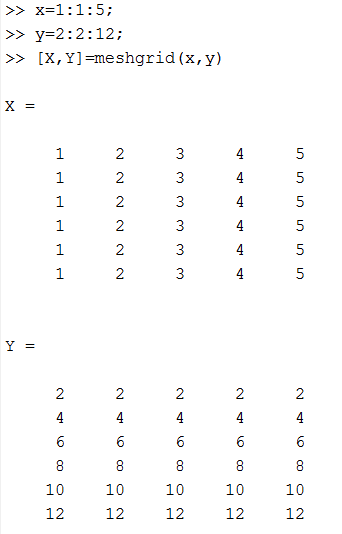

# MATLAB Crash Course

Author: methylDragon  
Contains a syntax reference for MATLAB!  
I'll be adapting it from the ever amazing Derek Banas: https://www.youtube.com/watch?v=NSSTkkKRabI

------

## Pre-Requisites

### Good to know

- Systems

## 1. Introduction

MATLAB stands for Matrix Laboratory. It's a very famous program used for working with matrices.

There are two main windows you'll really type into in MATLAB:

- **The Command Window**
  - It's like a terminal! You can define variables here, call functions, and use it like a calculator
- **The Editor**
  - You can write scripts here that you can use in the command window!

There's a third section known as the **Workspace**, where you can inspect your variables!

If you ever need to ask for help, either Google for it, or use the `help` function in the command window!

```matlab
help <function>
```

## 2. Command Line Interface

### 2.1  Path

Be sure to ensure that all scripts you want to write are in MATLAB **Path**, in other words, that they are accessible and visible to MATLAB.

In the file explorer on the left, you may add folders and subfolders to your path by right clicking and selecting `Add To Path`. Alternatively, you may double click on a folder to focus it and add it to Path, since your Path also includes your current focused folder!

### 2.2 Clearing Data

```matlab
clc % Clear command window (does not clear variables)
clf % Clear figures

clear % Clear everything
clear all % Clear everything

clear <variable> % Clear single variable
```

### 2.3 Configure Output

```matlab
format compact % Keeps output compact!
```

### 2.4 Stop Execution

Use `CTRL-c` to stop executing a particular command!

### 2.5 Precision

Precision is set to 15 digits by default. But you can configure that!

## 3. Basic MATLAB Syntax Reference

Click on New Script to start creating a new script!

### 3.1 Comments

[go to top](#top)

```matlab
% Single Comment

%{
    multi
    line
    comment!
%}
```

You can also use `CTRL-r` to comment and `CTRL-t` to uncomment!

### 3.2 Variables

Everything is a `double` by default in MATLAB.

```matlab
a = 5 % a is now 5! Yay!
```

Data Types:

- int8, int16, int32, int64
- char
- logical (Booleans)
- double
- single (Value without a decimal place)
- uint8

#### **More On Variables**

```matlab
c1 = 'A'
class(c1) % Prints the class/type of the variable!

s1 = 'A string'
class(s1) % With single quotes, the class is 'char'

s2 = "A string"
class(s2) % With double quotes, the class is 'string'

5 > 2 % Logical 1
b1 = true % Logical 1
```

To get the maximum number you can store, you can use these! The maximum and minimums differ depending on the number type. The example list I'm writing below is non-exhaustive.

```matlab
% For ints
intmax('int8')
intmin('int8')

% For doubles
realmax

% For singles
realmax('single')
```

### 3.3 Basic Operations

I really shouldn't need to explain this... You can use MATLAB like a calculator, and the results can go into variables!

```matlab
a = 1 + 2 + 3 + 4 + 5

5 + 5 % Add
5 - 5 % Subtract
5 * 5 % Multiply
5 / 5 % Divide
5 ^ 4 % Exponent
mod(5, 4) % Mod (get remainder)

% NOTE! MATLAB doesn't have increment and decrement operators. So you can't do stuff like a++, b--, etc.
```

### 3.4 Casting

```matlab
v2 = 8
v3 = int8(v2) % Like so!
```

Just write the appropriate class identifier and use it like a function!

### 3.5 Printing and Displaying

```matlab
% Use this to display vectors and numbers!
disp(some_vector_variable)

% Use this to print strings!
fprintf("Hello world!")

% sprintf prints as a string
sprintf('5 + 4 = %d\n', 5 + 4)
% With the %d here, it transplants the next variable argument into the string!
```

### 3.6 User Input

Using the `;` suppresses the input printout after the user has entered the input!

> Note: `"` might not work in some versions of MATLAB as a string delineator. Use `'` in that case.

**String Input**

```matlab
% String Input
% Notice the '' escapes the second quote
name = input('What''s your name : ', 's');

% Let's use this if statement to print the input out! (~ means not)
if ~isempty(name)
    fprinf('Hello %s\n', name)
end
```

**Vector Input**

```matlab
vInput = input('Enter a vector : ');
disp(vInput)
```

### 3.7 Useful Math Functions

`help elfun` for a whole list of math functions

```matlab
randi([10, 20]) % Random int
abs(-1) % Returns 1
floor(2.45) % Returns 2
ceil(2.45) % Returns 3
round(2.45) % Returns 2
exp(1) % e^x
log(100) % Log base e (ln)
log10(100) % Log base 10
log2(100) % Log base 2
sqrt(100) % Square root
deg2rad(90)
rad2deg(3.14)
```

### 3.8 Conditionals

```matlab
> % More than
< % Less than
>= % More than or equal to
<= % Less than or equal to
== % Equal to
~= % Not equal to

|| % Or
&& % And
~ % Not
```

**If block**

```matlab
if <condition>
    <do something>
elseif <condition>
    <do something else>
else
    <do something entirely different>
end % REMEMBER TO END!!!
```

**Switch Statement**

```matlab
switch score
    case 1
        disp("Aw")
    case 2
        disp("Better")
    case 3
        disp("You get the point")
    otherwise
        disp("WHO NAMED IT OTHERWISE OMG")
end % REMEMBER TO END
```

### 3.9 Vectors

They're one dimensional rows or columns!

**THE INDEXING FOR MATLAB STARTS AT 1, NOT 0!!!!**

```matlab
% Row Vectors
vector_1 = [5 3 2 1] % Yep!
vector_2 [5, 3, 2, 1] % Both are valid ways!

% Column Vectors
vector_3 = [5; 3; 2; 1]

% Index into the vectors
vector_1(1) % 5
vector_1(end) % 1 (Last value)
vector([1 2 3]) % Get first, second, and third value in vector

% Get range
vector_1(1:3) % First to third

% Change at index
vector_1(1) = 6

% Transpose Vector
a = [1 2 3]
a' % This is now 1, 2, 3 as a column!
```

**Vector Operations**

```matlab
a = [2; 3; 4]
b = [1 2 3]

a * b
% 2 4 6
% 3 6 9
% 4 8 2
```

### 3.10 Vector Methods

```matlab
vector_1 = [1 2 3 4 5]
length(vector_1)
sort(vector_1, 'descend')

% Create ranges
5 : 10 % Gives you [5 6 7 8 9 10]
2 : 2 : 10 % Gives you [2 4 6 8 10]

% Concatenate
a = [1 2 3]
b = [4 5 6]
[a b] % [1 2 3 4 5 6]

% Dot Product (Either...)
a * b' % Transpose as needed
dot(a, b) % Self explanatory

% Cross Product
cross(a, b) % Nice

% Linspace
linspace(1, 20, 4) % Generates 4 numbers equally spaced between 1 and 20

% Logspace
logspace(1, 3, 3) % Like linspace, but the spacing is logarithmic
```

### 3.11 Matrices

It's MATLAB, not Vector lab.

```matlab
matrix_a = [2 3 4; 4 6 8] % 2 rows, 3 columns (2x3)

length(matrix_a) % Gets you 3 (columns)
numel(matrix_a) % Number of values in matrix (6)
size(matrix_a) % Rows, then Columns (2 3)

% Generate random matrices!
randi([10, 20], 2)

% Index into matrices
a = [1 2 3; 4 5 6; 7 8 9]

a(1, 2) = 22 % Index into single value
a(1, :) = 25 % Change all row values
a(:, 2) % Change all column values
a(end, 1) % Last row
a(1, end) % Last column

% To delete a value, just literally put a semicolon at the end.
a(1, 2) = ;

% Multiply matrices
a * b

% Element-wise multiplication
a .* b % Take note of the period!

% Other matrix stuffffff
a - b
a + b
```

### 3.12 Matrix Methods

The list is not exhaustive!

#### **Construction**

Use the `help` command to find out how these work! They're overloaded functions.

```matlab
eye()
ones()
zeros()
diag()
```

#### **Mathematical Operations**

```matlab
sqrt(a) % Square root all values in matrix
sum(a) % Sum all columns
sum(a, 'all') % Sum all entries

prod(a) % Multiply all column values

cumsum(a, 'reverse') % Cumulative sum. First row stays the same, each row after is the sum of the preceding and current row (reverse makes it go in reverse)
cumsum(a) % Or if you don't want it reversed..
cumprod(a) % Cumulative product.

det() % Determinant
inv() % Inverse
```

#### **Conditionals and Indexing**

```matlab
isequal(a, b) % Check for equality
a > 3 % Apply conditional to all entries
find(a > 24) % Gives you index of entries that fulfill the condition
```

#### **Transformations**

```matlab
fliplr(a) % Flip left to right
flipud(a) % Flip up down

rot90(a) % Rotate 90 degrees
rot90(a, 2) % Rotate 180 degrees

reshape(a, 2, 6) % Reshape into 2x6, it's like numpy!
repmat(a, 2, 1) % Duplicate matrix into new matrix. Eg. If original matrix was 3x3, doing repmat(a, 2, 1) makes it 6x3

repelem(m3, 2, 1) % Duplicates ELEMENTS, so in this case, each element is duplicated twice in terms of the row
```

### 3.13 For Loops

For loops! It's pretty Pythonic. It iterates through a range.

```matlab
% Loop from 1 to 10 and print it
for i = 1:10
    disp(i)
end % REMEMBER TO END

% MORE EXAMPLES

% Print every value in matrix
a = [1 2 3; 4 5 6]
for i = 1:2
    for j = 1:3
        disp(a(i, j))
    end
end

% Print for undetermined length
b = [6 7 8]
for i = 1:length(b)
    disp(b(i))
end
```

### 3.14 While Loops

```matlab
i = 1 % You must create the variable first!

while i < 20
    if(mod(i, 2)) == 0
        disp(i)
        i = i + 1; % Semicolon suppresses the print
        continue
    end % This end is for i

    i = i + 1;
    if i >= 10
        break
    end
end
```

### 3.15 Cell Arrays

You can store data of multiple types

```matlab
cell_A = {'Hi', 35, [25 8 19]}
cell_B = cell(5) % Create the cell spaces first

cell_A{1} % Get first element
cell_A{3}(2) % Index further
cell_A{4} = 'Something else'
cell_A(4) = ; % Delete

for i = 1:length(cell_A)
    disp(cell_A{i})
end

% You can cast character arrays into cell arrays too!
a = ['A', 'BB', 'CCC']
char_array = cellstr(a)
```

### 3.16 Strings

Strings are vectors of characters!

```matlab
str_1 = 'I am a string'
length(str_1)

% Index into a string
str_1(1)
str_1(3:4) % Slices

% Concatenation
str = strcat(str1, ' and now I''m longer!')

% Look for substring
strfind(str, 'a') % Returns indexes of all found substrings

% Replace string
strrep(str, 'longer', 'bigger')

% Split string
str_array = strsplit(str, ' ') % Splits at all spaces. Makes a string array

% Convert numbers to string
int2str(99)
num2str(3.14)

% Check for equality
strcmp(str1, str2)

% Check if is char
ischar('Rawr!11!!1')

% Check if a string is just made of letters
isletter('num 2') % Logical 0
isstrprop('word2', 'alpha')

% Check if string is made of alphanumeric characters
isstrprop('word2', 'alphanum') % Logical 1

% Sort
sort(str, 'descend')

% Delete whitespace (it's like .strip() in python)
strtrim(str)

% Lower and Uppercase conversion
lower(str)
upper(str)
```

### 3.17 Structures

Custom data types! Think C++ structs! Or Python dictionaries/maps.

```matlab
methyl_struct = struct('name', 'methylDragon', ... % the ... lets you skip down to the next line (:
'species', ' Dragon')

disp(methyl_struct.name) % methylDragon

% Add a new field!
methyl_struct.sound = 'Rawr'

% Delete a field
methyl_struct = rmfield(methyl_struct, 'sound')

% Check if field exists
isfield(methyl_struct, 'species')

% Get all field names
fieldnames(methyl_struct)

% Store structures in vectors!
a(1) = methyl_struct
```

### 3.18 Tables

Tables are labelled rows of data in a table format

Get `help table` if you need help.

```matlab
a = {'A'; 'B'; 'C'; 'D'};
b = [29; 42; 1; 2]
c = {'AA', 'BB', 'CC', 'DD'}

% Create a table!!! We'll specify a as the index now
test_table = table(a, b, c, 'RowName', a)

% You can do cool stuff with tables!
mean(test_table.b) % For example.. find the means

% Add new fields
test_table.d = [1; 2; 3]

% Pull specific entries
test_table({'A', 'B'}, :) % This defaults to using the RowName as indexer

% Pull specific entries, using another row
a(ismember(test_table.b, {29, 42},:)
```

### 3.19 File IO

```matlab
% Let's just make a random matrix first
rand_matrix = randi([10, 50], 8)

% Let's save and load some files!
save sampdata.dat rand_matrix -ascii
load sampdata.dat
disp sampdata
type sampdata.dat

% We can save variables in a file as well!
save params % Leaving no arguments saves all variables you have on hand
load params
who % Display it on the screen
a = 123
save -append params a % This appends to the normal variable
```

### 3.20 Eval

If you know Python you should know what this does already.

Eval executes strings as code!

```matlab
toExecute = spritnf('total = %d + %d', 5, 4)
eval(toExecute) % Executes it as:
% total = 5 + 4
```

### 3.21 Pausing

You can pause in MATLAB too! Think of it like Arduino `delay()` or Python `time.sleep()`

```matlab
pause(5) % Pause for 5 seconds

pause off % Disable pause
pause on % Enable pause
```

## 4. Functional and OOP MATLAB

### 4.1 Functions

Functions have to come at the **end** of your file!

Local and global variable rules still apply! Local variables defined in functions don't change outside of the function! Just take note!

```matlab
% Function to calculate volume
% The return is defined by the name preceding the =
% The name of the function is the name following the =

% In this case, the return is 'vol' and the function name is 'cylinderVol'
function vol = cylinderVol(radius, height)
    vol = pi radius^2 * height
end

% Let's try another one! This time a function with no arguments
function randNum = getRandomNum
    randNum = randi([1, 100])
end

% Return more than one value
[coneV, cylVol] = getVols(10, 20) % I'll call the function here, and define it below

function [coneVol, cylinVol] = getVols(radius, height)
    cylinVol = pi * radius^2 * height
    coneVol = 1/3 * cylinVol
end

% Variable Number of Arguments
function sum = getSum(varargin)
    sum = 0;
    for k = 1:length(varargin)
        sum = sum + varargin{k}(1);
    end
end

% Return variable number of outputs
function [varargout] = getNumbers(howMany)
    for k = 1:howMany
        varargout{1}(k) = k;
    end
end
```

### 4.2 Anonymous Functions

No named functions! Think lambda in python

```matlab
cubeVol = @ (l, w, h) l * w * h; % (input) output

a = cubeVol(2, 2, 2) % Gives you 8! Correct!
```

**Pass Function to another Function**

Think decorators!

Source: https://www.youtube.com/watch?v=NSSTkkKRabI

```matlab
mult3 = @ (x) x * 3;
sol = doMath(mult3, 4)

function sol = doMath(func, num)
    sol = func(num);
end
```

**Returning Functions**

Source: https://www.youtube.com/watch?v=NSSTkkKRabI

```matlab
mult4 = doMath2(4);
sol2 = mult4(5)

function func = doMath2(num)
    func = @(x) x * num;
end
```

### 4.3 Recursive Functions

They call themselves!

```matlab
function val = factorial(num)
if num == 1
    val = 1;
else
    val = num * factorial(num - 1);
end
end
```

### 4.4 Classes

Static members are shared amongst all members of a class

```matlab
classdef Shape
    properties % Variables!!!
        height
        width
    end

    methods(Static)
        function out = setGetNumShapes(data)
            % Persistent values are shared by all objects also
            persistent Var;
            if isempty(Var)
                Var = 0;
            end
            if nargin % Number of input arguments
                Var = Var + data
            end
            out = Var;
        end
    end

    methods
        % Define a constructor
        function obj = Shape(height, width)
            obj.height = height
            obj.width = width
            obj.setGetNumShapes(1)
        end
        % Overloaded disp function
        % If you don't know what overloading is, check my C++ tutorial. It basically overwrites the functionality of a pre-existing function if the argument number matches
        function disp(obj)
            fprintf('Height : %.2f / Width : %.2f\n', obj.height, obj.width)
        end
        function area = getArea(obj)
            area = obj.height * obj.width;
        end
        % Overload Greater Than function
        function tf = gt(obja, objb)
            tf = obja.getArea > objb.getArea
        end
    end
end
```

**Let's try using it!**

```matlab
a1 = Shape(10, 20)
disp(a1)
Shape.setGetNumShapes
a1.getArea

a2 = Shape(5, 10)
disp(a2)
Shape.setGetNumShapes

a1 > a2
```

### 4.5 Class Inheritance

```matlab
classdef Trapezoid < Shape % Trapezoid inherits from Shape

    properties
        width2
    end

    methods
        function obj = Trapezoid(height, width, width2)
            obj@Shape(height,width) % The @ sign means you're taking it from the parent
            % In this case we're using Shape's constructor!
            obj.width2 = width2
        end
        function disp(obj)
            fprint('Height : %.2f / Width : %.2f / Width2 : %.2f', obj.height, obj.width, obj.width2);
        end
        function area = getArea(obj)
            area = (obj.height/2) * (obj.width + obj.width2);
        end
    end
end
```

**Let's try it out!**

```matlab
a3 = Trapezoid(10, 4, 6)
disp(a3)
a3.getArea
```

## 5. Plotting

### 5.1 Plotting in MATLAB

Source: https://www.youtube.com/watch?v=NSSTkkKRabI

`help plot` for help!

```matlab
xVals = 1:5
yVals = [2 4 8 5 9]
yVals2 = [1 5 7 6 8]

figure(1)
plot(xVals, yVals, 'g+', 'LineWidth', 2)
hold on % Draw over what was plotted, keep plot settings
plot(xVals, yVals2, 'k*')
legend('yVals', 'yVals2')

grid on % Turn grid on

xlabel('Days')
ylabel('Money')
title('Money Made Today')
figure(2)
bar(xVals, yVals, 'r')

% Colors : blue(b), black(k), cyan(c), green(g),
% magenta(m), red(r), yellow(y), white(y)
% Plot Symbols : . o x + * s d v ^ < > p h
% Line Types : -, :, -., - -

% Set font weights and the like
% gca is the axis object, gcf is the figure object
set(gca, 'FontWeight', 'bold', 'FontSize', 20, 'color', 'white');
set(gcf, 'color', 'white')

clf % Delete all figures
```

#### **Example Sinusoid with Time**

```matlab
y = A.*cos(2*pi .* t/T - 2*pi .* x/lambda + phi0);
```

### 5.2 3D Plotting in MATLAB

#### **3D Plots and Meshgrids**



```matlab
plot3() % Use this instead of plot2!

% Example
t = 0: pi/50 : 10*pi;
plot3(sin(t), cos(t), t)

% Meshgrids
meshgrid()
```

#### **Surfaces**

```matlab
% Plot surfaces
cylinder()
sphere()

surf() % Plot a surface
isosurface() % For when plotting normal surfaces are too hard
contour() % Plot a contour map instead
```

#### **Vector Fields**

```matlab
quiver() % 2D
quiver3() % 3D

colorbar % Add a colorbar!
```

## 6. Intermediate and Advanced Math

### 6.1 Vector Calculus

```matlab
gradient()
divergence()
curl()
del2() % Discrete laplacian
```

```
                            .     .
                         .  |\-^-/|  .    
                        /| } O.=.O { |\
```

​    

------

 [.png)](https://www.buymeacoffee.com/methylDragon)
