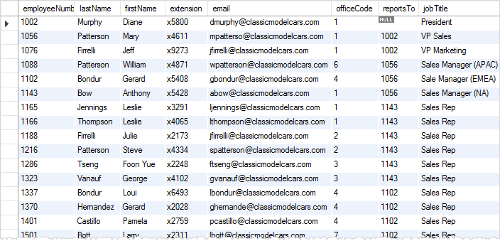

# MySQL Quickstart Guide

Author: methylDragon  
It's quick a tutorial to get you up to speed for MySQL!  
I'll be adapting it from the ever amazing Derek Banas: https://www.youtube.com/watch?v=yPu6qV5byu4

------

## Pre-Requisites

### Assumed knowledge (This is a syntax reference, and an intermediate tutorial, not a basic coding tutorial)

- CAN YOU LOGIC? IF SO CARRY ON HMHM
- Terminal ($ are terminal commands, > are MySQL terminal commands)

### Good to know

- PHP
- General coding syntax (I'll use # for comments)


## Table Of Contents <a name="top"></a>

1. [Introduction](#1)    
   1.1 [MySQL Database Architecture](#1.1)    
2. [Basic Syntax Reference](#2)    
   2.1   [Logging In and Logging Out](#2.1)    
   2.2   [Database Comments](#2.2)    
   2.3   [Database Design](#2.3)    
   2.4   [Table Creaton](#2.4)    
   2.5   [Data Types](#2.5)    
   2.6   [Primary Keys](#2.6)    
   2.7   [Foreign Keys](#2.7)    
   2.8   [Inserting and Deleting Data](#2.8)    
   2.9   [Displaying Table Values](#2.9) (Also with filters!)    
   2.10 [Displaying Table Values](#2.10) (With Data Conditionals!)    
   2.11 [Altering Tables](#2.11)    
   2.12 [Renaming Tables](#2.12)    
   2.13 [Joins](#2.13)    
   2.14 [Advanced Joins](#2.14) (Inner and Left/Right)    
3. [Reference Links](#3)  


## 1. Introduction <a name="1"></a>

>MySQL is a database, used for storing information in a way that makes it easy to get at particular pieces of information when you want them. It can be used for lots of things, but in this case, it's to store data to be used for a website. (r/eli5)

We're going to learn how to interface with, and alter MySQL databases in this reference! You can do so

- Via **Terminal**

- Via **PHP** using said terminal commands (referred to as Queries!)

- Via **Python** using the mySQL.connector plugin or sqlite3

  - For python, a cursor object has to be initialized, after which the commands can be passed to it as is:

    ```python
    import mysql.connector
    
    # Create database connection
    mydb = mysql.connector.connect(
      host="localhost",
      user="username",
      passwd="passwd"
      database="mydatabase"
    )
    
    mycursor = mydb.cursor() # Creates the cursor
    mycursor.execute("INSERT SQL COMMANDS HERE") # execute desired SQL terminal commands
    ```

    

If you want a GUI program to access your database, use https://www.mysql.com/products/workbench/

If working on WordPress, there's a bunch of handy database plugins out here. One of which is ARI Adminer. But apparently you can also use MySQL workbench: https://www.michaelstults.com/2014/10/how-to-setup-mysql-workbench-database-for-wordpress-on-windows-server/


### 1.1 MySQL Database Architecture <a name="1.1"></a>

[go to top](#top)

In MySQL, data is stored in **Tables** that are grouped within **Databases**. It works best when you can pre-define your database schemas.

Within each table, each entry of data is stored in a **row** (also known as records), whereas each property that is being stored (eg. Name, Telephone Number, Index Number) define the **columns** (also known as fields.)



## 2. Basic Syntax Reference <a name="2"></a>

### 2.1 Logging In and Logging Out <a name="2.1"></a>

[go to top](#top)

Naturally, in order to have write-access to a database, you have to log in.

```mysql
# One of these will work depending on your mysql version to LOG IN
# Key in your password when prompted
$ mysql5 -u <username> -p
$ mysql -u <username> -p

# To LOG OUT
> quit
```


### 2.2 Database Commands <a name="2.2"></a>

[go to top](#top)

It's good practice to write your commands and keywords in upper-case. It's not required, but it's better for clarity.

```mysql
# Show the list of databases
> SHOW DATABASES;
# Create a database
> CREATE DATABASE <database_name>;
> CREATE DATABASE IF NOT EXISTS <database_name>; # Creates the database if it doesn't exist
# Access a database
> USE <database_name>;
# See which database is being used
> SELECT DATABASE();
# Destroy database
> DROP DATABASE <database_name>;
> DROP DATABASE IF EXISTS <database_name>; # Destroys the database if it exists
```


### 2.3 Database Design <a name="2.3"></a>

[go to top](#top)

It's good practice to draw out your intended data input to see how you can design the schemas and tables.


Then eventually this will allow you to more easily see how to design your tables!


A nice way to design your databases is using the concept of **Atomic Tables** and **Table Templating**. You want to keep things organised so you can perform queries really quickly using your database.

According to Derek Banas, this means to have

- Every table focus on describing one thing (eg. dragons)
- Once you decide what your table should describe, decide what properties you need to describe that thing (eg. interests, name, etc.) (these properties will then be atomic)
- Write them down! If those properties require multiple inputs, pull them out and make them into separate tables (eg. things a dragon did today)

Additionally:

- Don't have multiple columns with the same sort of information
- Don't include multiple values in one cell
- Normalized tables


### 2.4 Table Creation <a name="2.4"></a>

[go to top](#top)

We've run through database commands

```mysql
# Create tables using the 'CREATE TABLE' command
> CREATE TABLE <tableName>(
> <columnName> <expected_type> <NULL_accepted?>);

# Show the tables you've created using 'SHOW TABLES'
> SHOW TABLES;

# Here's an example!
# I indented it for readability, but it doesn't actually get indented in terminal...
> CREATE TABLE dragonsurvey(
  > name VARCHAR(30) NOT NULL, # Required field (NOT NULL), with expected 30 characters of data
  > email VARCHAR(60) NULL, # Not required field (NULL)
  > zip MEDIUMINT UNSIGNED NOT NULL,
  > likes_dragons ENUM('Y','N') NOT NULL DEFAULT 'Y', # DEFAULT VALUES WOO!
  > id INT UNSIGNED NOT NULL AUTO_INCREMENT PRIMARY KEY);
  
# Now we can look at our table!
> DESCRIBE dragonsurvey; # This will display the table template we just made!
  
# Notice: The semicolon ; appeared at the end of the ENTIRE statement!
```

In some instances, the backtick \` symbol might be used for table and/or column names. There are a few reasons why this is a good idea:

- The desired table name goes against mySQL naming conventions (tables start with numbers, etc)
- The desired table name contains symbols that can be [misinterpreted by the parser](https://stackoverflow.com/questions/7395062/mysql-insert-do-field-names-require-backtick-accent-delimination) as operators such as `-` symbols - in these cases the backtick ensures that the names are treated correctly

Do take note that this would require the backtick symbol to be used when calling the table and/or columns.

### 2.5 Data Types <a name="2.5"></a>

[go to top](#top)

It's a bit of a hefty list, so check here instead:  

https://www.w3schools.com/sql/sql_datatypes.asp  
https://www.techonthenet.com/mysql/datatypes.php

```mysql
# The common ones are

# INTEGERS
TINYINT # 127 to -128
SMALLINT # 32768 to -32767
MEDIUMINT # 8388608 to -8388608
INT # 2^31 to -2^31 -1
BIGINT # 2^63 to -2^63 - 1
FLOAT
DOUBLE

# STRINGS
CHAR # Fixed length string
VARCHAR # Variable length string
BLOB # 2^16 bytes
ENUM # Limited number of total values
SET # List of possible legal character strings, can contain more than just one entry unlike ENUM

# DATE and TIME
DATE # YYYY-MM-DD
TIME # HH:MM:SS
DATETIME # YYYY-MM-DD HH:MM:SS
TIMESTAMP # YYYYMMDDHHMMSS
YEAR # YYYY
```


### 2.6 Primary Keys <a name="2.6"></a>

[go to top](#top)

Primary keys can be thought of as **unique identifiers** for each element in a table. So think of them like serial numbers.

They must be:

- Unique to each row
- Given a value whenever the row is created
- Cannot be null
- Cannot be changed

It's probably best to just auto-increment the value of the key using AUTO_INCREMENT


### 2.7 Foreign Keys <a name="2.7"></a>

[go to top](#top)

Foreign keys are a little bit different!

In Derek Banas' words, they:

- Are used to make references to the Primary Key of another table
- Can have a different name from the Primary Key name
- Can be NULL
- Do not have to be unique

Example: If a region listing and included the primary keys for all the different dragons inside (even though there's another table for dragons), those keys would be considered foreign.

Another Example: Let's say you have an email server, with two tables, one for users, and one for the emails sent. The user table will have a PRIMARY KEY for user IDs, but you can reference the user IDs in the emails sent, since each email had to have been sent by a user. For the email table, the FOREIGN KEY is the user ID inputted into each row.

It's a good way to ensure something exists, since multiple tables will reference it. Also a good way to set filtering constraints.


### 2.8 Inserting and Deleting Data <a name="2.8"></a>

[go to top](#top)

```mysql
# Remember! If you forget how the table is structured, use DESCRIBE
> DESCRIBE dragonsurvey;

####################
# INSERTING VALUES #
####################

# To insert a new data entry/row, use INSERT INTO <table> VALUE
> INSERT INTO dragonsurvey VALUE; # Will then create a prompt for value insertion

-> ('methylDragon', 'methylDragon@gmail.com', 37771466666, 'Y', NULL); # Make sure you enter the values according to how the table is templated!
# You can add multiple entires also, using the ','!
# Like this: (.., ..), (..,..), (..,..);
# Do note that the values to be added must ALWAYS be in tuple format - this means that if you are adding one value, it must be in the format (..,)

# NULL is there for the primary key, it'll be auto-filled in since the primary key is set as AUTO_INCREMENT

# Easter egg: Can you find out what methylDragon's zipcode is?

# You can also specify certain columns to insert into!
> INSERT INTO dragonsurvey (name, likes_dragons) VALUES;
-> ('someName', 'Y');

###################
# DELETING VALUES #
###################

# Delete data entries/rows using DELETE FROM
> DELETE FROM dragonsurvey WHERE likes_dragons="N";
# HAHAHA DELETE ALL THE DRAGON HATERS

###################
# UPDATING VALUES #
###################

# Update entered data using UPDATE and SET
> UPDATE dragonsurvey SET likes_dragons="Y" WHERE name="dragonHater";
# Forces dragonHater to like dragons ... :>
```


### 2.9 Displaying Table Values (Also with filters!) <a name="2.9"></a>

[go to top](#top)

```mysql
############################
# DISPLAYING AND FILTERING #
############################

# Display all properties
> SELECT * FROM dragonsurvey; # This will display every property of every row/data entry

# Display properties selectively
> SELECT <property>, <property> FROM dragonsurvey; # This will display the listed properties only, for all data entries

# Display properties, filtering by data
> SELECT <property>, <property> FROM dragonsurvey WHERE name="methylDragon";
# Here you'll display the listed properties, for data entries where the property 'name' stores 'methylDragon'

# Filter by data using a list
> SELECT * FROM dragonsurvey WHERE name IN ('methylDragon', 'someName', 'anotherName');
# We'll only display entries with these three names!

# Filter by count using HAVING
> SELECT likes_dragons, COUNT(likes_dragons) AS 'Amount' FROM dragonsurvey GROUP BY likes_dragons HAVING Amount > 1;
# Displays two categories, people who like dragons and people who don't. There'll be a count for each. WILL ONLY DISPLAY THE ENTRY if the count is greater than 1.

# Filter ranges of values BETWEEN certain limits
> SELECT * FROM dragonsurvey WHERE zip BETWEEN '100' AND '99999'
# Shows data of dragons with zipcodes between 100 and 99999

# Display uniques (no duplication)
> SELECT DISTINCT likes_dragons FROM dragonsurvey;
# This one will just return two entries (at most), since there are only two unique entries for like_dragons

#########################
# ORDERING AND LIMITING #
#########################

# Order your displays
> SELECT * FROM dragonsurvey ORDER BY name;
# Orders the data displayed in alphabetical order (ascending)
> SELECT * FROM dragonsurvey ORDER BY name DESC;
# Orders the data displayed in alphabetical order (descending)

# Order your displays, more precisely!
> SELECT * FROM dragonsurvey ORDER BY name zip;
# Orders first by name, then within equal names, by zip

# Limit the results
> SELECT * FROM dragonsurvey LIMIT 5;
# Shows the first 5 results
> SELECT * FROM dragonsurvey LIMIT 5, 10;
# Shows the 6-10th result

#########################
# MANIPULATING DISPLAYS #
#########################

# Rename your displayed data columns
> SELECT name AS "Dragon" FROM dragonsurvey;

# Concatenate results
> SELECT CONCAT(name, " ", id) AS "Name_ID" FROM dragonsurvey;
# This will combine the name and id properties, and list it as NAME_ID

# Count entries
> SELECT COUNT(DISTINCT likes_dragons) FROM dragonsurvey;
# Doesn't list the uniques, just counts them
> SELECT COUNT(*);
# Shows the number of data entries in the entire table

# Group entries
> SELECT likes_dragons, COUNT(*) FROM dragonsurvey GROUP BY likes_dragons;
# This will display two categories, people who like dragons and people who don't. Then there'll be a count for each

# MATH
# Some commonly used ones: MIN(), MAX(), -, +, /, %, SUM(), AVG()
# There's a lot more numeric functions
```

Function list: https://www.w3schools.com/sql/sql_ref_mysql.asp


### 2.10 Displaying Table Values (With Data Conditionals!) <a name="2.10"></a>

[go to top](#top)

```mysql
# Conditional operators: 
# = , > , < , >= , <= , !
# Logical operators:
# OR , || , AND , && , NOT , !

# CONDITIONALS!
> SELECT <property>, <property> FROM dragonsurvey WHERE zip > 100;
# You'll display all dragonsurvey participants who have zip greater than 100;

# LOGIC!
> SELECT <property>, <property> FROM dragonsurvey WHERE zip > 100 OR name="methylDragon";
# You'll display all dragonsurvey participants who have zip greater than 100 OR who are "methylDragon"

# FUNCTIONS!
> SELECT <property>, <property> FROM sometable WHERE month(date) > 02;
# Filters out every entry with date of month Jan or Feb (01 and 02)
# (Other functions are similarly callable!)

# FORMATS!
> SELECT name, id FROM dragonsurvey WHERE name LIKE 'm%' OR id LIKE '%8';
# % matches any sequence of characters
# _ matches any SINGLE character
# This one displays entries where 'name' starts with m OR id ends with 8
```


### 2.11 Altering Tables <a name="2.11"></a>

[go to top](#top)

```mysql
# To begin altering a table (adding, deleting, changing column names), use the ALTER keyword to open a prompt
> ALTER TABLE dragonsurvey;

# You can ADD:
-> ADD colour VARCHAR(30) NOT NULL AFTER name;
# The AFTER states that you want to have the property be inserted after the property called 'name'

# You can CHANGE column names:
> ALTER TABLE dragonsurvey CHANGE colour breath
# Which will create a prompt for the new property's datatype
-> ENUM('fire','ice','earth','lightning') NOT NULL;

# You can MODIFY COLUMN name types
> ALTER TABLE dragonsurvey MODIFY COLUMN breath VARCHAR(30) NOT NULL;

# You can DROP (delete) entire TABLEs:
> ALTER TABLE dragonsurvey DROP TABLE IF EXISTS dragonsurvey;
# NOOOOOOO
# PS: You can use IF EXISTS just to make sure it's only done if the table exists

# Or, just DROP a COLUMN
> ALTER TABLE dragonsurvey DROP COLUMN zip;
# Why would dragons need zipcodes anyway..?
```


### 2.12 Renaming Tables <a name="2.12"></a>

[go to top](#top)

```mysql
# Use the RENAME TABLE keyword to do this! It'll open a prompt
> RENAME TABLE
-> dragonsurvey to dragons;
# You can rename multiple tables this way, just use the ',' in place of the ';' until you're done.
```


### 2.13 Joins <a name="2.13"></a>

[go to top](#top)

You can JOIN two tables when you're pulling data!

You have to find commonalities between tables in order to join them though!

```mysql
# JOINING tables by common ID using =
> SELECT * FROM table1, table2 WHERE table1.id = table2.id;

# Notice, you can call specific table column names by using the .
# Eg: table1.name, table2.date, etc.

# You can join THREE TABLES TOO! Just use AND
# Just use table1.id = table2.id AND table2.id = table3.id

# All the filtering and grouping stuff mentioned in the previous tutorial catagories can be applied here as well!


```


### 2.14 Advanced Joins (Inner and Left/Right) <a name="2.14"></a>

[go to top](#top)

```mysql
# LEFT JOINs return all relevant data from the first table, even if the relevant data in the second table is null
> SELECT * FROM table1 LEFT JOIN table2 ON table1.id = table2.id;
# The RIGHT (second) table in this case is table2

# RIGHT JOINs do the opposite, prioritising the second table
> SELECT * FROM table1 RIGHT JOIN table2 ON table.id = table2.id;
# table2 is still the RIGHT table

# INNER JOINs return all relevant data, provided no relevant data from both tables are NULL
> SELECT * FROM table1 INNER JOIN table2 ON table.id = table2.id;
```

Confused? No worries, someone wrote a better tutorial: https://www.sitepoint.com/understanding-sql-joins-mysql-database/

## Reference Links <a name="3"></a>

[go to top](#top)

https://www.ntu.edu.sg/home/ehchua/programming/sql/MySQL_Beginner.html (Oh, cool, NTU has its own MySQL tutorial haha!)    

https://www.w3schools.com/sql/sql_ref_mysql.asp (Function list)  
https://www.w3schools.com/sql/sql_datatypes.asp (Data type list)  
https://www.techonthenet.com/mysql/datatypes.php (Also a data type list)  
https://www.sitepoint.com/understanding-sql-joins-mysql-database/ (Join list)

​    

------

[.png)](https://www.buymeacoffee.com/methylDragon)