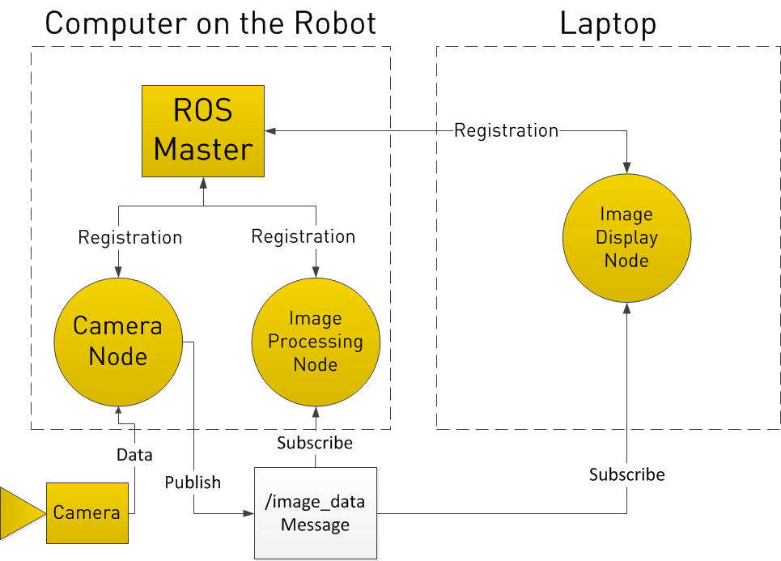

# ROS Crash Course

Author: methylDragon  
Fairly comprehensive ROS crash course!  
I'll be adapting it from the ROS Tutorials: http://wiki.ros.org/ROS/Tutorials    
and ETHz: http://www.rsl.ethz.ch/education-students/lectures/ros.html

------

## Pre-Requisites

- A system with Ubuntu 16.04 installed (no other versions!)
- Linux
- Python 3 and/or C++


## Table Of Contents <a name="top"></a>

1. [Introduction](#1)  
2. [Setup and Basic Concepts](#2)    
   2.1   [Installing ROS](#2.1)    
   2.2   [ROS Architecture](#2.2)    
   2.3   [Installing Packages](#2.3)    
   2.4   [Convenience Tools](#2.4)    
3. [ROS Crash Course](#3)    
   3.1   [ROS Workspaces](#3.1)    
   3.2   [rosbash](#3.2)    
   3.3   [roscore (ROS Master)](#3.3)    
   3.4   [Using ROS](#3.4)    
   3.5   [A Simple ROS Example](#3.5)    
   3.6   [Visualising the ROS Graph](#3.6)    
   3.7   [roslaunch](#3.7)    
   3.8   [Launch Files](#3.8)    
   3.9   [RViz](#3.9)    
   3.10 [Gazebo (Simulation)](#3.10)     


## 1. Introduction <a name="1"></a>

ROS stands for Robot Operating System. And true to its name, it's for working with robots!

ROS:

- Is a **publisher-subscriber framework** (pub-sub) for running independent programs on robots (across different system architectures)
- Has a **rich ecosystem of open-source packages and tools** written by its active community
- Is one of the **go-to frameworks for robotics research and prototyping!**

You have enough in the ecosystem to create a fairly robust autonomous system, and there are many tutorials for applications like robotic arms, autonomous ground vehicles, SLAM, and more!

> ROS is an open-source, meta-operating system for your robot. It provides the services you would expect from an operating system, including hardware abstraction, low-level device control, implementation of commonly-used functionality, message-passing between processes, and package management. It also provides tools and libraries for obtaining, building, writing, and running code across multiple computers. ROS is similar in some respects to 'robot frameworks,' such as [Player](http://playerstage.sf.net/), [YARP](http://eris.liralab.it/yarp/), [Orocos](http://www.orocos.org/), [CARMEN](http://carmen.sourceforge.net/), [Orca](http://orca-robotics.sourceforge.net/), [MOOS](http://www.robots.ox.ac.uk/~pnewman/TheMOOS/index.html), and [Microsoft Robotics Studio](http://msdn.microsoft.com/en-us/robotics/default.aspx).
>
> The ROS runtime "graph" is a peer-to-peer network of processes (potentially distributed across machines) that are loosely coupled using the ROS communication infrastructure. ROS implements several different styles of communication, including synchronous RPC-style communication over [services](http://wiki.ros.org/Services), asynchronous streaming of data over [topics](http://wiki.ros.org/Topics), and storage of data on a [Parameter Server](http://wiki.ros.org/Parameter%20Server). These are explained in greater detail in our [Conceptual Overview](http://wiki.ros.org/ROS/Concepts).	
>
> (http://wiki.ros.org/ROS/Introduction)


## 2. Setup and Basic Concepts <a name="2"></a>

### 2.1 Installing ROS <a name="2.1"></a>

[go to top](#top)

For this crash course, I'll be assuming that we'll be using ROS Kinetic for Ubuntu 16.04. Make sure you install the correct version of Ubuntu, otherwise it might be troublesome to install ROS (since it's officially supported on only specific distributions!)

Make sure you **read** the tutorials! Don't just blindly copy terminal commands!

Dualbooting Ubuntu 16.04: https://www.tecmint.com/install-ubuntu-16-04-alongside-with-windows-10-or-8-in-dual-boot/

Installing ROS: http://wiki.ros.org/kinetic/Installation/Ubuntu


> Here's a handy set of quick install scripts to get ROS set up!
>
> https://github.com/methylDragon/quick-install-scripts


### 2.2 ROS Architecture <a name="2.2"></a>

[go to top](#top)

As you know, ROS is a **publisher-subscriber** framework for facilitating robotics applications. What does this mean, even?

>  Imagine you're on an internet forum, with individuals publishing posts into and subscribing to (and reading from) from the forum topics, and you should get a pretty good idea of what's going on.

The ROS communication graph is made of ROS nodes (which can run robotics applications) communicating with each other:

- **ROS nodes** can be distributed across different systems, communicating via wired connections, wireless or the internet!
- **ROS nodes** can act as **Publishers** and/or **Subscribers**, and run programs that can react to messages set through ROS
- **Publishers** post **messages** onto **topics**
- **Subscribers** subscribe to **topics**, and receive **messages** as they are published
- All this activity is facilitated by the **ROS Master** (in the analogy, treat it as the forum site itself that hosts the nodes and topics, and mediates the messages!)


(Image source: clearpathrobotics.com)

So for a practical example. Consider a simple image processing system implemented in ROS. 

You have a camera node that **publishes** to an image_data **topic**, which is **subscribed** to by an image processing node and image display node.



(Image source: clearpathrobotics.com)

That's really the gist of what ROS is! It's a really powerful concept that allows for ease in creating distributed systems (or hooking additional nodes into existing systems written by other people, or hooking nodes written by other people into your own system!)

The rest of it is just learning how to route the publishers and subscribers, debug code, write new nodes, and interface them with hardware!


### 2.3 Installing Packages <a name="2.3"></a> 

When you first install ROS, it installs the base workspace for it (think of it as a working folder, or environment for working with ROS.) **It is in ROS workspaces do we install ROS packages, which define ROS nodes!**

After which, it is as simple as either using

```shell
$ sudo apt-get install <package_name>
```

Or, building from source otherwise

```shell
# With the package files in the correct locations (for more details, check out my catkin tutorial)

$ cd <workspace_directory>/catkin_ws
$ catkin_make
```


> Please go ahead and install the tutorials package!
>
> ```bash
> # Replace <distro> with your ROS distribution (it should be kinetic)
> $ sudo apt-get install ros-<distro>-ros-tutorials
> ```
>
> 


### 2.4 Convenience Tools  <a name="2.4"></a>

[go to top](#top)

A lot of your ROS use will involve heavy use of the Terminal, so it doesn't hurt to install convenience tools!

One tool I like a lot is Terminator. It lets you split your terminal panes and set default profiles for the terminal!

```shell
$ sudo apt-get update
$ sudo apt-get install terminator
```


## 3. ROS Crash Course <a name="3"></a>

### 3.1 ROS Workspaces <a name="3.1"></a>

[go to top](#top)

When you first start using ROS, it's most likely going to involve playing around with nodes other people have written, and running them with Terminal!

ROS comes with a whole bunch of command line tools that let you mess around with nodes and packages inside your ROS workspace! But in order to be able to use them, you must first **source** them from the ROS workspaces you want to use!

The ROS installation tutorial should have already gotten you set up with sourcing the base workspace for ROS.

```shell
$ echo "source /opt/ros/kinetic/setup.bash" >> ~/.bashrc
$ source ~/.bashrc
```


#### **Making your own workspace**

But what if we wanted to create our own workspace for our own robotics project? 

(It's generally recommended to do this so that you can port your project over to other systems instead of having to port the whole of ROS)

Then, we need to make our workspace

```shell
$ mkdir -p workspace_name/src # Create a catkin_ws folder with a src folder in it
$ cd workspace_name # Navigate into the folder's root
$ catkin_make # Build the required files
```

Then source it

```shell
$ source devel/setup.bash # Make sure you run this from your workspace's root!

# It would be good to also append this source command to your .bashrc so you don't have to keep doing it everytime you open a terminal

# Append source <workspace_directory>/devel/setup.bash
```

To check if you've sourced into it properly, run

```shell
$ echo $ROS_PACKAGE_PATH

# Ensure your workspace's directory appears in here
```

> For more in-depth information on ROS workspaces and building packages, check out my catkin tutorial!


### 3.2 rosbash <a name="3.2"></a>

[go to top](#top)

Further reading: http://wiki.ros.org/rosbash

Now that we've sourced our workspaces, we can use the command line utilities ROS provides to us!

These are mostly shortcuts for the common terminal commands, but can be used without specifying the explicit paths of the ROS packages and nodes!

- [roscd](http://wiki.ros.org/rosbash#roscd) - shortcut for `cd` , change to the directory of a ros package or node
- [rospd](http://wiki.ros.org/rosbash#rospd) - `pushd` equivalent of `roscd`
- [rosd](http://wiki.ros.org/rosbash#rosd) - lists directories in the directory-stack (for use with `rospd`)
- [rosls](http://wiki.ros.org/rosbash#rosls) - list files of a ros package
- [rosed](http://wiki.ros.org/rosbash#rosed) - edit a file in a package
- [roscp](http://wiki.ros.org/rosbash#roscp) - copy a file from a package
- [rosrun](http://wiki.ros.org/rosbash#rosrun) - run executables of a ros package (run a node)

Just try them out! Tab completion is your friend!

Example:

```shell
$ roscd <package>[/subdir]
$ rosrun <package> <node>

# Read the next section before running this! :)
$ rosrun roscpp_tutorials talker
```


### 3.3 roscore (ROS Master)<a name="3.3"></a>

[go to top](#top)

Ok! Now we're ready to really dive in deep!

As mentioned before, the **ROS master** facilitates messaging between nodes, and is what keep tracks of what nodes exist (nodes have to register with it whenever they initialise.)


#### **ROS Communication Setup**

In order to help it along, you **MUST** specify the IP address of the ROS master to each machine in the network that you want to communicate via ROS with!

```shell
# On the machine with the ROS master
$ export ROS_HOSTNAME=localhost
$ export ROS_MASTER_URI=http://localhost:11311
```

```shell
# On any other machine
$ export ROS_HOSTNAME=<MACHINE_IP_ADDRESS>
$ export ROS_MASTER_URI=<MASTER_MACHINE_IP_ADDRESS>
```

I'd highly suggest you append these commands into ~/.bashrc so you don't have to keep typing it!


#### **Starting the ROS Master**

Then, you can go ahead and start the ROS master. Pretty simple.

```shell
$ roscore
```


### 3.4 Using ROS <a name="3.4"></a>

[go to top](#top)

#### **Nodes**

Further reading: http://wiki.ros.org/rosnode

Now that our ROS master is up, we can get to running **ROS nodes**!

Remember that nodes are run from **packages**, and are essentially programs that can run independently, but which communicate via ROS' pub-sub architecture

Here are the relevant commands for starting nodes and getting information about them!

```shell
# Run nodes
$ rosrun package_name node_name

# See what nodes are running
$ rosnode list

# Get node info
$ rosnode info node_name

# Kill a node
$ rosnode kill node_name
```


#### **Topics**

Further reading: http://wiki.ros.org/rostopic

With the nodes up, topics should be listed if there are publishers or subscribers!

Note: Topics can only take a single type of message, even though messages themselves can consist of elements of multiple types!

```shell
# List current topics
$ rostopic list

# Subscribe to a topic and print messages as they are published to said topic
$ rostopic echo /topic_name

# Get topic information (like what messages it takes)
$ rostopic info /topic_name
```


#### **Messages**

Messages are the things that are sent to and read from the topics!

They define the type of the topic, and consist of different C++ types!

(Eg. A velocity message might consist of several floats x, y, and z.) A message designed for a specific topic can never have more or less arguments, and must be structured as defined! (They're more or less C++ structs --  a group of data elements grouped under a single name.)

(You define them in .msg files)

```shell
# Use this to see what message elements/messages a topic takes
$ rostopic type /topic_name

# You can publish a single message to a topic as follows!
$ rostopic pub /topic_name <type> <contents>
$ rostopic pub /my_topic std_msgs/String "Rawr"

# Or do it repeatedly! (this one does it 10 times per second)
$ rostopic pub -r 10 /cmd_vel geometry_msgs/Twist  '{linear:  {x: 0.1, y: 0.0, z: 0.0}, angular: {x: 0.0,y: 0.0,z: 0.0}}'
```


### 3.5 A Simple ROS Example <a name="3.5"></a>

[go to top](#top)

Ok! Now let's put what we've learnt to practice!

**Start the ROS master**

```shell
# In terminal 1
$ roscore
```
**Run the tutorial publisher node** in a **NEW TERMINAL** (if you close the ROS master's terminal, you stop it!!)

```shell
# In terminal 2
$ rosrun roscpp_tutorials talker
```
**Verify that the new node has been activated** in a **NEW TERMINAL**

```shell
# In terminal 3
$ rosnode list
$ rosnode info /talker
```
**Noticing that it publishes to a topic, let's check it out!**

```shell
$ rostopic info /chatter
$ rostopic type /chatter
```

**Cool! Now let's try subscribing to it**

```shell
# In terminal 4
$ rostopic echo /chatter

# We can also analyse the frequency! (In a NEW TERMINAL)
$ rostopic hz /chatter
```

Running echo should let you see what's being published to the topic, as it'll be displayed on the screen!

**Run the tutorial subscriber node** in a **NEW TERMINAL**

```shell
# In terminal 5
$ rosrun roscpp_tutorials listener
```

You should see the listener node start displaying messages that it sees on the screen, just like when you were echoing

**Close the tutorial publisher node** and try publishing your own message!

```shell
# In terminal 2, press Ctrl-C
$ rostopic pub /chatter std_msgs/String "data: 'Rawr'"
```


Now you know how publishers and subscribers work, and how to mess around with them!

For an interactive example that features keyboard input into a running node in a terminal, check out:    
http://wiki.ros.org/ROS/Tutorials/UnderstandingTopics

Or run these commands!

```shell
$ roscore
$ rosrun turtlesim turtlesim_node
$ rosrun turtlesim turtle_teleop_key

# Pause and play wth the turtle_teleop_key console

$ rosrun turtlesim draw_square
$ rosrun rqt_graph rqt_graph
```


### 3.6 Visualising the ROS Graph <a name="3.6"></a>

[go to top](#top)

Before you close everything from the previous section, try visualising the ROS computation graph!

```shell
# In a NEW terminal
$ rosrun rqt_graph rqt_graph
```

Then go to the dropdown menu, and select nodes/topics (all), then refresh the graph.

You should see a pretty good representation of the ROS system you've built, with nodes being represented as elipses, and topic as rectangles! It's good for debugging, or looking cool!


### 3.7 roslaunch <a name="3.7"></a>

[go to top](#top)

Ok. In the previous few examples, you had to manually write out the nodes you wanted to launch. What if you were lazy and wanted to do it in a single terminal with a single command?

Hmm...

Well we can use launch files! We can launch nodes with parameters using them! (It even starts a ROS master if you don't have one running!)

Use `roslaunch` to launch from a launch file!

```shell
# Using a launch file
$ roslaunch package_name launchfile_name.launch
```


### 3.8 Launch Files <a name="3.8"></a>

[go to top](#top)

Further reading: http://wiki.ros.org/roslaunch/XML

Launch files are written in XML. So get to learning it! It's not that hard!

```xml
<!-- This is an XML comment -->
```

#### **Minimal launch file**

```xml
<launch>
  <!-- This is how you specify nodes to be launched -->
  <node name="talker" pkg="rospy_tutorials" type="talker" output="screen" />
</launch>
```


#### **Setting parameters**

Certain nodes might have certain parameters that can be tweaked! (Eg. a laser node's max range)

Launch files can set them too!

```xml
<launch>
    <node pkg="move_base" type="move_base" name="move_base" machine="c2">
      <!-- A more robust renaming http://wiki.ros.org/roslaunch/XML/remap -->
      <remap from="odom" to="pr2_base_odometry/odom" />
        
      <!-- Declare parameters here! -->
      <param name="controller_frequency" value="10.0" />
      <param name="footprint_padding" value="0.015" />
      <param name="controller_patience" value="15.0" />
      <param name="clearing_radius" value="0.59" />
      
      <!-- Rosparam lets you use .yaml files for loading and dumping parameter data!
      http://wiki.ros.org/roslaunch/XML/rosparam -->
      <rosparam file="$(find 2dnav_pr2)/config/costmap_common_params.yaml" command="load" ns="global_costmap" />
      <rosparam file="$(find 2dnav_pr2)/config/costmap_common_params.yaml" command="load" ns="local_costmap" />
      <rosparam file="$(find 2dnav_pr2)/move_base/local_costmap_params.yaml" command="load" />
      <rosparam file="$(find 2dnav_pr2)/move_base/global_costmap_params.yaml" command="load" />
      <rosparam file="$(find 2dnav_pr2)/move_base/navfn_params.yaml" command="load" />
      <rosparam file="$(find 2dnav_pr2)/move_base/base_local_planner_params.yaml" command="load" />
    </node>
</launch>
```


#### **Taking arguments**

Now you can write your launch file to take arguments! You can write placeholder 'variables' that get filled when you run the launch file as such

```shell
$ roslaunch launch_file_name.launch arg_name:=value
```

```xml
<launch>
  <!-- Your arguments are declared here! They're like variables!-->
  <arg name="status_val" default="offline" /> 

  <!-- read value of arg -->
  <param name="status" value="$(arg status_val)"/>
</launch>
```


#### **Conditionals**

```xml
<?xml version="1.0"?>

<launch>
    <!-- Your arguments are declared here! They're like variables!-->
    <arg name="use_sim_time" default="true"/>
    <arg name="world" default="gazebo_ros_range"/>
    <arg name="debug" default="false"/>
    <arg name="physics" default="ode"/>

    <!-- You can define conditionals like so! -->
    <group if="$(arg use_sim_time)">
        <param name="/use_sim_time" value="true" />
    </group>
    
    <!-- Or evaluate them! -->
    <node if="$(eval arg physics == 'ode')" 
          name="control"
          pkg="controller_manager"
          type="spawner"
          args="physics_controller" /> 

</launch>
```


#### **Calling other launch files or importing files**

```xml
<launch>
    <!-- The include tag lets you call another launch file from within a launch file -->
    <!-- $(find package_name) can be used to find the system path to your package -->
    <include file="$(find gazebo_ros)/launch/empty_world.launch">
        <arg name="world_name" value="$(find gazebo_plugins)/test/test_worlds/$(arg world).world"/>
        <arg name="debug" value="$(arg debug)"/>
        <arg name="physics" value="$(arg physics)"/>
    </include>
</launch>
```


#### **Remapping nodes**

This means changing the **name** of the topic that a node is configured to subscribe or publish to!

```xml
<launch>
    <node pkg="roscpp_tutorials" type="talker" name="talker_node">
      <!-- Tell the node to publish to /jabber instead of /chatter -->
      <remap from="/chatter" to="/jabber" />
    </node>
    
    
    <node pkg="roscpp_tutorials" type="listener" name="listener">
      <!-- Tell the node to subscribe to /jabber instead of /chatter -->
      <remap from="/chatter" to="/jabber" />
    </node>
</launch>
```

Hooray we've remapped the topics!!


### 3.9 RViz <a name="3.9"></a>

[go to top](#top)

Read more: http://wiki.ros.org/rviz/Tutorials

RViz is a **3D visualisation tool for ROS** with many different camera views. 

It subscribes to topics, and you can choose to visualise the data!

You can save and load configurations in RViz! And it can take plugins! There's a lot to go through, so it probably warrants its own tutorial...

But some uses for it are:

- Just pure visualisation
- Mapping
- Navigation 'GUI' (You can send commands to the robot via RViz using the interface)
- Finding map points (Clicking on the Publish Point button publishes the coordinate to the topic /clicked_point)


### 3.10 Gazebo (Simulation) <a name="3.10"></a>

[go to top](#top)

Gazebo is one of the more popular simulation suites that is used with ROS. We're going to try using it with the Turtlebot3 simulator so we can get started writing code without having a hardware robot to play with! This way we can learn and practice the software side of things even without a huge budget!

Because the Turtlebot3 simulator is finicky, we're going to install the Linorobot simulator!

> **Please follow these steps!**
>
> - Install the desktop version of the Linorobot using the [ros_lino_base_install script](https://github.com/methylDragon/quick-install-scripts/blob/master/Linux/ros_lino_base_install) (Courtesy of [Linorobot.org](http://linorobot.org))
> - And the Linorobot [simulator](https://github.com/grassjelly/robot_playground)! (Follow the instructions on the repo!)


Ok! Let's try simulating the Linorobot! Run these commands in **SEPARATE TERMINALS.**

Ensure that running `$ echo $ROS_PACKAGE_PATH` displays a linorobot_ws and a catkin_ws!

```shell
# Start the Gazebo simulation of the Linorobot
# (The first run will take awhile, be patient)
$ roslaunch robot_playground bringup_sim.launch

# Run this in a separate terminal, you know the drill
# teleop_twist_keyboard lets you move the robot around!
$ rosrun teleop_twist_keyboard teleop_twist_keyboard

# If that doesn't work, use
$ rosrun teleop_twist_keyboard teleop_twist_keyboard.py
```

Let's try autonomous navigation!

```shell
# Start the navigation stack
$ roslaunch linorobot navigate.launch

# Aaaand start RViz with the navigation configurations!
$ roscd linorobot/rviz
$ rviz -d navigate.rviz

# Play around with it by using the 2D Pose Estimate and 2D Goal!
```


```
                            .     .
                         .  |\-^-/|  .    
                        /| } O.=.O { |\
```

​    

------

[.png)](https://www.buymeacoffee.com/methylDragon)