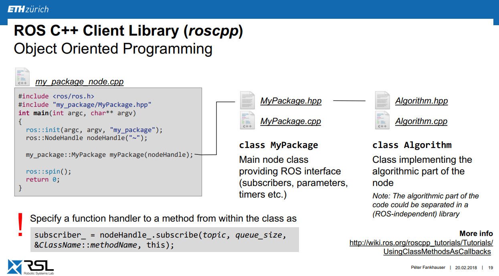

# Writing ROS Nodes

Author: methylDragon  
Fairly comprehensive ROS crash course!  
I'll be adapting it from the ROS Tutorials:http://wiki.ros.org/ROS/Tutorials    
and ETHz http://www.rsl.ethz.ch/education-students/lectures/ros.html    

------

## Pre-Requisites

- A system with Ubuntu 16.04 installed (no other versions!)
- Linux
- Python 3 and/or C++


## Table Of Contents <a name="top"></a>

1. [Introduction](#1)    
   1.1   [Introduction](#1.1)    
   1.2   [ROS Packages](#1.2)    
   1.3   [Nodes](#1.3)    
   1.4   [Parameters](#1.4)    
2. [Basics of Writing Nodes](#2)    
   2.1   [Introduction](#2.1)    
   2.2   [rospy](#2.2)    
   2.3   [rospy: hello_world](#2.3)    
   2.4   [rospy: Basic Publisher](#2.4)    
   2.5   [rospy: Basic Subscriber](#2.5)    
   2.6   [rospy: Parameters](#2.6)    
   2.7   [Making and building the rospy package](#2.7)    
   2.8   [Extra rospy tips](#2.8)    
   2.9   [roscpp](#2.9)    
   2.10 [roscpp: Concepts](#2.10)    
   2.11 [roscpp: hello_world](#2.11)    
   2.12 [roscpp: Basic Publisher](#2.12)    
   2.13 [roscpp: Basic Subscriber](#2.13)    
   2.14 [roscpp: Parameters](#2.14)    
   2.15 [Making and building the roscpp package](#2.15)    


## 1. Concepts <a name="1"></a>

### 1.1 Introduction <a name="1.1"></a>

[go to top](#top)

We've learnt about how to use ROS from the operator's perspective. Now we'll learn how to write nodes!

But before we really jump into the code, let's get some concepts out of the way first. Then I'll go through the commonly used client APIs/interfaces. (C++ and Python, **roscpp** and **rospy** respectively.)

There will be more concepts in the later sections, but let's take things as they come, ROS is a pretty extensive system after all.


### 1.2 ROS Packages <a name="1.2"></a>

[go to top](#top)

To create a new package:

```shell
$ catkin_create_pkg <package_name> <dependency_1> <dependency_2> ...
```

Your nodes and executables will inevitably find themselves within ROS **packages** if you ever intend them to be used in a ROS system.

Packages can contain:

- Source code (/src)
- Launch files (/launch)
- Config files (/config and /param)
- Message files (/msg)
- And more!


#### **Important Pointers**

- **Keep track of dependencies!** You have to state them properly!

- Make sure you **write your CMakelists.txt properly!** The Catkin reference I've written will help, but nothing beats trying it out yourself and having it break on you for a couple of (horrifically stressful) hours!

- **Separate message definition packages from other packages**, because including messages in your executable packages tends to break stuff.

  


#### **Package.xml and CMakeLists.txt (Briefly)**

For more info, read the catkin reference:

Package.xml defines the package's properties:

- Name
- Description
- Version
- Author
- Maintainer
- **Dependencies**
- **Build Tool** (use catkin !!)
- etc. etc.

CMakeLists.txt configures your package compilation, and configures:

- CMake version (`cmake_minimum_required`)
- Package name (`project()`)
- Package dependencies (`find_package()`)
- Python Module support (`catkin_python_setup()`)
- Message/service/action generator setup (`add_message_files()`, `add_service_files`, `add_action_files()`)
- Message/service/action generation (`generate_messages()`)
- Build Info (`catkin_package()`)
- Libraries and Executable build targets (`add_library()`, `add_exectuable()`, `target_link_libraries()`)
- Tests (`catkin_add_gtest()`)
- Install rules (`install()`)


#### **Workflow**

- Follow the instructions in the generated files to configure your package's CMakeLists.txt (more critical) and package.xml (ensure the build-tool selected is catkin!) (Refer to the catkin reference for more info!)
- Then write your nodes and populate the src space and other relavant directories within the package folder!
- Then go to the workspace root, and `catkin_make`!
- Then re-source the workspace and double-check to see if your packages can be called via rosrun/roslaunch

>  I'll go through this again if it's important to later on. But if not, check out the catkin reference!


### 1.3 Nodes <a name="1.3"></a>

[go to top](#top)

**Publishers** and **Subscribers**!

We already got the basic idea from the previous part, but going a little deeper, **nodes** can be treated like **objects** that:

- **Initialise** and **Shutdown** (with a node handler, and callback hooks!)
- **Publish** or **subscribe** to topics (sending or receiving messages!)
- **Run persistently** until otherwise (spin())
- Have **namespaces** (/node_name vs <namespace>/node_name)
- Can **log info** (ROS_INFO and ROS_INFO_STREAM)
- Can have **callback functions** (on receiving a message)
- Can store and retrieve **parameters** (via the ROS parameter server)


### 1.4 Parameters <a name="1.4"></a>

[go to top](#top)

**Configuration** parameters!

They're either **defined in launch files**, or referenced from **YAML files** within a package (like a config file!)

- The ROS Master will cater for a **parameter server** that will be maintained that stores all the parameters within the entire ROS network.
- **Nodes** use this parameter server to **store and retrieve parameters**


#### **Eligible Types**

http://wiki.ros.org/Parameter%20Server#Parameter_Types

> The Parameter Server uses XMLRPC data types for parameter values, which include:
>
> - 32-bit integers
> - booleans
> - strings
> - doubles
> - iso8601 dates
> - lists
> - base64-encoded binary data


#### **Storing Dictionaries as Parameters**

> You can also store dictionaries (i.e. structs) on the Parameter Server, though they have special meaning. The Parameter Server represents ROS namespaces as dictionaries. For example, imagine you set the following three parameters:
>
> ```
> /gains/P = 10.0
> /gains/I = 1.0
> /gains/D = 0.1
> ```
>
> You can either read them back separately, i.e. retrieving `/gains/P` would return 10.0, or you can retrieving `/gains`, which would return a dictionary:
>
> ```
> { 'P': 10.0, 'I': 1.0, 'D' : 0.1 }
> ```
>
> Just like the ROS naming hierarchy, you can nest dictionaries within dictionaries to represent child namespaces.

You deal with these dictionaries the same way you'd deal with them in C++ and Python.


#### **Loading Parameters**

Normally parameters are loaded using launch files. Use `rosparam`

```xml
<launch>

    <node pkg="my_package" type="node_name" name="custom_identifier" output="screen">
        <rosparam command="load" file="$(find my_package)/config/default.yaml" />
    </node>

</launch>
```


#### **Useful ROS terminal commands**

```shell
# List parameters
$ rosparam list

# Get value of parameter
$ rosparam get parameter_name

# Set value of parameter
$ rosparam set parameter_name value
```

Of course, you can write parameter retrieve and store commands within node source code! We'll go through that for each client library we'll be going over.


## 2. Basics of Writing Nodes <a name="2"></a>

### 2.1 Introduction <a name="2.1"></a>

[go to top](#top)

It's time to begin!

There are two commonly used client libraries/APIs for ROS.

- **rospy** for Python
- **roscpp** for C++

Python is generally slower, but easier to write for than C++. You can mix nodes of the two different types, but mixing languages within a node is a little harder.


### 2.2 rospy <a name="2.2"></a>

[go to top](#top)

(ros - pi, ros_py!!)

Adapted from: http://wiki.ros.org/rospy_tutorials/Tutorials/WritingPublisherSubscriber

>  Minimal projects can be found in the tutorial folder.

Remember that we're writing nodes here! So the hello world for this will be a 'hello world node', so to speak.

Ensure the following:

- You've created the workspace and sourced it
- These scripts are in your package's **src** directory
- You've built the scripts (read down for the tutorial for that)


### 2.3 rospy: hello_world <a name="2.3"></a>

[go to top](#top)

(You don't need a .py in the script name, the first line solves that issue)

```python
#!/usr/bin/env python
# The above line is MANDATORY

import rospy # Here's rospy!
from std_msgs.msg import String # This is how we import message types

def logger():
	
    # Initialise the node, call it logger
    # Anonymous means the node gets created as talker_serialnumber
    # (That prevents namespace clashes)
    # If there's a clash, the existing node will be booted off and forced to shutdown
    rospy.init_node('logger', anonymous = True)
    
    rate = rospy.Rate(10) # 10hz
    
    # As long as the node is not shutdown, keep running this
    while not rospy.is_shutdown():
        log_str = "HELLO WORLD"
        
        # ROS log is usually shown on the Terminal screen
        rospy.loginfo(log_str)
        rate.sleep()
        
if __name__ == '__main__':
    try:
        logger()
    except rospy.ROSInterruptException:
        pass    
```


### 2.4 rospy: Basic Publisher <a name="2.4"></a>

[go to top](#top)

```python
#!/usr/bin/env python

import rospy
from std_msgs.msg import String

def talker():
    # Create a publisher object
    # It publishes String messages to the topic 'chatter'
    pub = rospy.Publisher('chatter', String, queue_size = 10)
    
    rospy.init_node('talker', anonymous = True)
    rate = rospy.Rate(10) # 10hz
    
    while not rospy.is_shutdown():
        hello_str = "hello world %s" % rospy.get_time()
        rospy.loginfo(hello_str)
        
        pub.publish(hello_str)
        rate.sleep()

if __name__ == '__main__':
    try:
        talker()
    except rospy.ROSInterruptException:
        pass    
```


### 2.5 rospy: Basic Subscriber <a name="2.5"></a>

[go to top](#top)

```python
#!/usr/bin/env python

import rospy
from std_msgs.msg import String

def callback(data):
    rospy.loginfo(rospy.get_caller_id() + "I heard %s", data.data)
    
def listener():
    rospy.init_node('listener', anonymous = True)
    
    # Callback function gets run each time a message is received
    rospy.Subscriber("chatter", String, callback)

    # spin() keeps Python from exiting until this node is stopped
    rospy.spin()

if __name__ == '__main__':
    listener()
```


### 2.6 rospy: Parameters <a name="2.6"></a>

[go to top](#top)

Source: http://wiki.ros.org/rospy/Overview/Parameter%20Server

**Get parameters** (`get_param`)

Dictionaries are returned

```python
global_name = rospy.get_param("/global_name/etc")
relative_name = rospy.get_param("relative_name/etc")
private_param = rospy.get_param('~private_name/etc')    
default_param = rospy.get_param('default_param/etc', 'default_value')

# Fetch a group (dictionary) of parameters
gains = rospy.get_param('gains')
p, i, d = gains['P'], gains['I'], gains['D']
```

**Set parameters** (`set_param`, `set_param_raw`)

```python
# Using yaml strings
rospy.set_param('a_string', 'baz')
rospy.set_param('~private_int', '2')
rospy.set_param('list_of_floats', "[1., 2., 3., 4.]")
rospy.set_param('bool_True', "true")
rospy.set_param('gains', "{'p': 1, 'i': 2, 'd': 3}")

# Using raw python objects
rospy.set_param_raw('a_string', 'baz')
rospy.set_param_raw('~private_int', 2)
rospy.set_param_raw('list_of_floats', [1., 2., 3., 4.])
rospy.set_param_raw('bool_True', True)
rospy.set_param_raw('gains', {'p': 1, 'i': 2, 'd': 3})

rospy.get_param('gains/P') #should return 1
```

**Check parameter existance** (`has_param`)

```python
if rospy.has_param('to_delete'):
    rospy.delete_param('to_delete')
```

**Delete parameter** (`delete_param`)

```python
try:
    rospy.delete_param('to_delete')
except KeyError:
    print "value not set"
```

**Search parameters** (`search_param`)

```python
# This gets us the closest matching parameter in terms of the namespace
# But the name has to match, of course
param_name = rospy.search_param('global_example')

v = rospy.get_param(param_name)
```


### 2.7 Making and building the rospy package <a name="2.7"></a>

[go to top](#top)

Pre-requisites:

- You have to have **created** and **sourced** your catkin workspace!

  - Create some workspace (example_ws)

  - Create a src directory inside that workspace

  - Go to the root of the workspace, and use `$ catkin_make`

  - Then `$ source devel/setup.bash`

**1. Initialise your package**

```shell
$ cd <your_workspace_directory>/src
$ catkin_create_pkg package_name rospy <any other dependencies, including standard ones!>

# Eg. catkin_create_pkg basic_pub_sub rospy std_msgs
```

**2. Populate src with your rospy scripts**

Or, if you want to go modular, put them in sub-directories!

> **Example folder structure:**
>
> my_catkin_ws
>
> - src
>   - CMakeLists.txt
>   - **YOUR ROSPY PACKAGE**
>     - CMakeLists.txt (This is the one you edit)
>     - package.xml (This too!)
>     - **setup.py**
>     - src
>       - **PUT YOUR PYTHON SCRIPTS HERE**

**3. Create setup.py**

#### **Setup.py**

^ Super important! Put it in the **root** of your **package**!

Example setup.py:

```python
#!/usr/bin/env python

from distutils.core import setup
from catkin_pkg.python_setup import generate_distutils_setup

setup_args = generate_distutils_setup(
    
    # State your package directories within /src here
    packages = ['package_1', 'package_2'],
    
    # Script locations
    scripts = ['scripts/script_name'],
    
    # root/src, basically
    package_dir = {'': 'src'},
    
    # Your Python dependencies (eg. 'serial')
    install_requires = ['python_module_1', 'python_module_2']
)

setup(**setup_args)
```

**4. Write your package description (package.xml)**

For more info, read the **catkin tutorial**

Example package.xml:

>  **NOTE:** Python dependencies are defined using the `<exec_depend>` tags. But using the name from the rosdistro_list!
>
> In so doing, it's slightly different from declaring Python dependencies in setup.py.
>
> Writing it this way allows catkin to install it for other people when they install via catkin

```python
<?xml version="1.0"?>
<package format="2">
  <name>basic_pub_sub</name>
  <version>0.0.0</version>
  <description>A minimal rospy basic pub-sub package!</description>

  <author email="methyldragon@gmail.com">methylDragon</author>
  <maintainer email="methyldragon@gmail.com">methylDragon</maintainer>
  <url type="website">http://github.com/methylDragon</url>

  <license>MIT</license>

  <buildtool_depend>catkin</buildtool_depend>

  <build_depend>rospy</build_depend>
  <build_depend>std_msgs</build_depend>

  <build_export_depend>rospy</build_export_depend>
  <build_export_depend>std_msgs</build_export_depend>

  <exec_depend>rospy</exec_depend>
  <exec_depend>std_msgs</exec_depend>
  
</package>
```

**5. Configure the build (CMakeLists.txt)**

For more info, read the **catkin tutorial**

Example CMakeLists.txt:

```cmake
cmake_minimum_required(VERSION 2.8.3)
project(<package_name>)

find_package(catkin REQUIRED COMPONENTS
  rospy
  <other_dependencies>
)

# Enable python building
catkin_python_setup()

# Initialise the export variables
# Giving no arguments still initialises the variables (eg. CATKIN_PACKAGE_BIN_DESTINATION)
catkin_package()

# This is for installing SCRIPTS into the Install space
# Note: ONLY INSTALL THE EXECUTABLES YOU WANT TO BE ABLE TO ROSRUN!!
install(PROGRAMS
  <YOUR SOURCE_CODE DIRS HERE>
  <folders/SOURCE_CODE>
  DESTINATION ${CATKIN_PACKAGE_BIN_DESTINATION}
)
```

**6. Build the package**

- Go to the root of your workspace
- Run `catkin_make` and ensure no errors occured
- Source your workspace again `source devel/setup.bash`

**7. Verify the package**

Start a ROS master

```shell
$ roscore
```

Run your nodes

```shell
$ rosrun your_package_name node_name
```


#### **False Failures**

> You might find that the first time you run your package, the command will not autocomplete, because ROS takes awhile to find the package.
>
> To speed it along, either manually type out the rosrun command, or use `rospack profile` to rebuild the package tree.


### 2.8 Extra rospy tips <a name="2.8"></a>

[go to top](#top)

#### **Modularisation**

Read more: http://www.artificialhumancompanions.com/structure-python-based-ros-package/

> Minimal projects can be found in the tutorial folder.

It's always a good thing to **modularise** your code.

> Actually you can just name the folders whatever you want, but nodes and scripts is clear enough
>
> (Sometimes /nodes is called /bin)
>
> Nodes: Something you expect ROS to rosrun with
>
> Scripts: Any other kinds of scripts

---

> **Example folder structure:**
>
> - my_catkin_ws
>   - CMakeLists.txt
>   - src
>     - **YOUR_ROSPY_PACKAGE**
>       - CMakeLists.txt
>       - package.xml
>       - setup.py
>       - nodes
>         - node_1
>       - scripts
>         - script_1
>       - src
>         - python_package_1
>           - \_\_init\_\_.py
>           - node_source.py
>           - python_sub_package_1
>             - \_\_init\_\_.py
>             - node_sub_source_1.py
>             - node_sub_source_2.py

NOTE: Conventionally, the python package will be called the same name as the ROS package
> You must also use (and configure!) setup.py, which is the macro that will help Catkin locate the relevant Python files you'll want to use, as well as add your package to PYTHONPATH.

Where:

**python_package_1/\_\_init\_\_.py**

```python
#!/usr/bin/env python

from node_source import main
```

**node_1** (the executable node)

```python
#!/usr/bin/env python

# You can do this because of the __init__.py in my_pkg
from python_package_1 import main

if __name__== '__main__':
     main()
```

**node_source** (the code implementing the node)

```python
#!/usr/bin/env python

from python_sub_package_1 import node_sub_source_1

# Your implementing source code
# etc. etc.
```

(or, if you added an import statement in the sub_package's \_\_init\_\_.py,)

```python
#!/usr/bin/env python

from python_sub_package_1 import some_function

# + other source code
```

**setup.py**

```python
#!/usr/bin/env python

from distutils.core import setup
from catkin_pkg.python_setup import generate_distutils_setup

# No Python dependencies in this example

setup_args = generate_distutils_setup(
    packages=['my_pkg'],
    package_dir={'': 'src'},
)


setup(**setup_args)
```

**CMakeLists.txt**

```cmake
cmake_minimum_required(VERSION 2.8.3)
project(my_pkg)

find_package(catkin REQUIRED COMPONENTS
  rospy
)

catkin_package()
catkin_python_setup()

install(PROGRAMS
  nodes/node_1
  DESTINATION ${CATKIN_PACKAGE_BIN_DESTINATION}
)
```


#### **More info about \_\_init\_\_.py**

Read here: https://timothybramlett.com/How_to_create_a_Python_Package_with___init__py.html

Or read the advanced section of the Python tutorial!


#### **A better way to publish**

Source: http://wiki.ros.org/rospy_tutorials/Tutorials/AdvancedPublishing

As we know, when you're trying to publish something

```python
pub.publish(some_string) # rospy knows to create a std_msg.msg.String
```

But what if the message takes in multiple arguments?

```shell
$ rosmsg show std_msgs/ColorRGBA
float32 r
float32 g
float32 b
float32 a
```

Then you have to write it like this

```python
pub.publish(0.1, 0.2, 0.3, 0.4)

# But this is (in the words of the tutorial) kind of brittle!
# A better way is to actually use kwargs

pub.publish(a = 1.0)

# The rest will default to 0
```


### 2.9 roscpp  <a name="2.9"></a>

[go to top](#top)

Time to get started with C++!

>  Minimal projects can be found in the tutorial folder.

Remember that we're writing nodes here! So the hello world for this will be a 'hello world node', so to speak.

Ensure the following:

- You've created the workspace and sourced it
- These scripts are in your package's **src** directory
- You've built the scripts (read down for the tutorial for that)


### 2.10 roscpp: Concepts  <a name="2.10"></a>

[go to top](#top)

We'll be dealing with a bit more this time around than what we did in the rospy tutorial.

roscpp goes a tiny bit deeper!


#### **Node Handles**

Read more: http://wiki.ros.org/roscpp/Overview/NodeHandles

Node handles do several things:

- Handle **initialisation** and **shutdown**
- Handle communication with ROS (topics, services, parameters, etc.)


These node handles can exist in several types of namespaces:

- Public (default)
  - Eg: `nh_ = ros::NodeHandle();` (or `ros::NodeHandle nh_;`)
  - When looking for topics, resolves to: /namespace/topic
- Private
  - Eg: `nh_private_ = ros::NodeHandle("~");`
  - When looking for topics, resolves to: /namespace/node/topic
- Namespaced
  - Eg: `nh_rawr_ = ros::NodeHandle("rawr");`
  - When looking for topics, resolves to: /namespace/specific_name/topic
- Global
  - Eg: `nh_global_ = ros::NodeHandle("/");`
  - When looking for topics, resolves to: /topic


### 2.11 roscpp: hello_world  <a name="2.11"></a>

[go to top](#top)

```C++
#include <ros/ros.h> // Include the ROS main header file

int main(int argc, char** argv)
{
    ros::init(argc, argv, "rawrer", ros::init_options::AnonymousName);
    // Initialise a node named rawrer, make it anonymous
    // Check the rospy hello_world for what anonymous means

    ros::NodeHandle node_handle; // This HANDLES all communications with ROS
    // Topics, services, parameters, etc

    ros::Rate loopRate(10); // Hz

    // Let's just have a nice incrementer here
    unsigned int count = 0;

    // As long as ROS is running, keep running
    while (ros::ok())
    { // ros::ok() checks for the status of ROS
        ROS_INFO_STREAM("Rawr " << count); // Log it!
        // Notice how we aren't using cout here! Use ROS_INFO and ROS_INFO_STREAM!

        ros::spinOnce(); // Calls all callbacks waiting to be called-back
        loopRate.sleep(); // Sleep according to the loopRate
        count++; // Aaaand increment our counter
    }

    return 0;
}
```


### 2.12 roscpp: Basic Publisher  <a name="2.12"></a>

[go to top](#top)

```c++
#include <ros/ros.h>
#include <std_msgs/String.h>
#include <sstream>

int main(int argc, char **argv)
{
    // New node called talker
    ros::init(argc, argv, "talker");
    ros::NodeHandle nh;

    // Publish onto the "chatter" topic with a queue size of 1
    ros::Publisher chatter_publisher = nh.advertise<std_msgs::String>("chatter", 1);

    ros::Rate loopRate(10);

    unsigned int count = 0;

    while (ros::ok())
    {
        std_msgs::String message; // Make a new message object
        std::ostringstream string_count;
        string_count << count;

        message.data = "Rawr " + string_count.str(); // Write to it
        ROS_INFO_STREAM(message.data);

        chatter_publisher.publish(message);

        ros::spinOnce();
        loopRate.sleep();
        count++;
    }

    return 0;
}
```


### 2.13 roscpp: Basic Subscriber  <a name="2.13"></a>

[go to top](#top)

```c++
#include "ros/ros.h"
#include "std_msgs/String.h"

void chatter_callback(const std_msgs::String& msg)
{
	ROS_INFO("I heard: [%s]", msg.data.c_str());
}

int main(int argc, char **argv)
{
    // New node called listener
    ros::init(argc, argv, "listener");
    ros::NodeHandle nh;
    
    // Subscribe to chatter with a queue size of 10 and callback
    ros::Subscriber chatter_subscriber = nh.subscribe("chatter", 10, chatter_callback);
    ros::spin(); // Keep running until the node is killed
    
    return 0;
}
```


### 2.14 roscpp: Parameters  <a name="2.14"></a>

[go to top](#top)

First make a nodehandle: 

`ros::NodeHandle nh("~");` (For parameters, the nodehandle to use is normally **private**)


**Get parameters** (`getParam()`, `param()`)

`getParam()` returns a Boolean, but stores in the variable in the second argument

Returns **True** if a value was fetched

Returns **False** otherwise

`param()` works the same way, but if the parameter can't be retrieved, you can set a default value for it in that case.

```c++
std::string s;
int i;

// getParam()
// The param_name's fetched parameter value is stored in s!
nh.getParam("param_name", s);

// param()
nh.param("param_name_2", i, 42); // Default value is now 42

nh.param<std::string>("param_name_2", s, "default_val")
// Sometimes you need to include a hint
```

**Set parameters** (`setParam()`)

```c++
nh.setParam("param_name", "rawr");
```

**Check parameter existance** (`hasParam()`)

```c++
if (!nh.hasParam("my_param"))
{
	ROS_INFO("No param named 'my_param'");
}
```

**Delete parameter** (`deleteParam()`)

```python
nh.deleteParam("param_name");
```

**Search parameters** (`searchParam()`)

```c++
std::string param_name;
if (nh.searchParam("b", param_name))
{
	// If we found it, we can now query it using param_name
	int i = 0;

    nh.getParam(param_name, i);
}

else
{
	ROS_INFO("No param 'b' found in an upward search");
}
```


#### Getting arrays/dictionaries of parameters

In Python doing this is less of an issue because of auto-typing, but in C+ you need to pay a bit more attention.

You're allowed to store the arrays and dicts in `std::vector` and `std::map`s respectively. With the following types:

- bool
- int
- float
- double
- string


Then you can mess with them as per normal!

```c++
// Code source: http://wiki.ros.org/roscpp/Overview/Parameter%20Server

// Create a ROS node handle
ros::NodeHandle nh;

// Construct a map of strings
std::map<std::string,std::string> map_s, map_s2;
map_s["a"] = "foo";
map_s["b"] = "bar";
map_s["c"] = "baz";

// Set and get a map of strings
nh.setParam("my_string_map", map_s);
nh.getParam("my_string_map", map_s2);

// Sum a list of doubles from the parameter server
std::vector<double> my_double_list;
double sum = 0;
nh.getParam("my_double_list", my_double_list);
for(unsigned i=0; i < my_double_list.size(); i++) {
  sum += my_double_list[i];
}
```

Note: You'll have to use a for loop to populate a message with array/dict values, you can't do a direct cast, sadly.


### 2.15 Making and building the roscpp package  <a name="2.15"></a>

[go to top](#top)

Pre-requisites:

- You have to have **created** and **sourced** your catkin workspace!
  - Create some workspace (example_ws)
  - Create a src directory inside that workspace
  - Go to the root of the workspace, and use `$ catkin_make`
  - Then `$ source devel/setup.bash`

**1. Initialise your package**

```shell
$ cd <your_workspace_directory>/src
$ catkin_create_pkg package_name roscpp <any other dependencies, including standard ones!>

# Eg. catkin_create_pkg basic_pub_sub roscpp std_msgs
```

**2. Populate src with your roscpp scripts**

Or, if you want to go modular, put them in sub-directories!

> **Example folder structure:**
>
> - my_catkin_ws
>   - src
>     - CMakeLists.txt
>     - **YOUR ROSCPP PACKAGE**
>       - CMakeLists.txt (This is the one you edit)
>       - package.xml (This too!)
>       - src
>         - **PUT YOUR C++ SCRIPTS HERE**

**3. Write your package description (package.xml)**

For more info, read the **catkin tutorial**

Example package.xml:

```python
<?xml version="1.0"?>
<package format="2">
  <name>basic_pub_sub</name>
  <version>0.0.0</version>
  <description>A minimal roscpp basic pub-sub package!</description>

  <author email="methyldragon@gmail.com">methylDragon</author>
  <maintainer email="methyldragon@gmail.com">methylDragon</maintainer>
  <url type="website">http://github.com/methylDragon</url>

  <license>MIT</license>

  <buildtool_depend>catkin</buildtool_depend>

  <build_depend>roscpp</build_depend>
  <build_depend>std_msgs</build_depend>

  <build_export_depend>roscpp</build_export_depend>
  <build_export_depend>std_msgs</build_export_depend>

  <exec_depend>roscpp</exec_depend>
  <exec_depend>std_msgs</exec_depend>
  
</package>
```

**4. Configure the build (CMakeLists.txt)**

For more info, read the **catkin tutorial**

Example CMakeLists.txt:

```cmake
cmake_minimum_required(VERSION 2.8.3)
project(basic_pub_sub)

find_package(catkin REQUIRED COMPONENTS
  roscpp
  std_msgs
)

# Initialise the export variables
catkin_package(
  INCLUDE_DIRS src
  # LIBRARIES blah
  CATKIN_DEPENDS roscpp std_msgs 
  DEPENDS system_lib
)

include_directories(
  ${catkin_INCLUDE_DIRS}
)

# One per executable!
add_executable(basic_pub src/basic_pub.cpp)
target_link_libraries(basic_pub ${catkin_LIBRARIES})

add_executable(basic_sub src/basic_sub.cpp)
target_link_libraries(basic_sub ${catkin_LIBRARIES})

add_executable(hello_world src/hello_world.cpp)
target_link_libraries(hello_world ${catkin_LIBRARIES})


install(DIRECTORY launch
    DESTINATION ${CATKIN_PACKAGE_SHARE_DESTINATION}
)
```

**6. Build the package**

- Go to the root of your workspace
- Run `catkin_make` and ensure no errors occured
- Source your workspace again `source devel/setup.bash`

**7. Verify the package**

Start a ROS master

```shell
$ roscore
```

Run your nodes

```shell
$ rosrun your_package_name node_name
```


#### **False Failures**

> You might find that the first time you run your package, the command will not autocomplete, because ROS takes awhile to find the package.
>
> To speed it along, either manually type out the rosrun command, or use `rospack profile` to rebuild the package tree.


### 2.16 Extra roscpp tips  <a name="2.16"></a>

[go to top](#top)

#### **Modularisation and OOP**

Adapted from: https://github.com/ethz-asl/ros_best_practices

---

**Pre-Requisites:**

- Proficient in C++ OOP (read the C++ crash course OOP section!)
- This is a wiiiild ride...

Read the rospy modularisation section first to get an idea of what's going on!

---



Source: ETHz

>  **Example folder structure:**
>
> - my_catkin_ws
>   - CMakeLists.txt
>   - src
>     - **YOUR_ROSCPP_PACKAGE**
>       - CMakeLists.txt
>       - package.xml
>       - config
>         - default.yaml
>       - launch
>         - launch_Node.launch
>       - include
>         - **PACKAGE_HEADERS**
>           - algorithm.hpp
>           - nodeClassInterface.hpp
>       - src
>         - algorithm.cpp
>         - nodeClassInterface.cpp
>         - Node.cpp
>
> Note: Names files in the package /launch,  /src, and /include don't matter as long as you import the stuff properly

Where:

>  Since the code is way too long due to all the header files and imports and stuff, refer to the GitHub source link or the minimal project for examples

- **Node.cpp** (Starts the node)

- **nodeClassInterface** (Node interface)

  - .hpp (header file) (Interface)
  - .cpp (source code) (Implementation)

- **algorithm** (Algorithmic part of the node) (Can be separated into a ROS-independent library) 

  - .hpp (header file) (Interface)

  - .cpp (source code) (Implementation)

- **default.yaml** (For loading parameters)

- **launch_Node.launch** (For loading parameters on node start)

- **package.xml** (Good old 'friends')

- **CMakeLists.txt** (Make sure you configure this properly)


```
                            .     .
                         .  |\-^-/|  .    
                        /| } O.=.O { |\
```

​    

------

[.png)](https://www.buymeacoffee.com/methylDragon)