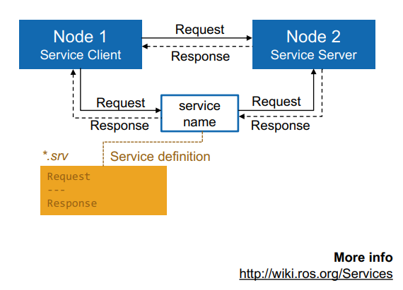
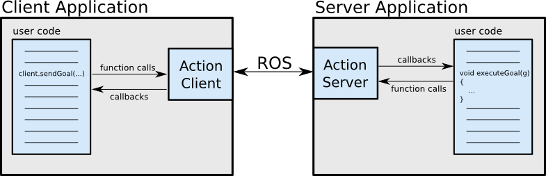

# ROS Messages, Services, and Actions

Author: methylDragon  
Fairly comprehensive ROS crash course!  
I'll be adapting code and tutorial content from the ROS Tutorials:http://wiki.ros.org/ROS/Tutorials    
and ETHz http://www.rsl.ethz.ch/education-students/lectures/ros.html    

------

## Pre-Requisites

- A system with Ubuntu 16.04 installed (no other versions!)
- Linux
- Python 3 and/or C++


## Table Of Contents <a name="top"></a>

1. [Introduction](#1)        
2. [Messages](#2)    
   2.1   [Introduction](#2.1)    
   2.2   [Message Files](#2.2)    
   2.3   [rosmsg](#2.3)    
   2.4   [Creating Message Files](#2.4)    
   2.5   [Using Custom Messages](#2.5) ([rospy](2.5.1)) ([roscpp](2.5.2)) ([Nested Messages](2.5.3))    
3. [Services](#3)    
   3.1   [Introduction](#3.1)    
   3.2   [Service Files](#3.2)    
   3.3   [rosservice](#3.3)    
   3.4   [Creating Service Files](#3.4)    
   3.5   [Writing Service Nodes](#3.5) ([rospy](3.5.1)) ([roscpp](3.5.2))    
4. [Actions](#4)    
   4.1   [Introduction](#4.1)    
   4.2   [Action Files](#4.2)    
   4.3   [rostopic for Actions](#4.3)    
   4.4   [Creating Action Files](#4.4)    
   4.5   [Writing Action Nodes](#4.5) ([rospy](4.5.1)) ([roscpp](4.5.2))    
5. [Concluding Comparison](#5)    

## 1. Introduction <a name="1"></a>

So now you know how to write nodes. Ever wondered if you could do more? Of course you can!

You can create **custom messages**, create **nodes just for serving requests**, or nodes that **carry out actions, and provide feedback.**

We're going to talk about **messages, services, and actions!**


## 2. Messages <a name="2"></a>

### 2.1. Introduction <a name="2.1"></a>

[go to top](#top)

Messages are what are sent to ROS nodes via topics! They are the subject that is published and sent to subscribers!

You can create messages very easily, because ROS has a couple of macros that dynamically generate the language-specific message related code for you! All you need to do, is create the **.msg file**.

> [msg](http://wiki.ros.org/msg): msg files are simple text files that describe the fields of a ROS message. They are used to generate source code for messages in different languages.
>
> (http://wiki.ros.org/ROS/Tutorials/CreatingMsgAndSrv)


### 2.2. Message Files <a name="2.2"></a>

[go to top](#top)

#### **Eligible Message Field Types**

Msg files are text files that consist of a single field per line. These are the eligible types:

- int8, int16, int32, int64 (plus uint*)
- float32, float64
- string
- time, duration
- other msg files
- variable-length array[] and fixed-length array[C]
- the special Header type

> The **Header** type consists of a **timestamp** and **coordinate frame.** A lot of packages use them, and it normally appears as the first line of a .msg file.


#### **Example .msg file**

```
  Header header
  string child_frame_id
  geometry_msgs/PoseWithCovariance pose
  geometry_msgs/TwistWithCovariance twist
```


### 2.3 rosmsg <a name="2.3"></a>

[go to top](#top)

ROS has a bunch of command line tools to help with messages as well!

```shell
# Show displays the contents of the corresponding message file
$ rosmsg show package_name message_name

# If you don't know the package, rosmsg will search for a matching message file!
$ rosmsg show message_name

# You can even use it in combination with rostopic to display type info about the topic!
$ rostopic type /topic_name | rosmsg show


# List displays a list of all messages
$ rosmsg list

# Package displays a list of all messages in a package
$ rosmsg package package_name

# Packages displays a list of all packages with messages
$ rosmsg packages

```


### 2.4 Creating Message Files <a name="2.4"></a>

[go to top](#top)

Let's try making some custom message files!

> Reminder: To create a new package,
>
> ```shell
> $ cd <your_workspace_directory>/src
> $ catkin_create_pkg package_name rospy <any other dependencies, including standard ones!>
> 
> # Eg. catkin_create_pkg basic_pub_sub rospy std_msgs
> ```

**1. Go to your package directory**

```shell
$ roscd msg_example_msgs # Using a message-only package is good practice!
$ mkdir msg # Make a msg folder to keep your message files

$ cd msg
$ touch My_msg.msg # Capitalising the first letter is the convention!
```

**2. Then open that .msg file in your favourite text editor** and HAVE AT IT! (Write your data types and names)

```
Header header
string name
uint8 dragon_rating
```

**3. Then go to package.xml** and **append these two lines**

```xml
  <build_depend>message_generation</build_depend>
  <exec_depend>message_runtime</exec_depend>
```

**4. Then say hello to our ~~nemesis~~ good old friend CMakeLists.txt**

Ensure these lines are present

```cmake
cmake_minimum_required(VERSION 2.8.3)
project(msg_example_msgs)

# Standard dependencies
find_package(catkin REQUIRED COMPONENTS
  roscpp
  rospy
  std_msgs
  message_generation
)

# Your message files!
add_message_files(
  FILES
  My_msg.msg # <-- Like this one!
)

# You need to include this in as well
# Call it BEFORE catkin_package
generate_messages(
  DEPENDENCIES
  std_msgs # You might have additional message files from other packages
)

# Additional catkin dependencies
catkin_package(CATKIN_DEPENDS
  message_runtime
)
```

> NOTE:
>
> When you are compiling a package that requires message files from a separate message package, be sure to add
>
> ```cmake
> add_dependencies(EXECUTABLE_NAME MESSAGE_PACKAGE_generate_messages_cpp)
> ```
>
> Otherwise it **will** fail!

**5. Then go back to your workspace root, and rebuild!**

```shell
$ roscd msg_example_msgs
$ cd ../..
$ catkin_make # or catkin_make install, see what works
```


### 2.5 Using Custom Messages <a name="2.5"></a>

[go to top](#top)

In the last tutorial part, we learnt how to use the **rospy** and **roscpp** client libraries to write nodes that use in-built messages!

Now I'll show you how to use them to include/import custom messages!

> Our message file is structured as such
>
> ```
> Header header
> string name
> uint8 dragon_rating
> ```

#### **rospy** <a name="2.5.1"></a>

Including the message

```python
#!/usr/bin/env python
# -*- coding: utf-8 -*-

# ^^^ The encoding line is just because I want to have a cute emoticon ヾ(°∇°*)

import rospy
from msg_example_msgs.msg import My_msg

# Create the message object to publish
msg = My_msg()
```

Testing it with a publisher

```python
# Then to use it~
def talker():
    # My_msg is the topic type (aka the message file the topic takes)
    pub = rospy.Publisher("msg_example", My_msg, queue_size = 10)
    
    rospy.init_node("msg_example_node", anonymous = True)
    rate = rospy.Rate(10)
    
    while not rospy.is_shutdown():
        msg.header.stamp = rospy.Time.now() # Since our message has a header
        # The header sequence value will increase once a subscriber is connected
        
        msg.name = "methylDragon"
        msg.dragon_rating = 10
        
        rospy.loginfo("FIND MY OUTPUT ON /msg_example ! ヾ(°∇°*)")
        
        pub.publish(msg)
        rate.sleep()
        
if __name__ == '__main__':
    try:
        talker()
    except rospy.ROSInterruptException:
        pass
```


#### **roscpp** <a name="2.5.2"></a>

Including the message

```c++
#include <ros/ros.h>
#include <msg_example_msgs/My_msg.h>

msg_example_msgs::My_msg msg;
```

Testing it with a publisher

```c++
int main(int argc, char **argv)
{
    ros::init(argc, argv, "msg_example_node");
    ros::NodeHandle nh;

    ros::Publisher chatter_publisher = nh.advertise<msg_example_msgs::My_msg>("msg_example", 1);

    ros::Rate loopRate(10);

    unsigned int count = 0;

    while (ros::ok())
    {
        msg_example_msgs::My_msg msg; // Make a new message object
        msg.header.stamp = ros::Time::now();
        
        msg.name = "methylDragon";
        msg.dragon_rating = 10;
        
        ROS_INFO_STREAM("       .     .\n"
                        "                                    .  |\\-^-/|  .\n"
                        "FIND MY OUTPUT ON /msg_example !   /| } O.=.O { |\\ \n");

        chatter_publisher.publish(msg);

        ros::spinOnce();
        loopRate.sleep();
    }

    return 0;
}
```


> Note: If you're importing messages from other packages, append these lines to **package.xml**
>
> ```xml
> <build_depend>name_of_package_containing_custom_msg</build_depend>
> <exec_depend>name_of_package_containing_custom_msg</exec_depend>
> ```
>
> And this line to **CMakeLists.txt**
>
> ```cmake
> add_dependencies(your_program ${catkin_EXPORTED_TARGETS})
> 
> # And then add these lines if you're using roscpp
> find_package(catkin REQUIRED COMPONENTS std_msgs sensor_msgs)
> include_directories(include ${catkin_INCLUDE_DIRS})
> 
> add_dependencies(your_program ${catkin_EXPORTED_TARGETS})
> add_dependencies(your_library ${catkin_EXPORTED_TARGETS})
> ```
> 
>
> If you're confused, just check the minimal msg_example package in resources and starter code.


#### **Nested Messages** <a name="2.5.3"></a>

Sometimes you might come across nested messages.

For example, the very common geometry_msgs/Twist message (http://docs.ros.org/api/geometry_msgs/html/msg/Twist.html)

The message definition is structured as such

```
# Twist

Vector3  linear
Vector3  angular
```

But you notice, that the data type is actually a geometry_msgs/Vector3 message! Which is structured as such

```
# Vector3

float64 x
float64 y
float64 z
```

Ok! Cool, we have a **nested message**. If we want to go ahead and construct a Twist message, we could either:

1. Make two Vector3 messages, and pass it in to the original message (the stupid way to do it)
2. Or access the class members directly! (THE SMART WAY.)

```python
# Let's say we have a twist message called twist_msg

twist_msg.linear.x = # HERE WE GO!
```

This should be fairly self explanatory.


## 3. Services <a name="3"></a>

### 3.1 Introduction <a name="3.1"></a>

[go to top](#top)

A ROS service is a special kind of topic that allows for two-way communication between nodes. (Specifically, request-response communication.)



(Image source: ETHz)


#### **Service Servers and Clients**

A service is facillitated by two types of nodes:

- The service **server** advertises the service, and listens for messages sent to the service
  - It then computes the response (*carrying out any required tasks along the way*), and publishes its response to the service!
- The service **client** publishes to the service, calling it
  - Then, it subscribes to the service and waits for the response, **stopping you from doing anything else on the terminal the service is called with.** (Services are synchronous! As opposed to actions, which are asynchronous and allow you to execute more instructions while the action is running.)


### 3.2 Service Files  <a name="3.2"></a>

[go to top](#top)

The message types available for use with services are based off of the eligible .msg types, as shown in the previous section of this tutorial.

But the service messages are defined in a special type of file called a .srv file.


#### **Eligible Service Field Types**

Exactly the same as messages!

Service files are just two message files 'smushed' into one!

> Eligible message field types
>
> - int8, int16, int32, int64 (plus uint*)
> - float32, float64
> - string
> - time, duration
> - other msg files
> - variable-length array[] and fixed-length array[C]
> - the special Header type


#### **Example .srv file**

Recall the example .msg file:

```
  Header header
  string child_frame_id
  geometry_msgs/PoseWithCovariance pose
  geometry_msgs/TwistWithCovariance twist
```

A .srv file is **similar** (it's just two message files smushed into one, one request, one response.)

The sections are separated by three dashes. It has to be done this way.

```
request
---
response
```

Eg:

```
int64 A
int64 B
---
int64 Sum
```


### 3.3 rosservice  <a name="3.3"></a>

[go to top](#top)

> NOTE: `rosservice` is **different** from `rossrv`, which does the same thing that `rosmsg` does for .srv files.

You can use `rosservice` in the same way `rostopic` is used to publish and subscribe to topics, except now you're **calling the service.**

```shell
# List available services
$ rosservice list

# Show the type of the service (what messages it takes)
$ rosservice type /service_name

# Call a service
$ rosservice call /service_name <argument_1> <argument_2> ...
```


### 3.4 Creating Service Files <a name="3.4"></a>

[go to top](#top)

Okay. Let's make a service file!

> Reminder: To create a new package,
>
> ```shell
> $ cd <your_workspace_directory>/src
> $ catkin_create_pkg package_name rospy <any other dependencies, including standard ones!>
> 
> # Eg. catkin_create_pkg basic_pub_sub rospy std_msgs
> ```

**1. Go to your package directory**

```shell
$ roscd srv_example
$ mkdir srv # Make a srv folder to keep your service files

$ cd srv
$ touch AddTwoInts.srv # Capitalising the first letter is the convention!
```

**2. Then open that .msg file in your favourite text editor** and HAVE AT IT! (Write your data types and names)

```
int64 A
int64 B
---
int64 Sum
```

**3. Then go to package.xml** and **append these two lines**

```xml
  <build_depend>message_generation</build_depend>
  <exec_depend>message_runtime</exec_depend>
```

**4. Then say hello to our ~~nemesis~~ good old friend CMakeLists.txt**

Ensure these lines are present (**IN ORDER!**)

```cmake
find_package(catkin REQUIRED COMPONENTS
   roscpp
   rospy
   std_msgs # <-- Add these
   message_generation # <-- Add these (even though you're generating services)
)

# Uncomment this block
add_service_files(
  FILES
  AddTwoInts.srv # <-- Add your srv files
)

# Uncomment this block (even though you're generating services)
generate_messages(
  DEPENDENCIES
  std_msgs
)

catkin_package(
  CATKIN_DEPENDS message_runtime <and your other catkin dependencies> # <-- Add this 
)
```

**5. Then go back to your workspace root, and rebuild!**

```shell
$ roscd srv_example
$ cd ../..
$ catkin_make # or catkin_make install, see what works
```


### 3.5 Writing Service Nodes <a name="3.5"></a>

[go to top](#top)

Source: http://wiki.ros.org/actionlib_tutorials/Tutorials

This one is a little more involved than just including the messages like we did in the previous part.

Let's use this service

AddTwoInts.srv

```
int64 A
int64 B
---
int64 Sum
```

Which should have generated a header file called AddTwoInts.h on build.


#### **rospy server** <a name="3.5.1"></a>

>  Note: You import from your PACKAGE_NAME.srv !

```python
#!/usr/bin/env python

from srv_example.srv import *
import rospy

# Here's your service callback function
def handle_add_two_ints(req):
    print("Returning [%s + %s = %s]" % (req.A, req.B, (req.A + req.B)))
    return AddTwoIntsResponse(req.A + req.B)

def add_two_ints_server():
    rospy.init_node('add_two_ints_server')
    
    # Here's your service hook (AddTwoInts is the service type/file)
    s = rospy.Service('add_two_ints', AddTwoInts, handle_add_two_ints)
    print("Ready to add two ints.")
    rospy.spin()

if __name__ == "__main__":
    add_two_ints_server()
```

#### **rospy client**

```python
#!/usr/bin/env python

import sys
import rospy
from srv_example.srv import *

# Service call handler (arguments are request.A, request.B, as x and y)
def add_two_ints_client(x, y):
    # Wait for service to become available
    rospy.wait_for_service('add_two_ints')
    
    try:
        # The service proxy handles the service call, like a temporary node!
        # add_two_ints is the service name
        # AddTwoInts is the service type/file
        add_two_ints = rospy.ServiceProxy('add_two_ints', AddTwoInts)
        resp1 = add_two_ints(x, y)
        return resp1.sum

    except rospy.ServiceException, e:
        print("Service call failed: %s" %  e)

# Invalid call reminder
def usage():
    return "Usage: %s [x y]" % sys.argv[0]

if __name__ == "__main__":
    
    # If the service call was properly formatted, proceed
    if len(sys.argv) == 3:
        x = int(sys.argv[1])
        y = int(sys.argv[2])
        
    # Else, remind the user of the proper usage
    else:
        print(usage())
        sys.exit(1) # Terminate the script	

    print("Requesting %s+%s" % (x, y))
    print("%s + %s = %s" % (x, y, add_two_ints_client(x, y)))
```

> Remember to `chmod +x scripts/service_node_file.py` !


#### **roscpp server **<a name="3.5.2"></a>

```c++
#include <ros/ros.h>
#include <srv_example/AddTwoInts.h>

// Callback function
bool add(srv_example::AddTwoInts::Request &request,
         srv_example::AddTwoInts::Response &response)
{
  response.Sum = request.A + request.B;
  
  ROS_INFO("request: x=%ld, y=%ld", (long int)request.A, (long int)request.B);
  
  ROS_INFO(" sending back response: [%ld]", (long int)response.Sum);
  
  return true;
}

int main(int argc, char **argv)
{
  // Start the node
  ros::init(argc, argv, "add_two_ints_server");
  ros::NodeHandle nh;
  
  // Advertise the service
  ros::ServiceServer service = nh.advertiseService("add_two_ints", add);
  ROS_INFO("Ready to add two ints.");
    
  // Spin up
  ros::spin();

  return 0;
}
```

#### **roscpp client**

```c++
#include <ros/ros.h>
#include <srv_example/AddTwoInts.h>
#include <cstdlib>

int main(int argc, char **argv) {
  ros::init(argc, argv, "add_two_ints_client");

  if (argc != 3) {
    ROS_INFO("Usage: %s [x y]", argv[0]);
    return 1;
  }

  ros::NodeHandle nh;
  ros::ServiceClient client = nh.serviceClient<srv_example::AddTwoInts>("add_two_ints");

  srv_example::AddTwoInts service;
  service.request.A = atoi(argv[1]);
  service.request.B = atoi(argv[2]);

  // Service callback function
  // client.call(service) calls the client!
  if (client.call(service)) {
    ROS_INFO("Sum: %ld", (long int)service.response.Sum);
  }
  else {
    ROS_ERROR("Failed to call service add_two_ints");
    return 1;
  }

  return 0;
} 
```


#### **Testing your service**

```shell
# Terminal 1
$ roscore

# Terminal 2
$ rosrun srv_example srv_example_server

# Terminal 3
$ rosservice call /add_two_ints 1 3

# Expected outputs
# Terminal 2: Returning [1 + 3 = 4] (Or something along those lines)
# Terminal 3: Sum: 4

# NOTE: Remember to catkin_make and source your devel/setup.bash !
```


#### **argv refresher**

`sys.argv` is a list that contains the arguments passed to the script using the command line. It comes from the argc argv  (argument count, argument vector) concept in C++.

Basically, the elements of sys.argv are as such.

The **first** element is the name of the script being called

The elements **beyond** the first are the arguments passed to the script in order.

SO. This is why you see calls to sys.argv[1], sys.argv[2] for the 2 argument service call in the rospy service example.


## 4. Actions <a name="4"></a>

### 4.1 Introduction <a name="4.1"></a>

[go to top](#top)

A ROS action is just like a ROS service, a special kind of topic that allows for two-way communication between nodes. But with some valuable, and notable differences.

If services have request-response behaviour, actions have **goal, result, feedback** behaviour. This behaviour is non-blocking, as opposed to services. Which means that the program continues to flow as the action is being executed!


(Image source: ETHz)


#### **Action Topics**

The Action topic is special, because it consists of 5 topics under its namespace:

- **/goal**
  - You send the desired goal to trigger the action here
- **/cancel**
  - You send a cancel signal to stop the action execution
- **/status**
  - Shows the status of the action server
- **/result**
  - Shows any end state messages from action execution
- **/feedback**
  - Shows any running messages during action execution


#### **Action Servers and Clients**

An action is facillitated by two types of nodes:

- The action **server** advertises the action topic, and listens for messages sent to the /goal or /cancel
  - When a valid goal is sent to /goal, it triggers the action server to execute the action it is programmed to carry out, changing its status
  - In the midst of executing that action, it constantly publishes to /feedback, giving information of the proceedings
  - Upon completion, error, or a stop command (pre-empt) (eg. a command sent to /cancel, which clears the goal on /goal), the action concludes, and publishes to /result the appropriate result message
- The action **client** publishes to the action topic
  - Then, it can poll the /feedback, /status, and /goal topics to get information of the proceedings of the action execution.
  - The client is able to continue with its program flow because action calls are not blocking (action calls are asynchronous), as opposed to service calls which are blocking.


#### **Goal, Feedback, and Result**



> **Goal**
> To accomplish tasks using actions, we introduce the notion of a goal that can be sent to an ActionServer by an ActionClient. In the case of moving the base, the goal would be a PoseStamped message that contains information about where the robot should move to in the world. For controlling the tilting laser scanner, the goal would contain the scan parameters (min angle, max angle, speed, etc).
>
> **Feedback**
> Feedback provides server implementers a way to tell an ActionClient about the incremental progress of a goal. For moving the base, this might be the robot's current pose along the path. For controlling the tilting laser scanner, this might be the time left until the scan completes.
>
> **Result**
> A result is sent from the ActionServer to the ActionClient upon completion of the goal. This is different than feedback, since it is sent exactly once. This is extremely useful when the purpose of the action is to provide some sort of information. For move base, the result isn't very important, but it might contain the final pose of the robot. For controlling the tilting laser scanner, the result might contain a point cloud generated from the requested scan.
>
> (Source: http://wiki.ros.org/actionlib)


### 4.2 Action Files <a name="4.2"></a>

[go to top](#top)

The message types available for use with actions are based off of the eligible .msg types, just like servces are.

But the action messages are defined in a special type of file called a .action file.


#### **Eligible Action Field Types**

Exactly the same as messages!

Action files are just three message files 'smushed' into one! (As opposed to service files' two.)

> Eligible message field types
>
> - int8, int16, int32, int64 (plus uint*)
> - float32, float64
> - string
> - time, duration
> - other msg files
> - variable-length array[] and fixed-length array[C]
> - the special Header type


#### **Example .action file**

Recall the example .msg file:

```
  Header header
  string child_frame_id
  geometry_msgs/PoseWithCovariance pose
  geometry_msgs/TwistWithCovariance twist
```

An .action file is **similar** (it's just three message files smushed into one, goal, result, feedback)

Again, the sections are separated by three dashes!

```
goal
---
result
---
feedback
```

Eg:

```
#goal definition
int32 order
---
#result definition
int32[] sequence
---
#feedback
int32[] sequence
```


### 4.3 rostopic for Actions <a name="4.3"></a>

[go to top](#top)

ROS has no special command line interface for interacting with actions. Do it via `rostopic`

```shell
# List available actions
# Look for the /goal, /cancel, /status, /result, /feedback pattern
$ rostopic list

# Show the type of the service (what messages it takes)
$ rostopic type /action_topic

# Call a service
# Just publish the goal!
$ rostopic pub /action_topic/goal goal_msg_type [CONTENT]
```


#### **Actionlib Ax GUI Tools**

There's a handy GUI client if you really want to use it. But using rostopic is probably better...

```shell
# Client
$ rosrun actionlib axclient.py

# Server
$ rosrun actionlib axserver.py
```


### 4.4 Creating Action Files <a name="4.4"></a>

[go to top](#top)

Source: http://wiki.ros.org/actionlib_tutorials/Tutorials

Ok, you know the drill. Let's get to writing an action file.

Create a package called `simple_action_example`. We'll make more later on, but for now let's just run this through for the simple example! We're going to do a fibonacci number calculator!

**1. Go to your package directory**

```shell
$ roscd simple_action_example
$ mkdir action # Make a srv folder to keep your service files

$ cd action
$ touch Fibonacci.action # Capitalising the first letter is the convention!
```

**2. Then open that .msg file in your favourite text editor** and HAVE AT IT! (Write your data types and names)

Make the Fibonacci action!

```
#goal definition
int32 order
---
#result definition
int32[] sequence
---
#feedback
int32[] sequence
```

**3. Then go to package.xml** and **append these two lines**

```xml
  <build_depend>message_generation</build_depend>
  <exec_depend>message_runtime</exec_depend>
```

**4. Then say hello to our ~~nemesis~~ good old friend CMakeLists.txt**

Ensure these lines are present (**IN ORDER!**)

> Note: This is if you want to generate action messages. But if you want to use actionlib, check the appropriate section in 4.5

```cmake
find_package(catkin REQUIRED COMPONENTS
   roscpp
   rospy
   actionlib_msgs # <-- Add this
   # Notice there's no message_generation, this is because it's implied by actionlib_msgs
)

# Uncomment this block
add_action_files(
  DIRECTORY action
  FILES Fibonacci.action
)

# Uncomment this block (even though you're generating services)
generate_messages(
  DEPENDENCIES
  actionlib_msgs
  std_msgs # And any other message packages you're using
)

catkin_package(
  CATKIN_DEPENDS roscpp actionlib_msgs <and your other catkin dependencies> # <-- Add this 
)
```

**5. Then go back to your workspace root, and rebuild!**

```shell
$ roscd simple_action_example
$ cd ../..
$ catkin_make # or catkin_make install, see what works
```

If you built this, you should find that in devel/include/simple_action_example, that there are 10 files that were created.

```
FibonacciActionFeedback.h  FibonacciAction.h        FibonacciFeedback.h  FibonacciResult.h
FibonacciActionGoal.h      FibonacciActionResult.h  FibonacciGoal.h
```

Pretty cool eh!


### 4.5 Writing Simple Action Nodes <a name="4.5"></a>

[go to top](#top)

Source: http://wiki.ros.org/actionlib_tutorials/Tutorials (With some additions from me)

Check the minimal packages for implementation.

#### **rospy server** <a name="4.5.1"></a>

```python
#! /usr/bin/env python

import rospy
import actionlib
import simple_action_example.msg

# Create the action server as a class
# The object is just in-case Python 2 is being used to interpret this
# https://stackoverflow.com/questions/54867/what-is-the-difference-between-old-style-and-new-style-classes-in-python
class FibonacciAction(object):
    # Create the Feedback and Result messages
    _feedback = simple_action_example.msg.FibonacciFeedback()
    _result = simple_action_example.msg.FibonacciResult()

    # Constructor
    def __init__(self, name):
        self._action_name = name
        
        # Hook callbacks
        self._as = actionlib.SimpleActionServer(self._action_name, 
                                                simple_action_example.msg.FibonacciAction, 
                                                execute_cb=self.execute_cb, 
                                                auto_start = False)
        
        # Start the action server
        self._as.start()

    # Goal execution callback
    def execute_cb(self, goal):
        # helper variables
        r = rospy.Rate(1)
        success = True
        
        # append the seeds for the fibonacci sequence
        self._feedback.sequence = []
        self._feedback.sequence.append(0)
        self._feedback.sequence.append(1)
        
        # Publish info
        rospy.loginfo('%s: Executing, creating fibonacci sequence of order %i with seeds %i, %i' % (self._action_name, goal.order, self._feedback.sequence[0], self._feedback.sequence[1]))
        
        # Execute the action
        for i in range(1, goal.order):
            # Check that preempt has not been requested by the client
            # If yes, kill the action
            if self._as.is_preempt_requested():
                rospy.loginfo('%s: Preempted' % self._action_name)
                self._as.set_preempted()
                success = False
                break
                
            self._feedback.sequence.append(self._feedback.sequence[i] + self._feedback.sequence[i-1])
            
            # publish the feedback
            self._as.publish_feedback(self._feedback)
            
            # this step is not necessary, the sequence is computed at 1 Hz for demonstration purposes
            r.sleep()
          
        if success:
            self._result.sequence = self._feedback.sequence
            rospy.loginfo('%s: Succeeded' % self._action_name)
            self._as.set_succeeded(self._result)
        
if __name__ == '__main__':
    rospy.init_node('fibonacci')
    server = FibonacciAction(rospy.get_name())
    rospy.spin()
```

#### **rospy client**

```python
#! /usr/bin/env python

from __future__ import print_function # Lets you print like Python 3
import rospy
import actionlib
import simple_action_example.msg

def fibonacci_client():
    # SimpleActionClient construction, targeting the fibonacci topic of type Fibonacci
    client = actionlib.SimpleActionClient('fibonacci', 
                                          simple_action_example.msg.FibonacciAction)

    # Waits until the action server has started up and started
    # listening for goals. (So the goals aren't ignored.)
    client.wait_for_server()

    # Creates a goal to send to the action server.
    goal = simple_action_example.msg.FibonacciGoal(order=20)

    # Sends the goal to the action server.
    client.send_goal(goal)

    # Waits for the server to finish performing the action.
    client.wait_for_result()

    # Prints out the result of executing the action
    return client.get_result()  # A FibonacciResult

if __name__ == '__main__':
    try:
        # Initializes a rospy node so that the SimpleActionClient can
        # publish and subscribe over ROS.
        rospy.init_node('fibonacci_client_py')
        result = fibonacci_client()
        
        print("Result:", ', '.join([str(n) for n in result.sequence]))
    except rospy.ROSInterruptException:
        print("program interrupted before completion", file=sys.stderr)
```


#### **roscpp server** <a name="4.5.2"></a>

```c++
#include <ros/ros.h>
#include <actionlib/server/simple_action_server.h>
#include <simple_action_example/FibonacciAction.h>

class FibonacciAction
{
protected:

  ros::NodeHandle nh_;

  // NodeHandle instance must be created before this line. Otherwise strange error occurs.
  actionlib::SimpleActionServer<simple_action_example::FibonacciAction> as_;
  std::string action_name_;

  // create messages that are used to published feedback/result
  simple_action_example::FibonacciFeedback feedback_;
  simple_action_example::FibonacciResult result_;

public:

  // Our constructor (with a cool initialisation list!)
  // https://stackoverflow.com/questions/2785612/c-what-does-the-colon-after-a-constructor-mean
  FibonacciAction(std::string name) :
    // Bind the callback to the action server. False is for thread spinning
    as_(nh_, name, boost::bind(&FibonacciAction::executeCB, this, _1), false),
    action_name_(name)
  {
    // Start the action server
    as_.start();
  }

  // Destructor
  ~FibonacciAction(void)
  {
  }

  // Execute action callback (passing the goal via reference)
  void executeCB(const simple_action_example::FibonacciGoalConstPtr &goal)
  {
    // helper variables
    ros::Rate r(1);
    bool success = true;

    // push_back the seeds for the fibonacci sequence
    feedback_.sequence.clear();
    feedback_.sequence.push_back(0);
    feedback_.sequence.push_back(1);

    // publish info to the console for the user
    ROS_INFO("%s: Executing, creating fibonacci sequence of order %i with seeds %i, %i", action_name_.c_str(), goal->order, feedback_.sequence[0], feedback_.sequence[1]);

    // start executing the action (i <= goal->order, as goal is a pointer)
    for(int i=1; i<=goal->order; i++)
    {
      // check that preempt has not been requested by the client
      if (as_.isPreemptRequested() || !ros::ok())
      {
        ROS_INFO("%s: Preempted", action_name_.c_str());
        // set the action state to preempted
        as_.setPreempted();
        success = false;
        break;
      }

      // Add the number to the feedback to be fed back
      feedback_.sequence.push_back(feedback_.sequence[i] + feedback_.sequence[i-1]);
      // publish the feedback
      as_.publishFeedback(feedback_);
      // this sleep is not necessary, the sequence is computed at 1 Hz for demonstration purposes
      r.sleep();
    }

    if(success)
    {
      result_.sequence = feedback_.sequence;
      ROS_INFO("%s: Succeeded", action_name_.c_str());
      // set the action state to succeeded
      as_.setSucceeded(result_);
    }
  }
};


int main(int argc, char** argv)
{
  ros::init(argc, argv, "fibonacci");

  // Create an action server object and spin ROS
  FibonacciAction fibonacci("fibonacci");
  ros::spin();

  return 0;
}
```

#### **roscpp client**

```c++
#include <ros/ros.h>
#include <actionlib/client/simple_action_client.h>
#include <actionlib/client/terminal_state.h>
#include <simple_action_example/FibonacciAction.h>

int main (int argc, char **argv)
{
  // Init ROS node called test_fibonacci
  ros::init(argc, argv, "test_fibonacci");

  // create the action client
  // true causes the client to spin its own thread
  actionlib::SimpleActionClient<simple_action_example::FibonacciAction> ac("fibonacci", true);

  ROS_INFO("Waiting for action server to start.");
  // wait for the action server to start
  ac.waitForServer(); //will wait for infinite time

  ROS_INFO("Action server started, sending goal.");
  // send a goal to the action
  simple_action_example::FibonacciGoal goal;
  goal.order = 20;
  ac.sendGoal(goal);

  //wait for the action to return
  bool finished_before_timeout = ac.waitForResult(ros::Duration(30.0));

  if (finished_before_timeout)
  {
    actionlib::SimpleClientGoalState state = ac.getState();
    ROS_INFO("Action finished: %s",state.toString().c_str());
  }
  else
    ROS_INFO("Action did not finish before the time out.");

  //exit
  return 0;
}
```


#### **roscpp CMakelists setup**

Example minimal file from the tutorials:

```python
cmake_minimum_required(VERSION 2.8.3)
project(simple_action_example)

find_package(catkin REQUIRED COMPONENTS roscpp actionlib actionlib_msgs)

# Since we added Boost
find_package(Boost REQUIRED COMPONENTS system)

add_action_files(
  DIRECTORY action
  FILES Fibonacci.action
)

generate_messages(
  DEPENDENCIES actionlib_msgs std_msgs
)

catkin_package(
  CATKIN_DEPENDS actionlib_msgs
)

include_directories(include ${catkin_INCLUDE_DIRS} ${Boost_INCLUDE_DIRS})

# Link the node
add_executable(fibonacci_server src/fibonacci_server.cpp)

target_link_libraries(
  fibonacci_server
  ${catkin_LIBRARIES}
)

add_dependencies(
  fibonacci_server
  # The one below is the name of your package!!
  ${simple_action_example_EXPORTED_TARGETS}
)

# Link the node
add_executable(fibonacci_client src/fibonacci_client.cpp)

target_link_libraries(
  fibonacci_client
  ${catkin_LIBRARIES}
)

add_dependencies(
  fibonacci_client
  # The one below is the name of your package!!
  ${simple_action_example_EXPORTED_TARGETS}
)
```


#### **Testing your action**

Easy! But remember that **you will need to echo the /feedback topic to see anything worthwhile!**

If you want to self-publish a goal, remember to send it with a header and goal ID!

```bash
# Terminal 1
$ roscore

# Terminal 2
$ rosrun simple_action_example fibonacci_server

# Terminal 3
$ rosrun simple_action_example fibonacci_client

# Then just echo the topics using rostopic echo /fibonacci/???
# And view the graph (using rqt_graph) if you want to!
```


### 4.6 Writing an Action Server with a Goal Callback <a name="4.6"></a>

[go to top](#top)

Source: http://wiki.ros.org/actionlib_tutorials/Tutorials (With some additions from me)


### 4.7 Writing a Goal Callback <a name="4.7"></a>

[go to top](#top)

Source: http://wiki.ros.org/actionlib_tutorials/Tutorials (With some additions from me)


## 5. Concluding Comparison <a name="5"></a>

[go to top](#top)


(Image source: ETHz)


```
                            .     .
                         .  |\-^-/|  .    
                        /| } O.=.O { |\
```

​    

------

[.png)](https://www.buymeacoffee.com/methylDragon)